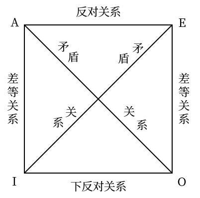
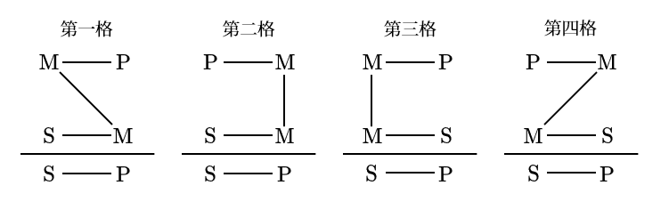
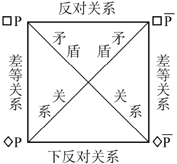
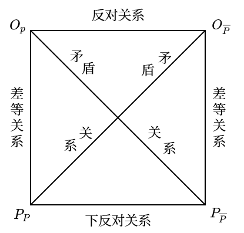

# 2 命题与演绎

1. 命题：表达判断的语句，命题一定能判断真假
    1. 判断：对事物情况所有断定的一种思维形式
    2. 语句：只有表达判断的语句才是命题，不同的语句可能表达相同的命题
2. 推理：从一个已知的命题出发推出另一个新命题的思维形式
    1. 由其出发进行推理的一直命题称为前提；把由一直命题所推出的命题称为结论
    2. 演绎推理（从一般到特殊），归纳推理（从特殊到一般），类比推理（从特殊到特殊）

## 2.1 简单命题
### 2.1.1 直言命题
1. 概念：断定事物具有某种性质的命题，具有主项 $S$，谓项 $P$，联项和量项
    1. 根据联项（是或不是）的不同，可以分为肯定命题或否定命题，根据量项（所有或有的）的不同，可以分为全程命题（包括单称命题）或特称命题
    2. 周延性：在一个命题中，其主项或谓项的全部外延被做了断定，那么这个命题的主项或谓项就是周延的
2. 四种命题形式：全称肯定命题（$\text{SAP}$，左上），全称否定命题（$\text{SEP}$，右上），特称肯定命题（$\text{SIP}$ 左下）以及特称否定命题（$\text{SOP}$，右下）
    1. 利用韦恩图，可以表示概念外延间各种不同关系的图解。其中利用阴影部分表示不存在，用 「$+$」 表示存在
    2. 就主项而言，全称命题是周延的；就谓项而言，否定命题是周延的

    <figure markdown>
        
        
    </figure>

3. 从下表主谓项之间的关系与不同命题形式之间的真假关系， 可以看出以下命题形式之间的关系，称之为逻辑方阵

    

    | 主谓项关系 | $\text{SAP}$ | $\text{SEP}$ | $\text{SIP}$ | $\text{SOP}$ |
    | :--------: | :------------: | :------------: | :------------: | :------------: |
    |  全同关系  |       真       |       假       |       真       |       假       |
    |  真包含于  |       真       |       假       |       真       |       假       |
    | 真包含关系 |       假       |       假       |       真       |       真       |
    |  交叉关系  |       假       |       假       |       真       |       真       |
    |  全异关系  |       假       |       真       |       假       |       真       |

    

    1. 反对关系：指全称肯定命题与全称否定命题
    2. 矛盾关系：指全称肯定命题与特称否定命题或全称否定命题与特称肯定命题
    3. 差等关系：指全称肯定命题与特称肯定命题或全称否定命题与特称否定命题
    4. 下反对关系：指特称肯定命题与特称否定命题

    <figure markdown>
        
        
    </figure>

4. 直言命题的推理
    1. 命题变形法：两种方法可以结合使用
        1. 换质法：改变命题的联项，即肯定命题与否定命题的相互转换
        2. 换位法：改变命题主项和谓项位置的方法

        

        |     原命题     |         换质命题          |    换位命题    |
        | :------------: | :-----------------------: | :------------: |
        | $\text{SAP}$ | $\mathrm{SE\overline{P}}$ | $\text{PIS}$ |
        | $\text{SEP}$ | $\mathrm{SA\overline{P}}$ | $\text{PES}$ |
        | $\text{SIP}$ | $\mathrm{SO\overline{P}}$ | $\text{PIS}$ |
        | $\text{SOP}$ | $\mathrm{SI\overline{P}}$ |    不能换位    |

        

    2. 依据逻辑方阵可以推断出一些命题的的真假情况，在同一素材下有以下性质成立
        1. 反对关系：若一个真，则另一个为假，反之不成立
        2. 矛盾关系：两个命题必为一真一假
        3. 差等关系：若全称命题为真，则特称命题必定为真

5. 直言三段论：两个包含共同项的直言命题作为前提推出一个直言命题为结论
    1. 三段论的结构
        1. 小项 $S$：在结论中作为主项的概念
        2. 大项 $P$：在结论中作为谓项的概念
        3. 中项 $M$：在前体中出现而在结论中没有出现的概念
    2. 三段论的公理与规则：一类对象的全体具有或不具有某个性质，那么这类对象的一部分也具有或不具有同样的性质
        1. 在一个三段论内，有且仅有三个不同的概念：集合概念和普遍概念不是相同的概念
        2. 中项在前提中必须周延至少一次：若中项中前提一次也没有被断定过其全部外延，则大小项都只与中项的一部分外延发生联系
        3. 大项或小项如果在前提中不周延，则在结论中也不周延：若前提中的大小项只被断定了部分外延，则结论断定的对象超出了前提断定的对象范围
        4. 两个否定前提不能推出结论，前提之一是否定的当且仅当结论是否定的
        5. 两个特称结论不能推出结论，前提之一是特称的，则结论是特称的
    3. 三段论的格与式
        1. 格：中项在前提中位置的不同而形成的三段论的各种形式
        2. 式：由于 $A, E, I, O$ 四种命题在前提和结论中组合的不同形式形成的三段论的各种形式

        <figure markdown>
            
            
        </figure>

        !!! note "各个格的规则"
            1. 第一格的大前提必须全称，小前提必须肯定：$\text{AAA,(AAI),AII,EAE,(EAO),EIO}$
            2. 第二格两个前提中必须有一个否定命题，大前提必须为全称命题：$\text{AEE,(AEO),AOO,EAE,(EAO),EIO}$
            3. 第三格小前提必须为肯定命题，且结论必须为特称命题：$\text{AAI,AII,EAO,EIO,IAI,OAO}$
            4. 第四格的前提如果有一个是否定命题，则大前提必须是全称命题；否则小前提必须是全称命题：$\text{AAI,AEE,IAI,EAO,EIO,(AEO)}$

            带括号的称为弱式，即本应得出全称结论但得出了特称结论的式子

6. 其他三段论
    1. 复合三段论：由两个或以上的三段论构成的特殊的三段论形式。前进式（后退式）的复合三段论是以前一个三段论的结论作为后一个三段论的大前提（小前提）的三段论
    2. 省略三段论：省去一个前提或结论的三段论

### 2.1.2 关系命题
1. 关系命题：断定事物之间的关系的命题，包括关系项 $R$，关系者项（包括前者项和后者项）以及量项（所有，部分），记为 $aRb$
2. 关系的性质
    1. 对称关系：如果 $aRb$ 为真时 $bRa$ 一定为真  
        反对称关系：如果 $aRb$ 为真时，$bRa$ 一定为假
    2. 传递关系：$aRb$ 与 $bRc$ 为真时，$aRc$ 一定为真  
        反传递关系：$aRb$ 与 $bRc$ 为真时，$aRc$ 一定为假
3. 关系推理
    1. 直接的关系推理：对称性关系推理与反对称性关系推理
    2. 间接的关系推理：传递性关系推理与反传递性关系推理
4. 混合关系三段论：一个前提是两项的关系命题，另一个前提是性质命题，结论是两项的关系命题
    1. 性质命题必须是肯定的
    2. 媒介项的概念必须至少周延一次
    3. 前提中不周延的概念在结论中不得周延
    4. 若前提中关系命题和结论中的关系命题是相同的肯定性或否定性的
    5. 如果关系 $R$ 不是对称的，则在前提中作为关系着前项或后项的概念在结论中也必须相应作为关系着前项或后项

## 2.2 复合命题
- 复合命题：由若干个简单命题通过一定的逻辑联结词组合而成的命题
    1. 肢命题：复合命题所包含的简单命题称为复合命题的肢命题，
    2. 联结词：连接肢命题的词语

### 2.2.1 复合命题
1. 联言命题：断定事物的若干种情况同时存在的命题
    1. 形式：$p\wedge q$，读作 「$p$ 合取 $q$」
    2. 当且仅当其每个肢命题都真时，此联言命题为真，否则为假。据此可以做联言推理

        !!! note "与自然语言的区别"
            自然语言中用「但是」「还」或者「尽管」等联结词所联结而成的联言命题并不完全等同于用 $\wedge$ 所联结而成的合取式，后者只是前者在真值方面的抽象

2. 选言命题：断定事物若干种可能情况的命题
    1. 相容的选言命题：断定事物若干种可能情况中至少有一种情况存在的命题，记作 $p \vee q$，读作 「$p$ 析取 $q$」
        1. 否定一部分选言肢，就要肯定另一部分选言肢
        2. 肯定一部分选言肢，不能否定另一部分选言肢
    2. 不相容的选言命题：断定事物若干可能情况中有而且只有一种情况存在的命题，记作 $p \dot{\vee} q=(p\vee q)\wedge \overline{(p \wedge q)}$，读作 「$p$ 强析取 $q$」
        1. 否定肯定式：肯定一个选言肢，就要否定其余的选言肢
        2. 肯定否定式：否定一个选言肢以外的选言肢，就要肯定未被否定的那个选言肢
3. 假言命题：断定事物情况之间条件关系的命题
    1. 前件：表示条件的肢命题   
        后件：表示依赖该条件而成立的命题
    2. 假言推理：前提中包含有假言命题，并且依据假言命题的逻辑性质来进行推演的推理
        1. 充分条件假言命题：前件是后件的充分条件的假言命题，即只要存在前件所断定的事物情况，就一定会出现后件所断定的事物情况。记作 $p \to q$，读作 「$p$ 蕴含 $q$」
            1. 肯定前件式：由 $p\to q$ 和 $p$ 推出 $q$
            2. 否定后件式：由 $\overline{p}\to \overline{q}$ 和 $\overline{q}$ 推出 $\overline{p}$
            3. 否定前件不能否定后件，肯定后件不能肯定前件
        2. 必要条件假言命题：前件是后件的必要条件的假言命题，即不存在前件所断定的事物情况，就不会有后件所断定的事物情况。记作 $p \leftarrow q$ 或 $\overline{p}\to \overline{q}$，读作 「$p$ 反蕴含 $q$」
            1. 否定前件式：由 $p\leftarrow q$ 和 $\overline{p}$ 推出 $\overline{q}$
            2. 肯定后件式：由 $p\leftarrow q$ 和 $q$ 推出 $p$
            3. 肯定前件不能肯定后件，否定后件不能否定前件
        3. 充分必要条件假言命题：前件既是后件的充分条件，又是后件的必要条件。记作 $p \leftrightarrow q=(p\to q)\wedge(p\leftarrow q)$，读作 「$p$ 等值于 $q$」
            1. 由 $p\leftrightarrow q$ 和 $p$ 可推出 $q$；和 $q$ 可推出 $p$
            2. 由 $p\leftrightarrow q$ 和 $\overline{p}$ 可推出 $\overline{q}$；和 $\overline{q}$ 可推出 $\overline{p}$
4. 负命题：对原命题断定情况的否定而作出的命题，记作 $\overline{p}$ 或 $\neg p$，读作 「非 $p$」
    1. 对于直言命题
        1. $\mathrm{\overline{SAP}}\leftrightarrow \mathrm{SOP}, \mathrm{\overline{SEP}}\leftrightarrow \mathrm{SIP}, \mathrm{\overline{SIP}}\leftrightarrow \mathrm{SEP}, \mathrm{\overline{SOP}}\leftrightarrow \mathrm{SAP}$
        2. $\overline{\overline{p}}=p$
    2. 对于复合命题
        1. $\overline{p\wedge q}=\overline{p}\vee \overline{q}, \overline{p\vee q}=\overline{p}\wedge \overline{q}, \overline{p\dot{\vee} q}=(p\wedge q)\vee (\overline{p}\wedge \overline{q})$
        2. $\overline{p\to q}=p\wedge \overline{q}, \overline{p\leftarrow q}=\overline{p}\wedge q, \overline{p\leftrightarrow q}=(p\wedge \overline{q})\vee (\overline{p}\wedge q)$
5. 真值表：显示复合命题的真假是如何由其肢命题的真假所决定的表格
    1. 复合命题的真值表（记 $+$ 为真，$-$ 为假）

        

        |  $p$  |  $q$  | $p\wedge q$ |    $p\vee q$    |   $p\dot{\vee} q$    |
        | :---: | :---: | :---------: | :-------------: | :------------------: |
        |  $+$  |  $+$  |     $+$     |       $+$       |         $-$          |
        |  $+$  |  $-$  |     $-$     |       $+$       |         $+$          |
        |  $-$  |  $+$  |     $-$     |       $+$       |         $+$          |
        |  $-$  |  $-$  |     $-$     |       $-$       |         $-$          |

        

        

        |  $p$  |  $q$  |  $p\to q$   | $p\leftarrow q$ | $p\leftrightarrow q$ |
        | :---: | :---: | :---------: | :-------------: | :------------------: |
        |  $+$  |  $+$  |     $+$     |       $+$       |         $+$          |
        |  $+$  |  $-$  |     $-$     |       $+$       |         $-$          |
        |  $-$  |  $+$  |     $+$     |       $-$       |         $-$          |
        |  $-$  |  $-$  |     $+$     |       $+$       |         $+$          |

        

    2. 重言式（不管其肢命题的真假情况如何，整个复合命题总是真的）可以用归谬赋值法判定

### 2.2.2 假言选言推理
1. 假言选言推理（二难推理）：由两个假言前提和一个具有二肢的选言前提联合作为前提而构成的推理
    1. 简单式和复杂式：结论是简单的直言命题或复合的选言命题
    2. 构成式和破坏式：论的得出是运用了充分条件假言推理的肯定式或否定式
2. 假言选言推理的分类
    1. 简单构成式：前提中肯定两个假言命题的不同前件，结论肯定两个假言命题的相同后件。即由 $p\to q, r\to q, p\vee r$ 推出 $q$
    2. 简单破坏式：前提中否定两个假言命题的不同后件，结论否定两个假言命题的相同前件。即由 $p\to q, p\to r, \overline{q}\vee \overline{r}$ 推出 $\overline{p}$
    3. 复杂构成式：前提中肯定两个不同假言命题的两个不同的前件，结论肯定两个不同的后件。即由 $p\to r, q\to s, p\vee q$ 推出 $r\vee s$
    4. 复杂破坏式：前提中否定两个不同假言命题的两个不同的后件，结论则否定两个不同的前件。即由 $p\to q, r\to s, \overline{r}\vee \overline{s}$ 推出 $\overline{p}\vee \overline{r}$

## 2.3 模态命题
### 2.3.1 模态命题
1. 定义：反映事物必然性或可能性的命题
    1. 用模态命题可以反映事物本身存在的某种必然性或可能性
    2. 表示对事物情况断定的不确定的性质
    3. 模态的种类：时间模态（在某些时候为真)、逻辑模态（命题必然为真)、认知模态（人们都认为为真）和意向模态（让人们相信其为真）
2. 分类：模态命题可分为可能命题和必然命题，两个命题都既有肯定的，也有否定的
    1. 可能肯定命题：$S$ 是 $P$ 是可能的，记作「可能 $p$」，写作 $\lozenge p$
    2. 可能否定命题：$S$ 不是 $P$ 是可能的，记作「可能 $\overline{p}$」，写作 $\lozenge \overline{p}$
    3. 必然肯定命题：$S$ 是 $P$ 是必然的，记作「必然 $p$」，写作 $\square p$
    4. 必然否定命题：$S$ 不是 $P$ 是必然的，记作「必然 $\overline{p}$」，写作 $\square \overline{p}$

    <figure markdown>
        
        
    </figure>

3. 模态推理：根据模态命题的性质及其相互间的逻辑关系进行推演
    1. 根据矛盾关系的直接推理：$\square p\leftrightarrow \overline{\lozenge \overline{p}}, \overline{\square p}\leftrightarrow \lozenge \overline{p}, \square \overline{p}\leftrightarrow \overline{\lozenge p}, \overline{\square \overline{p}}\leftrightarrow \lozenge p$
    2. 根据反对关系的直接推理：$\square p\to \overline{\square \overline{p}}, \square \overline{p} \to \overline{\square p}$
    3. 根据下反对关系的直接推理：$\overline{\lozenge p} \to \lozenge \overline{p}, \overline{\lozenge \overline{p}} \to \lozenge p$
    4. 根据差等关系的直接推理：$\square p\to \lozenge p, \overline{\lozenge p} \to \overline{\square p}, \square \overline{p} \to \lozenge \overline{p}, \overline{\lozenge \overline{p}} \to \overline{\square \overline{p}}$
4. 模态三段论
    1. 必然模态三段论：所有的 $M$ 必然是 $P$ ，所有的 $S$ 必然是 $M$ ，所以所有的 $S$ 必然是 $P$
    2. 必然和可能两种模态命题结合：凡 $P$ 必然是 $M$ ，凡 $S$ 可能不是 $M$ ，所以凡 $S$ 可能不是 $P$
    3. 必然命题和直言命题结合：凡 $M$ 必然不是 $P$ ，凡 $S$ 是 $M$ ，所以凡 $S$ 必然不是 $P$
    4. 可能命题与直言命题结合：凡 $M$ 可能是 $P$ ，凡 $S$ 是 $M$ ，所以凡 $S$ 可能是 $P$
    5. 可能模态三段论：凡 $M$ 可能是 $P$ ，凡 $S$ 可能是 $M$ ，所以凡 $S$ 可能是 $P$

### 2.3.2 规范命题
1. 含有「必须（$O$）」「禁止（$F$）」「允许（$P$）」等规范模态词的模态命题，分为六种命题
    1. 必须肯定命题：记作必须 $p$，写作 $O_p$
    2. 必须否定命题：记作必须非 $p$，写作 $O_\overline{p}$
    3. 禁止肯定命题：记作禁止 $p$，写作 $F_p$ ，可以与必须否定命题等价替换
    4. 禁止否定命题：记作禁止非 $p$，写作 $F_\overline{p}$ ，可以与必须肯定命题等价替换
    5. 允许肯定命题：记作允许 $p$，写作 $P_p$
    6. 允许否定命题：记作允许非 $p$，写作 $P_\overline{p}$
2. 规范命题之间的关系
    1. 反对关系：一个正确，另一个就不正确；一个不正确，另一个正确与否不定
    2. 下反对关系：一个错误，另一个就正确；一个正确，另一个正确与否不定
    3. 差等关系：「必须」命题正确，则「允许」命题必正确；「必须」命题不正确，则「允许」命题正确与否不定；「允许」命题正确，「必须」命题正确与否不定；「允许」命题错误，则「必须」命题必不正确
    4. 矛盾关系：一个正确，另一个不正确；反之亦然

        <figure markdown>
            
            
        </figure>

3. 规范推理：以规范命题为其前提和结论的演绎推理，其前提至少有一个是规范命题
    1. 根据规范命题矛盾关系的直接推理：$O_p\leftrightarrow \overline{P_\overline{p}}, \overline{O_p}\leftrightarrow P_\overline{p}, O_\overline{p}\leftrightarrow \overline{P_p}, \overline{O_\overline{p}}\leftrightarrow P_p$
    2. 根据规范命题反对关系的直接推理：$O_p\to \overline{O_\overline{p}}, O_\overline{p} \to \overline{O_p}$
    3. 根据规范命题下反对关系的直接推理：$\overline{P_p} \to P_\overline{p}, \overline{P_\overline{p}}\to P_p$
    4. 根据规范命题差等关系的直接推理：$O_p\to P_p, \overline{P_p}\to \overline{O_p}, O_\overline{p} \to P_\overline{p}, \overline{P_\overline{p}}\to \overline{O_\overline{p}}$
4. 规范三段论：直言三段论中引入规范模态词的一种三段论推理。一般来说，其大前提是规范命题，小前提是直言命题，结论是规范命题
    1. 必须规范三段论：凡 $M$ 必须 $P$ ，凡 $S$ 是 $M$ ，所以，凡 $S$ 必须 $P$ 
    2. 禁止规范三段论：凡 $M$ 禁止 $P$ ，凡 $S$ 是 $M$ ，所以，凡 $S$ 禁止 $P$ 
    3. 允许规范三段论：凡 $M$ 允许 $P$ ，凡 $S$ 是 $M$ ，所以，凡 $S$ 允许 $P$ 
