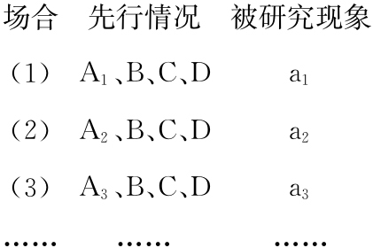

# 3 归纳与类比

## 3.1 归纳推理
### 3.1.1 归纳推理与因果分析
1. 是一种由特殊性知识的前提得出一般性知识的结论的推理，分为完全归纳推理和不完全归纳推理
    1. 前提是关于个别事物或现象的命题，结论是关于该类事物或现象的普遍性命题
    2. 归纳推理的结论所断定的知识范围超出了前提所断定的知识范围，是一种或然性推理
2. 完全归纳推理：根据对某类对象全部个体的考察，发现每一个个体都具有某种性质，因而断言该类对象都具有某种性质

    !!! note "完全归纳推理的要点"
        完全归纳推理是保真的，当且仅当 ① 前提所列举的应当是包括该类对象的每一个个体；② 作为前提的每一个判断都是真的

3. 部分归纳推理：根据对某类对象部分对象的考察，发现它们具有某种性质，因而断言该类对象都具有某种性质。部分归纳推理是不保真的，但是科学归纳推理比简单归纳推理的可靠性更高
    1. 简单归纳推理：$S_1, S_2, \cdots S_n$ 是 $S$ 的部分对象，$S_i$ 具有性质 $P$，且枚举中没有相反情况
    2. 科学归纳推理：$S_1, S_2, \cdots S_n$ 是 $S$ 的部分对象，$S_i$ 具有性质 $P$，且 $S_i$ 与 $P$ 均具有因果联系
4. 因果联系：一个现象的出现必然引起另一个现象的出现。探求因果联系的方法 (即「密尔五法」)：
    1. 求同法：某一现象出现在几种不同的场合，而在这些场合里，只有一个条件是相同的 (其他条件均不相同)
    2. 求异法：如果在某现象出现的场合里有某个条件，在某现象不出现的另一场合里没有这个条件，那么这个条件是此现象产生的原因
    3. 求同求异并用法：如果在正事例组 (由被研究现象出现的若干场合组成的组) 的各场合中只有一个共同的情况且在负事例组 (由被研究现象不出现的若干场合组成的组合) 的各场合中都不存在，那么这个情况就是被研究现象的原因

        <figure markdown>
            
            
        </figure>
        

    4. 共变法：如果一个现象发生变化，另一个现象就随之发生变化，那么前一现象就是后一现象的原因或部分原因

        <figure markdown>
            
            
        </figure>

    5. 剩余法：如果某一复合现象是由另一复合原因所引起的，那么把其中确认有因果联系的部分减去，剩下的部分也必然有因果联系

### 3.1.2 经验认识方法
1. 观察：在对象或现象的自然状态下，有目的地通过感官去研究对象或现象
2. 实验：在控制对象或现象的条件下有目的地通过感官去认识对象或现象
3. 比较：在思维中用以确定对象之间相同点和相异点的逻辑方法
4. 分析法：在思维中把对象的整体分解为各个部分、方面、特性和因素而加以认识的逻辑方法  
    综合法：在思维中将已有的关于对象的各个部分、方面、特性和因素的认识联结起来，形成关于对象的统一整体的认识的逻辑方法

## 3.2 类比推理
1. 定义：根据两个或两类对象在某些属性上相同，推断出其在另外的属性上也相同的一种推理。类比推理是不保真的推理，其可靠性在于是否从两类对象的较本质的属性进行类比
    1. 性质类比推理：根据两个或两类对象在某些性质上的相同或相似，又知其中一个或一类对象还具有另外一种性质，从而推知另一个或一类对象也具有这另外一种性质的类比推理
    2. 关系类比推理：根据两个或两类对象之间的关系在某些方面类似于另两个或两类对象之间的关系，现又知前两个或两类对象在另一方面存在关系，从而推知后两个或两类对象也在另一方面存在关系
2. 假说：根据已掌握的事实材料和科学原理对某一未知事物及其发展规律所作出的一种推测性的说明
    1. 假说的特点
        1. 具有推测的性质
        2. 有事实材料和科学知识的根据
        3. 是认识接近客观真理的一种方式
    2. 假说的构成步骤
        1. 通过观察所研究的某一现象的各种情况，占有该现象的各种事实材料
        2. 运用有关的科学知识对已占有的各种事实材料进行科学分析，提出假说
        3. 从假定的这一现象发生的原因推出其应有的结果
        4. 验证所研究的某一现象的各种情况，是否符合这个假定的原因所应产生的结果
        5. 根据验证的结果作出最后的结论。如果所假定的原因被证实，则假说成立，否则就推翻，再重新假定并另立假说
    3. 假说的作用
        1. 发现科学规律、创立科学理论的重要思维方法
        2. 用于现代科学决策的制订过程，科学决策离不开科学预测，后者是一个提出假说和验证假说的过程
