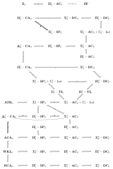

# 4 形式算术

## 4.1 形式算术
### 4.1.1 原始递归算术
1. 原始递归算术的语言 $\mathscr L(R)$ 由逻辑符号和非逻辑符号组成
    1. 逻辑符号：① 可数无穷的变元集 $\mathbf{Var}$；② 联结词 $\bot, \wedge, \vee, \to$；③ 括号 $)$ 与 $($
    2. 非逻辑符号 $R$：① 等词 $=$；② 常数 $0$；③ 后继函数 $\mathrm{S}$；④ 余下所有原始递归函数
2. 原始递归算术的公理系统
    1. 逻辑公理：命题逻辑的所有重言式与等词公理
    2. 非逻辑公理：定义所有原始递归函数的公式，以及 $\mathrm{S}(x) \neq 0$ 与 $\mathrm{S}(x) = \mathrm{S}(y) \to x = y$
    3. 推理规则：肯定前件规则、代入规则与以下无量词归纳法模式

        $$
        \begin{prooftree}
        \AxiomC{$\varphi(0)$}
        \AxiomC{$\varphi(x) \to \varphi(\mathrm{S}(x))$}
        \BinaryInfC{$\varphi(y)$}
        \end{prooftree}
        $$

### 4.1.2 一阶算术
初等数论的语言 $\mathscr L(S)$，其中 $S = \{=, \mathrm{S}, +, \times, 0\}$ 且 $\Omega(=) = 2, \Omega(\mathrm{S}) = 1, \Omega(+) = \Omega(\times) = 2, 0 \in \mathbf C$

1. 设 $S-$语句集为
    1. $\forall x  \ (\mathrm{S} x \not = 0)$
    2. $\forall x \forall y \ (\mathrm{S} x = \mathrm{S} y \rightarrow x = y)$
    3. $\forall x \ (x \not = 0 \rightarrow \exists y \ (x = \mathrm{S} y))$
    4. $\forall x \ (x+0 = x)$
    5. $\forall x \forall y \ (x+\mathrm{S} y = \mathrm{S}(x+y))$
    6. $\forall x \ (x \cdot 0 = 0)$
    7. $\forall x \forall y \ (x \cdot \mathrm{S} y = x \cdot y+x)$

    定义 $\text{Robinson}$ 算术 $\mathbf{Q}$ 是以上公理的理论

    1. 对每个标准自然数 $n \in \mathbf{N}$，在 $\mathrm{Q}$ 内都存在对应项 $\small \underbrace{\normalsize \mathrm{S} \mathrm{S}\cdots \mathrm{S}}_{\normalsize n} \normalsize 0$，简记为 $\mathrm{S}^{n} \ 0$
        1. $\mathrm{Q} \not \vdash \forall x \ (\mathrm{S} x \neq x)$
        2. 对任意 $n \in \mathbf{N}$，$\mathrm{Q} \vdash \mathrm{S} n \not = \mathrm{S}^{n} \ 0$
        3. $\vdash \forall x(\mathrm{S} x+\mathrm{S}^{n} \ 0 = x+\mathrm{S} \mathrm{S}^{n} \ 0)$
        4. $\vdash \mathrm{S}^{m} \ 0+\mathrm{S}^{n} \ 0 = \mathrm{S}^{m+n} \ 0$ 且 $\vdash \mathrm{S}^{m} \ 0 \cdot \mathrm{S}^{n} \ 0 = \mathrm{S}^{m \cdot n} \ 0$
        5. 如果 $n \neq m$ 则 $\vdash \mathrm{S}^{n} \ 0 \neq \mathrm{S}^{m} \ 0$
        6. 如果 $m \leqslant n$ 则 $\vdash \mathrm{S}^{m} \ 0 \leqslant \mathrm{S}^{n} \ 0$
        7. 如果 $m \not \leqslant n$ 则 $\vdash \mathrm{S}^{m} \ 0 \not \leqslant \mathrm{S}^{n} \ 0$
        8. $\vdash \forall x(x \leqslant \mathrm{S}^{n} \ 0 \leftrightarrow x = 0 \vee \cdots \vee x = \mathrm{S}^{n} \ 0)$
        9. $\vdash \forall x(x \leqslant \mathrm{S}^{n} \ 0 \vee \mathrm{S}^{n} \ 0 \leqslant x)$
    2. 引入公理 $x \leqslant y \leftrightarrow \exists z \ (x+z=y)$ 得到 $\mathbf{Q}_{\leqslant}$
        1. 令 $\Phi \in \{\Sigma_{n}, \Sigma_{n}^{+}, \Pi_{n}, \Pi_{n}^{+}, \Delta_{n}, \Delta_{n}^{+}\}$ 为公式层级，则对所有 $A \in \Phi$ 引入公理
            1. 归纳公理（$\Phi-\mathrm{IND}$）：$A(0) \wedge \forall x \ (A(x) \to A(S x)) \to \forall x \ A(x)$
            2. 最小公理（$\Phi-\mathrm{MIN}$）：$\exists x \ A(x) \to \exists x \ (A(x) \wedge \neg \exists y \ (y<x \wedge A(y)))$
            3. 替换公理（$\Phi-\mathrm{REPL}$）：$\forall x \leqslant t \ \exists y \ A(x, y) \to \exists z \ \forall x \leqslant t \ \exists y \leqslant z \ A(x, y)$

            定义 $\mathbf{I\Phi} =\mathbf{Q}_{\leqslant}+\Phi-\mathrm{IND}, \mathbf{L\Phi} =\mathbf{Q}_{\leqslant}+\Phi-\mathrm{MIN}, \mathbf{B\Phi} =\mathbf{Q}_{\leqslant}+\Phi-\mathrm{REPL}$

            1. $\mathbf{I \Sigma}_{n+1}  \vdash \mathbf{B \Sigma}_{n+1}$
            2. $\mathbf{B \Sigma}_{n+1} \vdash \mathbf{B \Pi}_{n}$
            3. $\mathbf{B \Sigma}_{n+1} \vdash \mathbf{I \Sigma}_{n}$
            4. $\mathbf{I \Sigma}_{n} \dashv\vdash \mathbf{I \Pi}_{n} \dashv\vdash \mathbf{L \Sigma}_{n} \dashv\vdash \mathbf{L \Pi}_{n}$

        2. 定义 $\log x=\min \left\{y \mid 2^{y} \leqslant x\right\}$ 以及 $\omega_{1}(x, y)=x^{\log y}, \omega_{n+1}(x, y)=2^{\omega_{n}(\log x, \log y)}$
            1. $\Omega_{n}: \forall x \forall y \exists z \ \left(z=\omega_{n}(x, y)\right)$
            2. $\mathrm{exp}: \forall x \forall y \exists z \ \left(x^{y}=z\right)$

2. 设 $S-$语句集为
    1. $\forall x \ (\mathrm{S} x \not = 0)$
    2. $\forall x \forall y \ (\mathrm{S} x = \mathrm{S} y \rightarrow x = y)$
    3. $\forall x \ (x+0 = x)$
    4. $\forall x \forall y \ (x+\mathrm{S} y = \mathrm{S}(x+y))$
    5. $\forall x \ (x \times 0 = 0)$
    6. $\forall x \forall y \ (x \times \mathrm{S} y = x \times y+x)$
    7. 归纳公理模式：对每个一阶公式 $\varphi$，都有对 $\varphi$ 的归纳公理 $\forall x \ ((\varphi(0) \wedge \forall x(\varphi(x) \rightarrow \varphi(\mathrm{S} x))) \rightarrow \forall x \varphi(x))$

    定义 $\text{Peano}$ 算术 $\mathbf{PA}$ 是以上公理的理论

    1. 称 $\mathfrak N$ 是 $\mathfrak N = \{\mathbf N, \{Z^{\mathfrak N}\}_{Z \in S}\}$ 的标准模型
        1. 存在可数的非标准 $\mathbf{PA}$ 模型 $\mathfrak M$，即 $\mathfrak M$ 与 $\mathfrak N$ 初等等价但不同构
        2. $\text{Friedman}$ 定理：$\mathbf{PA}$ 两个非标准模型的其中一个必然与另一个的前段同构，此时称后者是前者的尾节扩张
    2. 在 $\mathbf{PA}$ 引入 $\nu$ 次递归定义的公理
        1. $\forall y \forall x \ (Z_{y}(P_{y}^{\mathfrak{M}}, x) \rightarrow x \in P_{y}^{\mathfrak{M}})$
        2. $\forall y \forall x_{0} \forall x_{1} \ (P_{<y}^{\mathfrak{M}} x_{0} x_{1} \leftrightarrow x_{0}<y \wedge x_{1} \in P_{x_{0}}^{\mathfrak{M}})$
        3. $\forall x \ (\mathfrak{M}_{u}(F, x) \rightarrow F(x)) \rightarrow \forall x \ (P_{u}^{\mathfrak{M}} x \rightarrow F(x))$

        得到理论 $\mathbf{ID}_{\nu}$，并定义 ${\displaystyle \mathbf{ID}_{<\nu}=\bigcup_{\mu<\nu} \mathbf{ID}_{\mu}}$

        1. 若去除归纳定义集 $I \subseteq \mathbf{N}$ 需要是某单调算子 $\Gamma: \mathcal P(\mathbf N) \rightarrow \mathcal P(\mathbf N)$ 的**最小**不动点限制，则得到弱化的 $\widehat{\mathbf{ID}}_{\nu}$ 系统
        2. 若限制仅在不含否定联结词的公式上归纳，则可在 $\widehat{\mathbf{ID}}_{\nu}$ 基础上进一步弱化得到 $\mathbf{ID}_{\nu}\#$

### 4.1.3 二阶算术
二阶算术的结构 $\left\{A, S^\mathfrak A, \{Z^\mathfrak A\}_{Z\in S}\right\}$ 中，除了限制量词在自然数上的论域 $A$ 外，还增加了限制量词在自然数的论域 $S \subseteq \mathcal P(A)$

1. 用小写字母 $i, j, k, m, n, \ldots$ 表示自然数，用 $X, Y, Z, \ldots$ 表示集合．设 $S-$语句集为
    1. $\forall x \ (\mathrm{S} x \not = 0)$
    2. $\forall x \forall y \ (\mathrm{S} x = \mathrm{S} y \rightarrow x = y)$
    3. $\forall x \ (x+0 = x)$
    4. $\forall x \forall y \ (x+\mathrm{S} y = \mathrm{S}(x+y))$
    5. $\forall x \ (x \times 0 = 0)$
    6. $\forall x \forall y \ (x \times \mathrm{S} y = x \times y+x)$
    7. 归纳公理模式（$\mathrm{Ind}$）：对所有不含 $X$ 作为自由变元的公式 $X$ 有 $\forall X(0 \in X \wedge \forall n(n \in X \rightarrow n+1 \in X)) \rightarrow \forall n(n \in X)$
    8. 理解公理模式（$\mathrm{CA}$）：对所有不含 $X$ 作为自由变元的公式 $X$ 有 $\exists X \forall n(n \in X \leftrightarrow \varphi(n))$

    定义二阶算术 $\mathbf{Z}_2$ 是以上公理的理论．对于层级 $\Phi \in \{\Sigma_{n}^{m}, \Pi_{n}^{m}, \Delta_{n}^{m}\}$ 的公式 $\varphi$，定义公理

    1. $\Phi-$归纳公理模式（$\Phi-\mathrm{Ind}$）：$\varphi(0) \wedge \forall n \ (\varphi(n) \rightarrow \varphi(n+1)) \rightarrow \forall n \ \varphi(n)$
    2. $\Phi-$理解公理模式（$\Phi-\mathrm{CA}$）：$\exists X \forall n \ (n \in X \leftrightarrow \varphi(n))$
    3. $\Phi-$算术超限递归公理模式（$\Phi-\mathrm{TR}$）：对公式 $\theta(n, X)$，令 $\Theta(X)=\{n \in \mathbf{N} \mid \theta(n, X)\}, Y \subseteq \mathbf{N} \times A$ 且对每个 $a \in A$ 有 $Y_{a}=\Theta\left(Y^{a}\right)$，其中 $Y_{a}=\{m \mid (m, a) \in Y\}, Y^{a}=\left\{(n, b) \mid n \in Y_{b} \wedge b<_{A} a\right\}$，则对任意 $\Theta$ 与 $A$，相应的集合 $Y$ 都存在
    4. $\Phi-$选择公理模式（$\Phi-\mathbf{AC}$）：$\forall x \exists Y \ \varphi(x, Y) \rightarrow \exists Z \forall x \ \varphi\left(x,(Z)_{x}\right)$，其中 $(Z)_{x} = \{z: (z, x) \in Z\}$
    5. $\Phi-$依赖选择公理模式（$\Phi-\mathbf{DC}$）：$\forall x \forall X \exists Y \ \varphi(x, X, Y) \rightarrow \exists Z \forall x \ \varphi\left(x,(Z)_{x},(Z)_{x+1}\right)$，其中 $(Z)_{x} = \{z: (z, x) \in Z\}$
    6. $\Phi-$分离原则模式（$\Phi-\mathrm{SP}$）：$\forall x \ (\varphi(x) \rightarrow \neg \psi(x)) \rightarrow \exists X \forall x \ ((\varphi(x) \rightarrow x \in X) \wedge(x \in X \rightarrow \neg \psi(x)))$
    7. $\Phi-$超限归纳模式（$\Phi-\mathrm{TI}$）：设谓词 $W(X)$ 表示集合 $X$ 是自然数上的良序，将 $(i, j) \in X$ 记作 $i <_{X} j$，则 $\forall X \ \left(W(X) \rightarrow\left(\forall j \ \left(\forall i<_{X} j \ \varphi(i) \rightarrow \varphi(j)\right) \rightarrow \forall j \ \varphi(j)\right)\right)$
    8. $\Phi-\mathrm{Bar}$ 归纳公理模式（$\Phi-\mathrm{BI}$）：若 $a \prec b$ 有定义，则 $(\forall i \prec j \ (i \in X) \to j \in X) \to \forall n \ \varphi(n)$

    若取消 $\varphi$ 的限制，则去除对应的 $\Phi$ 前缀

2. 对于任意 $\mathbf{Z}_2$ 的子系统 $\mathbf{T}_0$，令 $\mathbf{T} = \mathbf{T}_0 + \mathrm{1-Ind}$，其中 $\mathrm{1-Ind}$ 是对所有一阶公式都成立的归纳公理模式．设 $\Phi \in \{\Sigma_{n}^{m}, \Pi_{n}^{m}, \Delta_{n}^{m}\}$
    1. $\mathbf{RCA}_0 = \mathbf{Q} + \Sigma_1^0-\mathrm{Ind} + \Delta_1^0-\mathrm{CA}$
    2. $\mathbf{WKL}_0 = \mathbf{RCA}_0 + \text{K}\ddot{\mathrm o}\text{nig}$，后者即弱 $\text{K}\ddot{\mathrm o}\text{nig}$ 引理：若 $T$ 为 $2^{<\omega}$ 的无限子树，则 $T$ 有一个无限分支
    3. $\mathbf{ACA}_0 = \mathbf{RCA}_0 + \Pi_0^1-\mathrm{CA}, \mathbf{\Phi}-\mathbf{CA}_0 = \mathbf{RCA}_0 + \Phi-\mathrm{CA}$
    4. $\mathbf{ATR}_0 = \mathbf{RCA}_0 + \mathrm{TR}, \mathbf{\Phi}-\mathbf{TR}_0 = \mathbf{RCA}_0 + \Phi-\mathrm{TR}$
    5. $\mathbf{\Phi}-\mathbf{AC}_0 = \mathbf{RCA}_0 + \Phi-\mathbf{AC}$
    6. $\mathbf{\Phi}-\mathbf{DC}_0 = \mathbf{RCA}_0 + \Phi-\mathbf{DC}$
    7. $\mathbf{\Phi}-\mathbf{SP}_0 = \mathbf{RCA}_0 + \Phi-\mathrm{SP}$
    8. $\mathbf{\Phi}-\mathbf{TI}_0 = \mathbf{ACA}_0 + \Phi-\mathrm{TI}$

## 4.2 不完备定理
### 4.2.1 可表示性
1. 关系的可表示性：令 $T$ 为包含 $\mathbf{Q}$ 的理论，称自然数上的 $k$ 元关系 $P$ 为在 $T$ 中（数码逐点）可表示的当且仅当存在 $P$ 的一个表示公式 $\rho(\overline{x})$ 使得 $\left(n_{1}, n_{2}, \ldots, n_{k}\right) \in P \to T \vdash \rho\left(\mathrm{S}^{n_{1}} \ 0, \mathrm{S}^{n_{2}} \ 0, \ldots, \mathrm{S}^{n_{k}} \ 0\right)$ 且 $\left(n_{1}, n_{2}, \ldots, n_{k}\right) \notin P \to T \vdash \neg \rho\left(\mathrm{S}^{n_{1}} \ 0, \mathrm{S}^{n_{2}} \ 0, \ldots, \mathrm{S}^{n_{k}} \ 0\right)$
    1. 可表示性的简单性质
        1. 如果 $P$ 是可表示的，则 $P$ 是递归的
        2. 可表示的关系在否定、析取与合取运算下封闭
        3. 如果 $P$ 在 $\mathbf{Q}$ 中被公式 $\rho$ 表示，则 $P$ 在 $\mathbf{Q}$ 的任何一致扩张（例如 $\mathbf{PA}$ 或 $\operatorname{Th}(\mathfrak{N})$）中都被 $\rho$ 表示
        4. $P$ 在 $\operatorname{Th}(\mathfrak{N})$ 中被 $\rho$ 表示当且仅当 $P$ 在结构 $\mathfrak{N}$ 中被 $\rho$ 定义
    2. $\mathbf{Q}$ 的 $\Sigma_{1}-$完备性：对任一 $\Sigma_{1}-$闭语句 $\tau$ 有 $\mathfrak{N} \models \tau$ 当且仅当 $\mathbf{Q} \vdash \tau$
    3. 若关系 $P \subseteq \mathbf{N}^{k+1}$ 被 $\rho(\overline{x}, \overline{y})$ 表示，则关系 $\exists c<$ b \ $P(\overline{a}, c)$ 和 $\forall c<b \ P(\overline{a}, c)$ 分别被 $\exists z<y \ \rho(\overline{x}, z)$ 和 $\forall z<y \ \rho(\overline{x}, z)$ 表示
    4. 对任何 $k$ 元关系 $R \subseteq \mathbf{N}^{k}$ 和任何递归且一致的扩张 $T \supseteq Q$，以下命题等价
        1. $R$ 在 $T$ 中可表示
        2. $R$ 是一个递归关系
        3. $R$ 在 $T$ 中可被一个 $\Delta_{1}$ 公式表示
2. 函数的可表示性：称一个函数 $f: \mathbf{N}^{k} \rightarrow \mathbf{N}$ 在 $T$ 中可表示当且仅当存在公式 $\varphi\left(x_{1}, \ldots, x_{k}, y\right)$，使得对所有 $\left(n_{1}, \ldots, n_{k}\right) \in \mathbf{N}^{k}$，都有 $\vdash_{T} \forall y\left[\varphi\left(\mathrm{S}^{n_{1}} \ 0, \ldots, \mathrm{S}^{n_{k}} \ 0, y\right) \leftrightarrow y=f\left(\mathrm{S}^{n_{1}} \ 0, \ldots, \mathrm{S}^{n_{k}} \ 0\right)\right]$
    1. 可表示性定理：所有的递归函数在 $\mathbf{Q}$ 中都是可表示的，因此所有的递归关系在 $\mathbf{Q}$ 中也都是可表示的
        1. 令 $t$ 为一个项，其中出现的变元包含在 $x_{1}, x_{2}, \ldots, x_{k}$ 中，则它诱导出的 $k$ 元函数 $f_{t}\left(n_{1}, n_{2}, \ldots, n_{k}\right)= t\left(n_{1}, n_{2}, \ldots, n_{k}\right)$ 是可表示的．特别地，零函数、后继函数、投射函数都是可表示的
        2. 可表示函数的类对复合运算封闭，即若函数 $h_{1}\left(x_{1}, x_{2}, \ldots, x_{n}\right)$, $h_{2}\left(x_{1}, x_{2}, \ldots, x_{n}\right), \ldots, h_{r}\left(x_{1}, x_{2}, \ldots, x_{n}\right)$ 和 $g\left(y_{1}, y_{2}, \ldots, y_{r}\right)$ 都是可表示的，则复合函数 $f=g\left(h_{1}, h_{2}, \ldots, h_{r}\right)$ 也是可表示的
        3. 可表示函数形成的类对原始递归封闭
        4. 假定函数 $g(x, y)$ 是可表示的并且 $\forall x \exists y \ g(x, y)=0$，则函数 $f(x)= \mu y [g(x, y)=0]$ 也是可表示的
    2. 如果一个函数 $f$ 作为关系是可表示的，则 $f$ 作为函数也是可表示的（但表示它们的公式可能不相同）
    3. 定义函数

        $$
        \begin{aligned}
        \alpha(c, d, i) & =\mu r[\exists q \leqslant c \ (c=q(1+(i+1) d)+r)] \\
        J(a, b) & =\dfrac{1}{2}(a+b)(a+b+1)+a \\
        K(p) & =\mu a \leqslant p \ [\exists b \leqslant p \ J(a, b)=p] \\
        L(p) & =\mu b \leqslant p \ [\exists a \leqslant p \ J(a, b)=p]
        \end{aligned}
        $$

        则以上函数在 $\mathbf{Q}$ 中都是可表示的

3. 算术编码：为 $S$ 中的每个符号指派一个自然数，其中 $\sharp v_{i} = 2i + 21$

    

    |  $\zeta$  | $\sharp \zeta$ |    $\zeta$    | $\sharp \zeta$ |
    | :-------: | :------------: | :-----------: | :------------: |
    | $\forall$ |       1        |      $)$      |       13       |
    |     0     |       3        |    $\neg$     |       15       |
    |     S     |       5        | $\rightarrow$ |       17       |
    |     +     |       7        |      $=$      |       19       |
    |  $\cdot$  |       9        |    $v_{0}$    |       21       |
    |    $($    |       11       |   $\cdots$    |    $\cdots$    |

    

    指派给字符串 $\xi=\zeta_{0} \ldots \zeta_{n}$ 的 $\text{G}\ddot{\mathrm o}\text{del}$ 编码为 $\sharp \xi = \operatorname{enc}(\zeta_{0}, \zeta_{1}, \cdots, \zeta_{n})$，并用 $\natural \xi$ 表示 $\sharp \xi$ 的逆运算

    1. 以下集合是原始递归的
        1. $\{\sharp x: x$ 是一个变元$\}$
        2. $\{\sharp t: t$ 是一个项$\}$
        3. $\{\sharp \alpha: \alpha$ 是一个原子公式$\}$
        4. $\{\sharp \alpha: \alpha$ 是一个公式$\}$
        5. $\{\sharp \alpha: \alpha$ 是一个闭语句$\}$
        6. $\{\sharp \alpha: \alpha$ 是一条逻辑公理$\}$
        7. $\{\sharp m: m$ 是一个数码$\}$
    2. 以下关系是原始递归的
        1. $x$ 在 $\alpha$ 中自然出现，即 $x$ 是一个变元，$\alpha$ 是一个项或公式，且 $\natural x$ 在 $\natural \alpha$ 中自由出现
        2. $t$ 在 $\alpha$ 中可替换 $x$，即 $x$ 是一个变元，$\alpha$ 是一个公式，$t$ 是一个项且 $\natural t$ 在 $\natural \alpha$ 中可替换 $\natural x$
        3. $\alpha$ 是 $\beta$ 的一个全称概括，即 $\alpha, \beta$ 是公式且 $\natural \alpha$ 是 $\natural \beta$ 的一个全称概括
    3. 存在一个原始递归函数 $\operatorname{SUB}$ 使得对任意项或公式 $\alpha$，对任意变元 $x$ 和任意项 $t$ 有 $\operatorname{SUB}(\sharp \alpha, \sharp x, \sharp t) = \sharp \alpha(t/x)$
    4. 令 $T$ 为一个被集合 $X \subseteq T$ 所公理化的理论，此时 $X$ 是递归的
        1. 关系「$b$ 是一个 $T$ 上的一个证明序列」是递归的
        2. 关系 $\operatorname{BEW}_{T}(b, a)$ 为「$b$ 是一个 $T$ 上的一个证明序列且 $b_{\mathrm{lh}(b)-1}=a$」，则 $\mathrm{BEW}_{T}(b, a)$ 是递归的
        3. 关系 $\mathrm{BWB}_{T}(a)$ 为 $\exists b \ \mathrm{BEW}_{T}(b, a)$，则 $\mathrm{BWB}_{T}(a)$ 是递归可枚举的，在一般情况下是不递归的

### 4.2.2 可证性
1. 令 $\varphi(\overline{x}, y)$ 为公式，且 $\mathbf{PA} \vdash \forall x \exists^{1} y \ \varphi(\overline{x}, y)$，将 $S$ 扩张为 $S' = S \cup \{f\}$，加入公理 $\forall x \ \varphi(\overline{x}, f(\overline{x}))$
    1. 对每一个 $S^{\prime}$ 上的公式 $\theta(\overline{v})$，在语言 $S$ 中都存在一个自然的翻译 $\theta^{*}(\overline{v})$
    2. 设 $\mathfrak{A}$ 为 $S'$ 的一个结构，$\mathfrak{A} \vDash \forall x \ \varphi(\overline{x}, f(\overline{x}))$ 且 $\mathfrak{A} \vDash \mathbf{PA}$
        1. 对所有的 $S^{\prime}$ 上的公式 $\theta(\overline{v})$ 和所有 $\overline{a} \in|\mathfrak{A}|^{k}$ 都有 $\mathfrak{A} \vDash \theta[\overline{a}]$ 当且仅当 $\mathfrak{A} \vDash \theta^{*}[\overline{a}]$
        2. 对所有 $S^{\prime}$ 上的公式 $\theta$，$\mathfrak{A}$ 都满足对 $\theta$ 的归纳公理 $I \theta$
        3. 对每一个 $S^{\prime}$ 上层级 $\Phi \in \{\Sigma_{n}^{m}, \Pi_{n}^{m}, \Delta_{n}^{m}\}$ 的公式 $\theta$，都在 $\mathbf{PA}$ 中添入一条新的归纳公理 $I \theta$．令 $\mathbf{PA}\left(S^{\prime}\right)$ 为扩充后的公理系统，则 $\mathbf{PA}\left(S^{\prime}\right)$ 是 $\mathbf{PA}$ 的一个 $\Phi-$保守扩张，即对每一个 $S$ 上的闭语句 $\sigma$ 都有 $\mathbf{PA}\left(S^{\prime}\right) \vdash \sigma$ 当且仅当 $\mathbf{PA} \vdash \sigma$
    3. 称函数 $f$ 在 $T$ 中是可证递归的当且仅当存在一个 $\Sigma_{1}-$公式 $\varphi(\overline{x}, y)$ 使得 $T \vdash \forall \overline{x} \forall y \ (\varphi(\overline{x}, y) \leftrightarrow y=f(\overline{x}))$；称关系 $R$ 在 $T$ 中是可证递归的当且仅当存在 $\Sigma_{1}-$公式 $\varphi(\overline{x})$ 和 $\psi(\overline{x})$ 使得 $T \vdash \forall \overline{x} \ (R(\overline{x}) \leftrightarrow \varphi(\overline{x}) \leftrightarrow \neg \psi(\overline{x}))$
        1. 令 $S^{\prime}=S \cup\{f, R\}$，$f$ 和 $R$ 是可证递归的函数和关系，则任何 $\mathbf{PA}\left(S^{\prime}\right)$ 中的可证递归函数和关系都在 $\mathbf{PA}$ 可证递归
        2. 令 $f$ 为在 $\mathbf{PA}$ 中可证递归函数，令 $\mathfrak{N}$ 和 $\mathfrak{M}$ 为 $\mathbf{PA}$ 的模型且 $\mathfrak{M}$ 是 $\mathfrak{N}$ 的尾节扩张，则对所有的 $\overline{a}$ 有 $b \in \mathfrak{N}, f^{\mathfrak{N}}(\overline{a})=b$ 当且仅当 $f^{\mathfrak{M}}(\overline{a})=b$
2. 设理论 $T$ 是可公理化的且 $\mathbf{Q} \subseteq T$，定义 $\operatorname{Bew}_{T}(y, x)$ 与 $\operatorname{Bwb}_{T}(x)$ 为 $\mathbf{Q}$ 内形式化的 $\mathrm{BEW}$ 和 $\mathrm{BWB}$
    1. $\operatorname{Bew}_{T}(y, x)$ 是可证递归的，$\operatorname{Bwb}_{T}(x)$ 一般不是 $\Delta_1$ 的
    2. 记 $\square_{T} \alpha$ 为 $\mathrm{Bwb}_{T}(\sharp \alpha)$，$\operatorname{Con}(T)$ 为 $\neg \square_{T} \bot$
3. $\text{Hilbert}-\text{Bernays}-\text{L}\ddot{\mathrm{o}}\text{b}$ 可证性条件：令 $\sigma$ 和 $\tau$ 为闭语句
    1. $\text{D1}:$ 若 $\vdash_{T} \sigma$，则 $\vdash_{T} \square_{T} \sigma$
        1. $\text{D1}$ 不蕴涵 $\vdash_{T} \sigma \rightarrow \square_{T} \sigma$，后者不一定是元定理
        2. $\text{D1}$ 对任何 $\mathbf{Q}$ 的扩张 $T$ 都成立，即若 $\vdash_{T} \sigma$，则 $\vdash_{T} \square_{T} \sigma$
    2. $\text{D2}: \ \vdash_{T} \square_{T}(\sigma \rightarrow \tau) \rightarrow \square_{T} \sigma \rightarrow \square_{T} \tau$
        1. 若 $\text{D1}$ 与 $\text{D2}$ 成立，则 $\text{D0}:$ 若 $\sigma \vdash_{T} \tau$，则 $\square_{T} \sigma \vdash_{T} \square_{T} \tau_{0}$ 成立
        2. 若 $\vdash_{T} \sigma \leftrightarrow \tau$ 则 $\vdash_{T} \square_{T} \sigma \leftrightarrow \square_{T} \tau$
    3. $\text{D3}: \ \vdash_{T} \square_{T} \sigma \rightarrow \square_{T} \square_{T} \sigma$

### 4.2.3 不完备定理
1. 不动点引理：给定公式 $\beta\left(v_{1}\right)$，其中只有变元 $v_{1}$ 自由出现，则可能行地找到一个闭语句 $\sigma$ 使得 $\mathbf{Q} \vdash \sigma \leftrightarrow \beta\left(\mathrm{S}^{\sharp \sigma} 0\right)$
2. 第一不完备定理：理论 $T \subseteq \mathrm{Th}(\mathfrak{N})$ 是可公理化的，则 $T$ 是不完全的；特别地，没有 $\mathrm{Th}(\mathfrak{N})$ 的完全公理化
    1. $\text{Tarski}$ 不可定义性定理：集合 $\sharp \mathrm{Th}(\mathfrak{N})$ 在结构 $\mathfrak{N}$ 中是不可定义的
    2. $\text{G}\ddot{\mathrm o}\text{del}-\text{Rosser}$ 定理：令 $T \supseteq \mathbf{Q}$ 为一个可公理化理论．若 $T$ 是一致，则存在一个 $\Pi_{1}-$闭语句 $\sigma$ 使得 $T \nvdash \sigma$ 且 $T \nvdash \neg \sigma$
    3. $\mathbf{Q}$ 强不可判定性：任何一个理论 $T$ 如果满足 $T \cup \mathbf{Q}$ 是一致的，则 $T$ 不是递归的
3. 第二不完备定理：设理论 $T$ 是可公理化的且 $\mathbf{Q} \subseteq T$
    1. 若 $T$ 一致，则 $\nvdash_{T} \mathrm{Con}(T)$
    2. $\vdash_{T} \operatorname{Con}(T) \rightarrow \neg \square_{T} \operatorname{Con}(T)$

    第二不完备定理说明 $\text{Hilbert}$ 纲领不可能照原样实现

    1. 令 $\mathbf{PA}^*$ 为 $\mathbf{PA} + \neg \operatorname{Con}(\mathbf{PA})$，则 $\mathbf{PA}^*$ 一致
    2. 对任意序数 $\alpha < \varepsilon_{0}$，$\mathbf{PA}$ 可证明 $\operatorname{TI}(\alpha)$，但无法证明 $\operatorname{TI}(\varepsilon_{0})$，此时记 $\operatorname{PTO}(\mathbf{PA}) = \varepsilon$，称 $\mathbf{PA}$ 的证明论序数为 $\varepsilon_0$

4. $\text{L}\ddot{\mathrm{o}}\text{b}$ 定理
    1. $\vdash_{T} \square_{T}\left(\square_{T} \alpha \rightarrow \alpha\right) \rightarrow \square_{T} \alpha$
    2. 若 $\vdash_{T} \square_{T} \alpha \rightarrow \alpha$，则 $\vdash_{T} \alpha$

    令 $T$ 表示任何一个普遍有效的闭语句（例如 $0 = 0$），则 $T$ 是 $\square_{T}(x)$ 的唯一不动点

    !!! note "$\text{Ramsey}$ 定理"
        设 $\kappa, \lambda, m$ 为基数，$n \in \mathbf{N}$，定义 $[\kappa]^{n}=\{X \subseteq \kappa \mid |X| =n\}$

        1. 划分性质 $\kappa \rightarrow(\lambda)_{m}^{n}$：$[\kappa]^{n}$ 的 $m-$划分中，每部分都有一个大小为 $\lambda$ 的齐次集，即使得 $[\lambda]^{n}$ 元素都属于同一划分的 $\lambda \subseteq \kappa$，$m = 2$ 时可省略下标
        2. 有穷 $\text{Ramsey}$ 定理：$N \rightarrow \left(M \right)_{k}^{n}$，它在 $\mathbf{N}$ 中成立但无法在 $\mathbf{PA}$ 中证明

## 4.3 反推数学
### 4.3.1 子系统与反推数学
1. $\mathbf{RCA}_0$ 中可依照 $\mathbf{ZFC}$ 建立实数集，定义 $\mathbf{R}$ 上的连续函数
    1. $\mathbf{RCA}_0$ 中存在所有递归全函数，但不一定能证明某个函数是全函数
    2. 在 $\mathbf{RCA}_0$ 中，对任意 $\Sigma_{1}^0$ 公式 $\varphi(n)$，或者存在有限集合 $X$ 使得 $\forall n \ (n \in X \leftrightarrow \varphi(n))$ 成立，或者存在单射 $f: \mathbf N \to N$ 使得 $\forall n \ (\exists m \  f(m) =n \leftrightarrow \varphi(n))$ 成立
    3. 以下公理在 $\mathbf{RCA}_0$ 中可证
        1. $\Pi_1^0-$归纳法
        2. 有界 $\Sigma_{1}^{0}-$理解公理：$\forall n \exists X \forall i \ (i \in X \leftrightarrow(i<n \wedge \varphi(i)))$
        3. 强 $\Sigma_1^0-$有界公理：$\forall m \ \exists n \ \forall i<m \ (\exists j \ \varphi(i, j) \rightarrow \exists j<n \ \varphi(i, j))$
    4. 以下定理在 $\mathbf{RCA}_0$ 中可证
        1. 任何完备一致理论至少有一个模型
        2. 代数学基本定理
        3. 区间套定理
        4. 零点存在定理
        5. 压缩映射原理
        6. $\text{Baire}$ 纲定理

2. $\mathbf{WKL}_0$ 是 $\mathbf{RCA}_0$ 的真扩张
    1. $\text{Harrington}$ 定理：$\mathbf{WKL}_0$ 是 $\mathbf{RCA}_0$ 的 $\Pi_1^1-$保守扩张
    2. $\text{Friedman}$ 定理：$\mathbf{WKL}_0$ 是 $\mathbf{PRA}$ 的 $\Pi_2^0-$保守扩张
    3. 以下定理在 $\mathbf{RCA}_0$ 中与 $\mathbf{WKL}_0$ 等价
        1. $\text{G}\ddot{\mathrm o}\text{del}$ 完全性定理
        2. 可数交换环必有素理想
        3. 闭区间上的连续函数必有界
        4. 闭区间上的连续函数的 $\text{Cantor}$ 定理
        5. $\text{Heine}-\text{Borel}$ 定理
        6. $\text{Brouwer}$ 不动点定理
        7. $\text{Weierstrass}$ 逼近定理
        8. $\text{Hahn}-\text{Banach}$ 泛函延拓定理
3. $\mathbf{ACA}_0$ 是 $\mathbf{WKL}_0$ 的真扩张
    1. $\mathbf{ACA}_0$ 是一阶算术 $\mathbf{PA}$ 的保守扩张
    2. $\text{Barwise}-\text{Schlipf}$ 定理：$\mathbf{\Sigma}_1^1-\mathbf{AC}_0$ 是 $\mathbf{ACA}_0$ 的 $\Pi_2^1-$保守扩张
        1. 对任意 $\Pi_3^1$ 语句 $\sigma$ 都有 $\mathbf{\Sigma}_{1}^{1}-\mathbf{AC}_{0}+\Sigma_{1}^{1}-\mathrm{Ind} \vdash$ 若 $\mathrm{AC}_{0} \vdash \sigma$，则 $\sigma$ 成立
        2. $\mathbf{ATR}_{0} \nvdash \Sigma_{1}^{1}-\mathrm{Ind}$
    3. 定义集合归纳公理（$\mathrm{SI}$）：$\forall X \ (0 \in X \wedge \forall n \ (n \in X \rightarrow n+1 \in X) \rightarrow \forall n \ n \in X)$，则 $\mathbf{ACA}_{0} - (\Sigma_1^0-\mathrm{Ind}) + \mathrm{SI} \vdash \Pi_0^1-\mathrm{Ind}$
    4. 以下定理在 $\mathbf{RCA}_0$ 中与 $\mathbf{ACA}_0$ 等价
        1. 良序集基本定理
        2. 有穷 $\text{Ramsey}$ 定理
        3. $\text{K}\ddot{\mathrm o}\text{nig}$ 引理：若 $T$ 为有限分支的无限子树，则 $T$ 有一个无限分支
        4. 可数交换环必有极大理想
        5. 可数向量空间的基存在
        6. $\text{‌Bolzano}-\text{Weierstrass}$ 定理
        7. $\text{Cauchy}$ 收敛原理
4. $\mathbf{ATR}_0$ 与 $\mathbf{\Phi}-\mathbf{AC}_0$
    1. 无穷博弈：设公式层级 $\Phi \in \{\Sigma_{n}^{m}, \Pi_{n}^{m}, \Delta_{n}^{m}\}$，函数 $S_1, S_2: \mathbf N^{<\mathbf{N}} \to \mathbf N$，记由

        $$
        \begin{aligned}
        n_{2k} & = S_1(n_0, n_1, ..., n_{2k-1}) \\
        n_{2k+1} & = S_2(n_0, n_1, ..., n_{2k})
        \end{aligned}
        $$

        定义的无穷序列 $\left<n_0, n_1, n_2 \cdots,\right>$ 为 $S_1 \# S_2$

        1. 对任意 $\Phi$ 公式 $\varphi(X)$，若有 $\exists S_1 \forall S_2 \ \varphi \left(S_1 \# S_2\right) \vee \exists S_1 \forall S_2 \ \neg \varphi\left(S_1 \# S_2\right)$，则称 $\Phi-$博弈是可判定的
        2. 对任意 $\Phi$ 公式 $\varphi(X), \psi(X)$，若有 $\theta(X) = \phi(X) \wedge \neg \psi(X)$ 且 $\exists S_1 \forall S_2 \ \theta \left(S_1 \# S_2\right) \vee \exists S_1 \forall S_2 \ \neg \theta\left(S_1 \# S_2\right)$，则称 $\Phi_{\rho}-$博弈是可判定的（例如 $\Sigma_{1 \rho}^0-$博弈的可判定性）

    2. $\text{Ramsey}$ 性质：对于任意层级 $\Phi \in \{\Sigma_{n}^{m}, \Pi_{n}^{m}, \Delta_{n}^{m}\}$ 的公式 $\varphi(f)$，若 $\exists f \in[\mathbf{N}]^{\mathrm{N}} \ (\forall g \in[\mathbf{N}]^{\mathrm{N}} \ \varphi(f \circ g) \vee \forall g \in[\mathbf{N}]^{\mathbf{N}} \ \neg \varphi(f \circ g))$，则称 $\Phi-$划分具有 $\text{Ramsey}$ 性质
    3. 以下定理在 $\mathbf{RCA}_0$ 中与 $\mathbf{ATR}_0$ 等价
        1. $\Sigma_1^0-$博弈可判定
        2. $\Sigma_1^0-$划分具有 $\text{Ramsey}$ 性质
        3. $\text{Baire}$ 空间的不可数闭集包含完全集
        4. $\text{Lusin}$ 定理
    4. 以下定理在 $\mathbf{RCA}_0$ 中与 $\mathbf{\Pi}_1^1-\mathbf{AC}_0$ 等价
        1. $\Sigma_{1 \rho}^0-$博弈可判定
        2. $\Sigma_2^0-$划分具有 $\text{Ramsey}$ 性质
        3. $\text{Cantor}-\text{Bendixson}$ 定理：闭集可表示为一个完全集与一个可数集的和

### 4.3.2 二阶算术体系
1. $\mathbf{Z}_2 = \mathbf{\Pi}_\omega^1-\mathbf{CA}$，一般地有 $\mathbf{Z}_{n+3} = \mathbf{\Pi}_\omega^{n+2}-\mathbf{CA}, \mathbf{Z}_\omega = \mathbf{\Pi}_0^\omega-\mathbf{CA}$
    1. $\mathbf{\Delta}_{k}^{1}-\mathbf{CA}_{0} \dashv \mathbf{\Pi}_{k}^{1}-\mathbf{SP}_{0} \dashv \mathbf{\Sigma}_{k}^{1}-\mathbf{AC}_{0} \dashv \mathbf{\Sigma}_{k}^{1}-\mathbf{DC}_{0}$
    2. $\mathbf{\Sigma}_{k}^{1}-\mathbf{DC}_{0} \vdash \mathbf{\Sigma}_{k}^{1}-\mathrm{Ind}$
    3. $\mathbf{\Pi}_{k}^{1}-\mathbf{AC}_{0} \dashv\vdash \mathbf{\Sigma}_{k+1}^{1}-\mathbf{AC}_{0}$
    4. $\mathbf{\Pi}_{k}^{1}-\mathbf{DC}_{0} \dashv\vdash \mathbf{\Sigma}_{k+1}^{1}-\mathbf{DC}_{0}$
2. 称不包含非标准自然数的二阶算数结构为 $\omega-$模型，若任意在标准模型模型上成立的 $\Sigma_1^1$ 语句在 $\omega-$模型中成立，则称其为 $\beta-$模型
    1. 对任意 $\omega-$模型 $\mathfrak{M}$，都有 $\mathfrak{M} \vDash \Sigma_{\omega}^{1}-\mathrm{Ind}$
    2. 对任意 $\beta-$模型 $\mathfrak{M}$，都有 $\mathfrak{M} \vDash \Sigma_{\omega}^{1}-\mathrm{TI}$ 且 $\mathfrak{M} \vDash \mathbf{ATR}_0$
    3. $\mathbf{\Pi}_1^1-\mathbf{AC}_0$ 中可证存在可数 $\beta-$模型
3. $\text{Simpson}$ 定理：$\mathbf{\Sigma}_{1}^{1}-\mathbf{TI}_{0} \dashv\vdash \mathbf{ATR}_{0}+\mathbf{\Sigma}_{1}^{1}-\mathrm{Ind}$
    1. $\mathbf{\Pi}_{1}^{1}-\mathbf{TI}_{0} \dashv\vdash \mathbf{\Sigma}_{1}^{1}-\mathbf{DC}_{0}$
    2. $\mathbf{ATR}_{0}+\Sigma_{\omega}^{1}-\mathrm{TI} \nvdash \mathbf{\Pi}_{1}^{1}-\mathbf{CA}_{0}$
    3. $\mathbf{ATR}_{0}+\mathbf{\Sigma}_{\infty}^{1}-\mathrm{Ind} \nvdash \Sigma_{1}^{1}-\mathbf{DC}_{0}$
    4. $\mathbf{\Sigma}_{1}^{1}-\mathbf{DC}_{0}+\mathbf{\Sigma}_{\infty}^{1}-\mathrm{Ind} \nvdash \mathbf{ATR}_{0}$

    !!! note "二阶算术关系图"

        <figure markdown>
            
            
        </figure>
