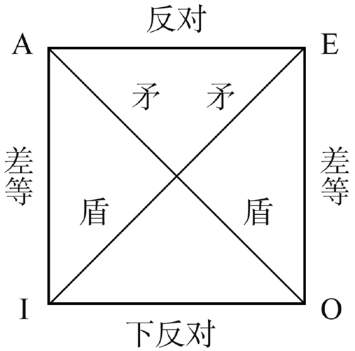

# 2 命题与推理

1. 命题: 表达判断的语句, 命题一定能判断真假
    1. 判断: 对事物情况所有断定的一种思维形式
    2. 语句: 只有表达判断的语句才是命题, 不同的语句可能表达相同的命题
2. 推理: 从一个已知的命题出发推出另一个新命题的思维形式
    1. 由其出发进行推理的一直命题称为前提; 把由一直命题所推出的命题称为结论
    2. 演绎推理 (从一般到特殊), 归纳推理 (从特殊到一般), 类比推理 (从特殊到特殊)

## 2.1 简单命题
### 2.1.1 直言命题
1. 概念: 断定事物具有某种性质的命题, 具有主项 $\mathrm{S}$, 谓项 $\mathrm{P}$, 联项和量项
    - 根据联项 (是或不是) 的不同, 可以分为肯定命题或否定命题, 根据量项 (所有或有的) 的不同, 可以分为全程命题 (包括单称命题) 或特称命题
    - 周延性: 在一个命题中, 其主项或谓项的全部外延被做了断定, 那么这个命题的主项或谓项就是周延的
2. 四种命题形式: 全称肯定命题 ($\mathrm{SAP}$, 左上), 全程否定命题 ($\mathrm{SEP}$, 右上), 特称肯定命题 ($\mathrm{SIP}$ 左下) 以及 特称否定命题 ($\mathrm{SOP}$, 右下)
    1. 利用 Venn 图, 可以表示概念外延间各种不同关系的图解. 其中, 利用阴影部分表示不存在, 用 「$+$」 表示存在
    2. 就主项而言, 全称命题是周延的; 就谓项而言, 否定命题是周延的 

    

3. 从下表主谓项之间的关系与不同命题形式之间的真假关系， 可以看出以下命题形式之间的关系, 如图称为「逻辑方阵」

    | 主谓项关系 | $\mathrm{SAP}$ | $\mathrm{SEP}$ | $\mathrm{SIP}$ | $\mathrm{SOP}$ |
    | :--------: | :------------: | :------------: | :------------: | :------------: |
    |  全同关系  |       真       |       假       |       真       |       假       |
    |  真包含于  |       真       |       假       |       真       |       假       |
    | 真包含关系 |       假       |       假       |       真       |       真       |
    |  交叉关系  |       假       |       假       |       真       |       真       |
    |  全异关系  |       假       |       真       |       假       |       真       |

    1. 反对关系: 指全称肯定命题与全称否定命题
    2. 矛盾关系: 指全称肯定命题与特称否定命题或全称否定命题与特称肯定命题
    3. 差等关系: 指全称肯定命题与特称肯定命题或全称否定命题与特称否定命题
    4. 下反对关系: 指特称肯定命题与特称否定命题

    

4. 直言命题的推理
    1. 命题变形法: 两种方法可以结合使用
        1. 换质法: 改变命题的联项, 即肯定命题与否定命题的相互转换
        2. 换位法: 改变命题主项和谓项位置的方法

        |     原命题     |         换质命题          |    换位命题    |
        | :------------: | :-----------------------: | :------------: |
        | $\mathrm{SAP}$ | $\mathrm{SE\overline{P}}$ | $\mathrm{PIS}$ |
        | $\mathrm{SEP}$ | $\mathrm{SA\overline{P}}$ | $\mathrm{PES}$ |
        | $\mathrm{SIP}$ | $\mathrm{SO\overline{P}}$ | $\mathrm{PIS}$ |
        | $\mathrm{SOP}$ | $\mathrm{SI\overline{P}}$ |    不能换位    |

    2. 依据逻辑方阵可以推断出一些命题的的真假情况, 在同一素材下有以下性质成立
        1. 反对关系: 若一个真, 则另一个为假, 反之不成立
        2. 矛盾关系: 两个命题必为一真一假
        3. 差等关系: 若全称命题为真, 则特称命题必定为真

5. 直言三段论: 两个包含共同项的直言命题作为前提推出一个直言命题为结论

### 2.1.2 关系命题

## 2.2 复合命题

## 2.3 模态命题

