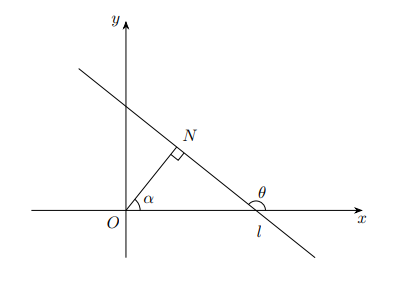
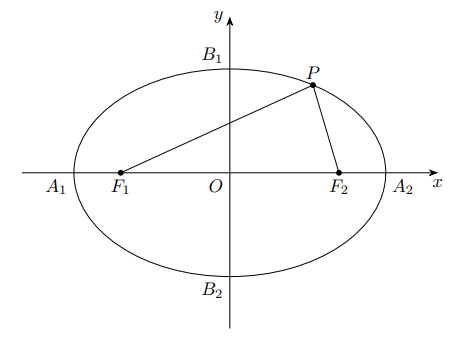
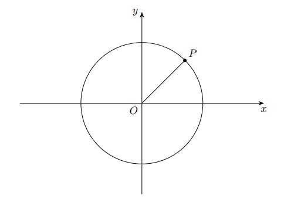
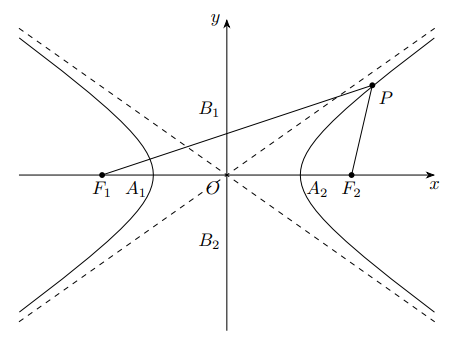
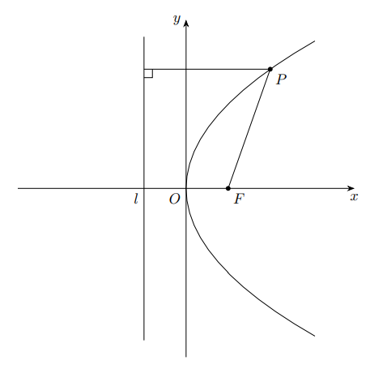

# 3 曲线方程与曲线论

## 3.1 曲线方程
1. 平面曲线的一般方程：在平面直角坐标系中，若方程 $F(x, y) = 0$ 与曲线 $L$ 有关系「点 $P(x, y)$ 在曲线 $L$ 上当且仅当 $(x, y)$ 满足该方程」，则称该方程为 $L$ 的曲线方程
    1. 向量式参数方程：若取 $t \in [a, b]$ 的一切可能取的值，由 $\boldsymbol r(t) = x(t) \boldsymbol e_1 + y(t) \boldsymbol e_2 \ (a \leqslant t \leqslant b)$ 表示的径向量 $\boldsymbol r(t)$ 的终点总在一条曲线上；反之在这条曲线上的任意点总对应着以它为终点的径向量，且该径向量可由 $t$ 的某一值 $t_0\ \left(a \leqslant t_0 \leqslant b\right)$ 完全决定，则称 $\boldsymbol r(t) = x(t) \boldsymbol e_1 + y(t)$ 为曲线的向量式参数方程
    2. 坐标式参数方程：若 $\boldsymbol r(t) = x(t) \boldsymbol e_1 + y(t) \boldsymbol e_2$ 为曲线的向量式参数方程，则称

        $$
        \left\{\begin{aligned}
        & x = x(t) \\
        & y = y(t) \\
        \end{aligned}\right.
        \ (a \leqslant t \leqslant b)
        $$

        为曲线的坐标式参数方程

    3. 普通方程：如果从曲线的坐标式参数方程中消去参数 $t$，则能得出曲线的普通方程 $F(x, y) = 0$

2. 空间曲线的一般方程：空间曲线 $L$ 可以看成两个曲面的交线，设

    $$
    \left\{\begin{aligned}
    F_1(x, y, z) & = 0 \\
    F_2(x, y, z) & = 0
    \end{aligned}\right.
    $$

    是两个曲面方程且相交于曲线 $L$．若点 $P(x, y, z)$ 在曲线 $L$ 上当且仅当 $(x, y, z)$ 满足该方程组，则称方程组为空间曲线 $L$ 的一般方程

    1. 向量式参数方程：设向量函数 $r(t)=x(t) \boldsymbol{e}_1+y(t) \boldsymbol{e}_2+z(t) \boldsymbol{e}_3$，当 $t \in [a, b]$ 时, $\boldsymbol{r}(t)$ 的终点全部都在空间曲线 $L$ 上，反之空间曲线 $L$ 上的任意点的径向量都可由 $t$ 的某个值表示（$a \leqslant t \leqslant b$），则称该方程为空间曲线 $L$ 的向量式参数方程
    2. 坐标式参数方程：设 $r(t)=x(t) \boldsymbol{e}_1+y(t) \boldsymbol{e}_2+z(t) \boldsymbol{e}_3$ 为曲线的向量式参数方程，则称

        $$
        \left\{\begin{aligned}
        & x = x(t) \\
        & y = y(t) \\
        & z = z(t)
        \end{aligned}\right.
        \ (a \leqslant t \leqslant b)
        $$

        为曲线的坐标式参数方程

### 3.1.1 平面直线
1. 平面直线的一般方程：$Ax + By + C = 0 \ (A^2 + B^2 \neq 0)$

    <figure markdown>
        
        
    </figure>

    1. 斜率与倾角：当 $B \neq 0$ 时，称 $k = -\dfrac{A}{B}$ 为直线的斜率，称 $\arctan k$ 为直线的倾角 $\theta$，后者是 $l$ 上方向向量与基 $\boldsymbol e_1$ 的夹角，且其取值范围为 $\left[\left. 0, \dfrac{\pi}{2}\right)\right. \cup \left( \dfrac{\pi}{2}, \pi\right)$；当 $B = 0$ 时，称直线 $l$ 的斜率不存在，倾角为 $\dfrac{\pi}{2}$
    2. 法线与法距：称过点 $O$ 且与直线 $l$ 垂直于点 $N$ 的直线为 $l$ 的法线．定义法线的辐角为 $x$ 轴对应的基 $\boldsymbol e_1$ 逆时针旋转到法向量 $\overrightarrow{ON}$ 经过的角度，并定义法距为 $|\overrightarrow{ON}| = \dfrac{\left|C\right|}{\sqrt{A^2+B^2}}$
    3. 直线的截距：称直线与坐标轴的交点（如果存在）对应的实数为直线的截距

    !!! note "一般方程的变形"
        1. 点斜式：通过点 $P_0\left(x_0, y_0\right)$，斜率 $k=\tan \theta$ 的直线方程为 $y-y_0=k\left(x-x_0\right)$
        2. 斜截式：斜率 $k=\tan \theta$，在 $y$ 轴上的截距为 $c$ 的直线方程为 $y=kx+c$
        3. 截距式：在 $x$ 轴与 $y$ 轴上的截距分别为 $a, b$ 的直线方程为 $\dfrac{x}{a}+\dfrac{y}{b}=1$
        4. 两点式：通过点 $P_1\left(x_1, y_1\right), P_2\left(x_2, y_2\right)$ 的直线方程为 $\dfrac{y-y_1}{y_2-y_1}=\dfrac{x-x_1}{x_2-x_1}$
        5. 法线式：法距为 $p$，法线辐角为 $\alpha$ 的直线 $l$ 方程为 $x \cos \alpha+y \sin \alpha=p$

2. 平面直线方程的其他表示
    1. 向量参数方程：设 $M(x_0, y_0)$ 是方向向量为 $\boldsymbol v$ 的直线 $l$ 上一点，则直线方程为 $\boldsymbol r = \boldsymbol r_0 + t\boldsymbol v$，其中 $\boldsymbol r_0 = \overrightarrow{OM}$
    2. 极坐标方程：设 $M(\rho_0, \theta_0)$ 是直线 $l$ 上任一点的极坐标
        1. 过原点的直线：$\theta = \theta_0$
        2. 不过原点的直线：设法距为 $p$，法线辐角为 $\alpha$，则直线方程为 $\rho=\dfrac{p}{\cos (\alpha-\theta)}$
    3. 参数式方程：设 $M(x_0, y_0)$ 是倾角为 $\theta$ 的直线 $l$ 上任一点，则直线 $l$ 的参数方程为 $\left\{\begin{array}{l} x=x_0+t \cos \theta \\ y=y_0+t \sin \theta \end{array}\right. \ (t \in \mathbf R)$
3. 平面直线与点的关系：设 $l: Ax + By + C = 0 \ (A^2 + B^2 \neq 0)$ 为一条直线，点 $P$ 的坐标为 $(x_1, y_1)$，点 $Q(x_2, y_2)$ 在直线 $l$ 上．则点到直线的距离 $d$ 定义为 $\min |\overrightarrow{PQ}| = \dfrac{\left|A x_1+B y_1+C\right|}{\sqrt{A^2+B^2}}$
4. 平面直线间关系：设两直线 $l_1, l_2$ 方程为

    $$
    \begin{aligned}
    &l_1: A_1 x + B_1 y + C_1 = 0 \\
    &l_2: A_2 x + B_2 y + C_2 = 0
    \end{aligned}
    $$

    定义两直线的夹角 $\theta = \arccos \left|\dfrac{A_1 A_2 + B_1 B_2}{\sqrt{A_1^2 + B_1^2} \sqrt{A_2^2 + B_2^2}}\right| \ (0 \leqslant \theta \leqslant \dfrac{\pi}{2})$

    1. 两直线重合当且仅当 $\dfrac{A_1}{A_2}=\dfrac{B_1}{B_2}=\dfrac{C_1}{C_2}$
    2. 定义两直线平行为方向向量共线且直线不重合，此时 $\dfrac{A_1}{A_2}=\dfrac{B_1}{B_2}\neq\dfrac{C_1}{C_2}$

        !!! note "两平面间的距离"
            设 $l_1: A x + B y + C_1 = 0$ 与 $l_2: Ax + By + C_2 = 0$ 是两条平行直线，则两直线距离为 $d = \dfrac{|C_1 - C_2|}{\sqrt{A^2+B^2}}$

    3. 定义两直线相交为方向向量不共线，此时 $\dfrac{A_1}{A_2}\neq\dfrac{B_1}{B_2}$；特别地，定义两直线垂直为方向向量正交，此时 $A_1 A_2 + B_1 B_2 = 0$

5. 直线系：具有某种共同特征的直线的集合，表示这个直线系的方程称作直线系方程
    1. 有共同斜率 $k_0$ 的直线系方程：$y = k_0x + b$，其中 $b$ 为参数
    2. 在 $y$ 轴上共截距 $b_0$ 的直线系方程：$y = kx + b_0$，其中 $k$ 为参数
    3. 与直线 $A_0 x+B_0 y+C_0=0$ 平行的直线系方程：$A_0 x+B_0 y+C=0$，其中 $C$ 参数）
    4. 与直线 $A_0 x+B_0 y+C_0=0$ 垂直的直线系方程： $B_0 x-A_0 y+C=0$，其中 $C$为参数）
    5. 过已知点 $P\left(x_0, y_0\right)$ 的直线系方程：$\left(y-y_0\right)=k\left(x-x_0\right)$，其中 $k$ 为参数且不含直线 $x=x_0$
    6. 过两直线 $A_1 x+B_1 y+C_1=0$ 及 $A_2 x+B_2 y+C_2=0$ 交点的直线系方程：$\lambda\left(A_1 x+B_1 y+C_1\right)+\mu\left(A_2 x+B_2 y+C_2\right)=0$，其中 $\lambda, \mu$ 是不全为零的参数
    7. 在两轴上截距之和为定值 $p_0$ 的直线系方程: $\dfrac{x}{a}+\dfrac{y}{p_0-a}=1 \ (a \neq 0, p_0)$，其中 $a$ 为参数

### 3.1.2 空间直线
1. 空间直线的一般方程：设有两个平面 $\pi_1$ 和 $\pi_2$ 的方程为

    $$
    \left\{\begin{aligned}
    & \pi_1: A_1 x+B_1 y+C_1 z+D_1=0 \\
    & \pi_2: A_2 x+B_2 y+C_2 z+D_2=0
    \end{aligned}\right.
    $$

    且相交，则记其交线为直线 $l$，上述方程组称为直线的一般方程

    1. 在空间给定了一点 $M(x_0, y_0, z_0)$ 与一个非零方向向量 $\boldsymbol v = \begin{bmatrix} X & Y & Z \\ \end{bmatrix}^{\mathrm T}$，则通过点 $M$ 且与向量 $\boldsymbol v$ 平行的直线 $l$ 惟一确定
        1. 向量式参数方程：$\boldsymbol r = \boldsymbol r_0 + t\boldsymbol v$，其中 $\boldsymbol r_0 = \overrightarrow{OM}$
        2. 坐标式参数方程：

            $$
            \left\{\begin{array}{l}
            x=x_0+X t \\
            y=y_0+Y t \\
            z=z_0+Z t
            \end{array}\right.
            $$

        3. 标准方程：$\dfrac{x-x_0}{X}=\dfrac{y-y_0}{Y}=\dfrac{z-z_0}{Z}$，也称作直线的对称式方程

            !!! note "方向向量与方向数"
                在直角坐标系下，方向向量常取单位向量 $\boldsymbol v_0 = \begin{bmatrix} \cos \alpha & \cos \beta & \cos \gamma \\ \end{bmatrix}^{\mathrm T}$，称 $\alpha, \beta, \gamma$ 为直线的方向角，$\cos \alpha, \cos \beta, \cos \gamma$ 为直线的方向余弦，与直线的方向向量成比例的一组数 $l, m, n \ (l:m:n=\cos \alpha:\cos \beta:\cos \gamma)$ 为直线的方向数，且有如下关系成立

                $$
                \begin{gathered}
                \cos \alpha=\pm\dfrac{l}{\sqrt{l^2+m^2+n^2}}\\
                \cos \beta=\pm\dfrac{m}{\sqrt{l^2+m^2+n^2}} \\
                \cos \gamma=\pm\dfrac{n}{\sqrt{l^2+m^2+n^2}}
                \end{gathered}
                $$

    2. 两点式方程：通过空间两点 $M_1(x_1, y_1, z_1)$ 与 $M_2(x_2, y_2, z_2)$ 的直线 $l$ 唯一确定
        1. 向量式参数方程：$\boldsymbol{r}=\boldsymbol{r}_1+t\left(\boldsymbol{r}_2-\boldsymbol{r}_1\right)$，其中 $\boldsymbol r_i = \overrightarrow{OM}_i$
        2. 坐标式参数方程：

            $$
            \left\{\begin{array}{l}
            x=x_1+t\left(x_2-x_1\right) \\
            y=y_1+t\left(y_2-y_1\right) \\
            z=z_1+t\left(z_2-z_1\right)
            \end{array}\right.
            $$

        3. 标准方程：$\dfrac{x-x_1}{x_2-x_1}=\dfrac{y-y_1}{y_2-y_1}=\dfrac{z-z_1}{z_2-z_1}$

    3. 射影式方程：设直线 $l$ 的标准式方程为 $\dfrac{x-x_0}{X}=\dfrac{y-y_0}{Y}=\dfrac{z-z_0}{Z}$，则有

        $$
        \left\{\begin{aligned}
        & x = \dfrac XZ (z - z_0) + x_0 \\
        & y = \dfrac YZ (z - z_0) + y_0
        \end{aligned}\right.
        $$

2. 空间直线与点的关系：设 $l: \dfrac{x-x_0}{X}=\dfrac{y-y_0}{Y}=\dfrac{z-z_0}{Z}$ 为一条直线，点 $P$ 的坐标为 $(x_1, y_1, z_1)$，点 $Q(x_2, y_2, z_2)$ 在直线 $l$ 上．则点到直线的距离 $d$ 定义为

    $$
    \min |\overrightarrow{PQ}| = \dfrac{\sqrt{\left|\begin{array}{cc}
    y_1-y_0 & z_1-z_0 \\
    Y & Z
    \end{array}\right|^2+\left|\begin{array}{cc}
    z_1-z_0 & x_1-x_0 \\
    Z & X
    \end{array}\right|^2+\left|\begin{array}{cc}
    x_1-x_0 & y_1-y_0 \\
    X & Y
    \end{array}\right|^2}}{\sqrt{X^2+Y^2+Z^2}}
    $$

3. 空间直线间关系：设两直线 $l_1, l_2$ 方程为

    $$
    \begin{aligned}
    &l_1: \dfrac{x-x_1}{X_1}=\dfrac{y-y_1}{Y_1}=\dfrac{z-z_1}{Z_1} \\
    &l_2: \dfrac{x-x_2}{X_2}=\dfrac{y-y_2}{Y_2}=\dfrac{z-z_2}{Z_2}
    \end{aligned}
    $$

    定义两直线的夹角 $\theta = \arccos \left|\dfrac{X_1 X_2+Y_1 Y_2+Z_1 Z_2}{\sqrt{X_1^2+Y_1^2+Z_1^2} \cdot \sqrt{X_2^2+Y_2^2+Z_2^2}}\right| \ (0 \leqslant \theta \leqslant \dfrac{\pi}{2})$

    1. 两直线异面当且仅当

        $$
        \Delta=\left|\begin{array}{ccc}
        x_2-x_1 & y_2-y_1 & z_2-z_1 \\
        X_1 & Y_1 & Z_1 \\
        X_2 & Y_2 & Z_2
        \end{array}\right| \neq 0
        $$

    2. 两直线共面时
        1. 两直线重合当且仅当

            $$
            X_1: Y_1: Z_1=X_2: Y_2: Z_2=\left(x_2-x_1\right):\left(y_2-y_1\right):\left(z_2-z_1\right)
            $$

        2. 定义两直线平行为方向向量共线且直线不重合，此时

            $$
            X_1: Y_1: Z_1=X_2: Y_2: Z_2\neq\left(x_2-x_1\right):\left(y_2-y_1\right):\left(z_2-z_1\right)
            $$

        3. 定义两直线相交为方向向量不共线，此时 $\Delta=0$ 且 $X_1: Y_1: Z_1\neq X_2: Y_2: Z_2$；特别地，定义两直线垂直为方向向量正交，此时 $X_1 X_2+Y_1 Y_2+Z_1 Z_2=0$

    !!! note "空间直线间的距离"
        设两直线 $l_1, l_2$ 方程为

        $$
        \begin{aligned}
        &l_1: \dfrac{x-x_1}{X_1}=\dfrac{y-y_1}{Y_1}=\dfrac{z-z_1}{Z_1} \\
        &l_2: \dfrac{x-x_2}{X_2}=\dfrac{y-y_2}{Y_2}=\dfrac{z-z_2}{Z_2}
        \end{aligned}
        $$

        定义空间两直线上的点之间的最短距离为两直线之间的距离

        1. 当直线共面时，两相交直线或两重合直线间的距离为 $0$；两平行直线间的距离等于其中一直线上的任意点到另一直线的距离
        2. 当直线异面时，两直线间距离等于其公垂线之长：

            $$
            d=\left|\dfrac{\left|\begin{array}{ccc}
            x_2-x_1 & y_2-y_1 & z_2-z_1 \\
            X_1 & Y_1 & Z_1 \\
            X_2 & Y_2 & Z_2
            \end{array}\right|}{\sqrt{\left|\begin{array}{c}
            Y_1 & Z_1 \\
            Y_2 & Z_2
            \end{array}\right|^2+\left|\begin{array}{c}
            Z_1 & X_1 \\
            Z_2 & X_2
            \end{array}\right|^2+\left|\begin{array}{c}
            X_1 & Y_1 \\
            X_2 & Y_2
            \end{array}\right|} \mid}\right|
            $$

### 3.1.3 椭圆与圆
1. 椭圆的定义：设 $F_1, F_2$ 为两点，则到两点的距离之和为定长的点集称为椭圆．称点 $F_1, F_2$ 为焦点，$|\overrightarrow{F_1 F_2}|$ 为焦距，焦距的一半称为半焦距

    <figure markdown>
        
        
    </figure>

    1. 标准方程：设定长为 $a$，令 $b = \sqrt{a^2 - c^2} > 0$

        

        | 标准方程 | $\dfrac{x^2}{a^2} + \dfrac{y^2}{b^2} = 1$ | $\dfrac{y^2}{a^2} + \dfrac{x^2}{b^2} = 1$ |
        | :------: | :---------------------------------------: | :---------------------------------------: |
        |   焦点   |          $F_1(-c, 0), F_2(c, 0)$          |          $F_1(0, c), F_2(0, -c)$          |
        |   准线   |         $x = \pm \dfrac{a^2}{c}$          |         $y = \pm \dfrac{a^2}{c}$          |

        

    2. 一般方程：$E: A x^2+B xy+C y^2+D x+E y+F=0$
        1. 定义椭圆的中心为使 $\overrightarrow{MF}_1 + \overrightarrow{MF}_2 = \boldsymbol 0$ 的点 $M$，此时坐标为 $\left(\dfrac{B E-2 C D}{4 A C-B^2}, \dfrac{B D-2 A E}{4 A C-B^2}\right)$
        2. 长轴倾角 $\theta = \dfrac 12 \arctan \dfrac{B}{A - C}$，长短半轴分别为为

            $$
            \begin{aligned}
            & a = \sqrt{\dfrac{2\left(A X_c{ }^2+C Y_c{ }^2+B X_c Y_c-1\right)}{A+C+\sqrt{(A-C)^2+B^2}}} \\
            & b = \sqrt{\dfrac{2\left(A X_c^2+C Y_c^2+B X_c Y_c-1\right)}{A+C-\sqrt{(A-C)^2+B^2}}}
            \end{aligned}
            $$

            其中 $(X_c, Y_c)$ 为椭圆中心坐标

    3. 参数方程：椭圆 $E: \dfrac{x^2}{a^2} + \dfrac{y^2}{b^2} = 1$ 的参数方程为 $\left\{\begin{aligned} & x = a\cos \varphi \\ & y = b\sin \varphi \end{aligned}\right.$，椭圆 $E: \dfrac{y^2}{a^2} + \dfrac{x^2}{b^2} = 1$ 的参数方程为 $\left\{\begin{aligned} & x = b\cos \varphi \\ & y = a\sin \varphi \end{aligned}\right.$，其中 $\varphi$ 是参数，称作离心角

2. 椭圆的性质：设 $E: \dfrac{x^2}{a^2} + \dfrac{y^2}{b^2} = 1 \ (a > b > 0)$ 为一个椭圆
    1. 对称性：设 $P(x_0, y_0)$ 是一个点
        1. 椭圆 $E$ 关于 $x$ 轴与 $y$ 轴对称：$\dfrac{x_0^2}{a^2} + \dfrac{y_0^2}{b^2} = 1 \leftrightarrow \dfrac{(-x_0)^2}{a^2} + \dfrac{y_0^2}{b^2} = 1 \leftrightarrow \dfrac{x_0^2}{a^2} + \dfrac{(-y_0)^2}{b^2} = 1$
        2. 椭圆 $E$ 关于中心 $O(0, 0)$ 中心对称：$\dfrac{x_0^2}{a^2} + \dfrac{y_0^2}{b^2} = 1 \leftrightarrow \dfrac{(-x_0)^2}{a^2} + \dfrac{(-y_0)^2}{b^2} = 1$
    2. 截距：椭圆与坐标轴的交点对应的实数，称四个交点 $A_1(-a, 0), A_2(a, 0), B_1(0, b), B_2(0, -b)$ 为椭圆 $E$ 的顶点
        1. 称线段 $\overline{A_1A_2}$ 为椭圆的长轴，其长度为 $2a$，并称 $a$ 为椭圆 $E$ 的半长轴长
        2. 称线段 $\overline{B_1B_2}$ 为椭圆的短轴，其长度为 $2b$，并称 $b$ 为椭圆 $E$ 的半短轴长
    3. 离心率：设半焦距 $c = \sqrt{a^2 - b^2}$，定义椭圆 $E$ 的离心率为椭圆上的点到焦点的距离与到准线的距离之比 $e = \dfrac ca \in (0, 1)$．取 $e = 0$，则椭圆退化为圆
3. 圆的定义：到顶点距离为定长的点集，称该定长为圆的半径

    <figure markdown>
        
        
    </figure>

    1. 标准方程：圆心坐标为 $(a, b)$，半径为 $r$ 的圆方程为 $(x - a)^2 + (y - b)^2 = r^2$
    2. 一般方程：$C: x^2 + y^2 + Dx + Ey + F = 0$，设 $\Delta = D^2 + E^2 - 4F$
        1. 若 $\Delta > 0$，方程的轨迹是一个圆，且圆心坐标为 $\left(-\dfrac D2, - \dfrac E2\right)$，半径为 $\dfrac{\sqrt{D^2 + E^2 - 4F}}{2}$
        2. 若 $\Delta = 0$，则方程退化为点 $\left(-\dfrac D2, - \dfrac E2\right)$，称之为点圆
        3. 若 $\Delta < 0$，则方程没有实数解，此时称之为虚圆
    3. 极坐标方程：圆心坐标为 $(\rho_0, \theta_0)$，半径为 $r$ 的圆的极坐标方程为 $\rho^2 - 2\rho_0\rho \cos(\theta - \theta_0) + \rho_0^2 = r^2$
    4. 参数方程：圆心坐标为 $(a, b)$，半径为 $r$ 的圆的参数方程为 $C: \left\{\begin{aligned} & x = a + r\cos \theta \\ & y = b + r\sin\theta \end{aligned}\right.$

4. 圆的性质：设 $C: (x - a)^2 + (y - b)^2 = r^2$ 是一个圆
    1. 圆与点的关系：设 $M(x_0, y_0)$ 是一个点，$(x - a)^2 + (y - b)^2 = r^2$ 是一个圆
        1. 点在圆外当且仅当 $(x_0 - a)^2 + (y_0 - b)^2 > r^2$
        2. 点在圆上当且仅当 $(x_0 - a)^2 + (y_0 - b)^2 = r^2$
        3. 点在圆内当且仅当 $(x_0 - a)^2 + (y_0 - b)^2 < r^2$
    2. 圆系：特定条件的某些圆构成的集合，一个圆系所具有的共同形式的方程称为圆系方程
        1. 圆心坐标为 $(a_0, b_0)$ 的同心圆系方程：$(x - a_0)^2 + (y - b_0)^2 = r^2$，其中 $r$ 为参数
        2. 经过直线 $l: Ax + By + C = 0$ 与圆 $C: x^2 + y^2 + Dx + Ey + F = 0$ 的交点圆系方程：$x^2 + y^2 + Dx + Ey + F + \lambda(Ax + By + C) = 0$，其中 $\lambda$ 为参数
        3. 经过圆 $C_1: x^2 + y^2 + D_1x + E_1y + F_1 = 0$ 与圆 $C_2: x^2 + y^2 + D_2x + E_2y + F_2 = 0$ 的两交点 $A, B$ 的共轴圆系：$\lambda(x^2 + y^2 + D_1x + E_1y + F_1) + \mu(C_2: x^2 + y^2 + D_2x + E_2y + F_2 = 0)$，其中 $\lambda, \mu$ 是不全为零的参数．由 $A, B$ 确定的直线称为两圆的根轴

### 3.1.4 双曲线
1. 双曲线：设 $F_1, F_2$ 为两点，则到两点的距离之差的绝对值为定长的点集称为双曲线．称点 $F_1, F_2$ 为焦点，$|\overrightarrow{F_1 F_2}|$ 为焦距，焦距的一半称为半焦距

    <figure markdown>
        
        
    </figure>

    1. 标准方程

        

        | 标准方程 | $\dfrac{x^2}{a^2} - \dfrac{y^2}{b^2} = 1$ | $\dfrac{y^2}{a^2} - \dfrac{x^2}{b^2} = 1$ |
        | :------: | :---------------------------------------: | :---------------------------------------: |
        |   焦点   |          $F_1(-c, 0), F_2(c, 0)$          |          $F_1(0, c), F_2(0, -c)$          |
        |   准线   |         $x = \pm \dfrac{a^2}{c}$          |         $y = \pm \dfrac{a^2}{c}$          |

        

    2. 一般方程：$H: A x^2+B xy+C y^2+D x+E y+F=0$
        1. 定义双曲线的中心为使 $\overrightarrow{MF}_1 + \overrightarrow{MF}_2 = \boldsymbol 0$ 的点 $M$，此时坐标为 $\left(\dfrac{B E-2 C D}{4 A C-B^2}, \dfrac{B D-2 A E}{4 A C-B^2}\right)$
        2. 实轴倾角 $\theta = \dfrac 12 \arctan \dfrac{B}{A - C}$，长短半轴分别为为

            $$
            \begin{aligned}
            & a = \sqrt{\dfrac{2\left(A X_c{ }^2+C Y_c{ }^2+B X_c Y_c-1\right)}{A+C+\sqrt{(A-C)^2+B^2}}} \\
            & b = \sqrt{\dfrac{2\left(A X_c^2+C Y_c^2+B X_c Y_c-1\right)}{A+C-\sqrt{(A-C)^2+B^2}}}
            \end{aligned}
            $$

            其中 $(X_c, Y_c)$ 为双曲线中心坐标

    3. 参数方程：双曲线 $H: \dfrac{x^2}{a^2} - \dfrac{y^2}{b^2} = 1$ 的参数方程为 $\left\{\begin{aligned} & x = a\sec \varphi \\ & y = b\tan \varphi \end{aligned}\right.$，双曲线 $H: \dfrac{y^2}{a^2} - \dfrac{x^2}{b^2} = 1$ 的参数方程为 $\left\{\begin{aligned} & x = b\sec \varphi \\ & y = a\tan \varphi \end{aligned}\right.$，其中 $\varphi$ 是参数

2. 双曲线的性质：设 $H: \dfrac{x^2}{a^2} - \dfrac{y^2}{b^2} = 1 \ (a, b > 0)$ 为一个双曲线
    1. 对称性：设 $P(x_0, y_0)$ 是一个点
        1. 双曲线 $H$ 关于 $x$ 轴与 $y$ 轴对称：$\dfrac{x_0^2}{a^2} - \dfrac{y_0^2}{b^2} = 1 \leftrightarrow \dfrac{(-x_0)^2}{a^2} - \dfrac{y_0^2}{b^2} = 1 \leftrightarrow \dfrac{x_0^2}{a^2} - \dfrac{(-y_0)^2}{b^2} = 1$
        2. 双曲线 $H$ 关于中心 $O(0, 0)$ 中心对称：$\dfrac{x_0^2}{a^2} - \dfrac{y_0^2}{b^2} = 1 \leftrightarrow \dfrac{(-x_0)^2}{a^2} - \dfrac{(-y_0)^2}{b^2} = 1$
    2. 截距：双曲线与坐标轴的交点对应的实数，称两个交点 $A_1(-a, 0), A_2(a, 0)$ 为双曲线 $H$ 的顶点，设 $B_1(0, b), B_2(0, -b)$ 为两个点
        1. 称线段 $\overline{A_1A_2}$ 为双曲线的实轴，其长度为 $2a$，并称 $a$ 为双曲线 $H$ 的实半轴长
        2. 称线段 $\overline{B_1B_2}$ 为双曲线的虚轴，其长度为 $2b$，并称 $b$ 为双曲线 $H$ 的虚半轴长
    3. 渐近线：$\dfrac{x^2}{a^2} - \dfrac{y^2}{b^2} = 0$，即 $y = \pm \dfrac ba x$．设 $P(x_0, y_0)$ 在双曲线上，则 $P$ 到渐近线的距离 $d$ 趋近于 $0$
    4. 离心率：设半焦距 $c = \sqrt{a^2 + b^2}$，定义双曲线 $H$ 的离心率为双曲线上的点到焦点的距离与到准线的距离之比 $e = \dfrac ca \in (1, +\infty)$

### 3.1.5 抛物线
1. 抛物线：设 $F$ 是一个点，$l$ 为一条直线．则到点 $F$ 的距离等于到直线 $l$ 距离的点集称为抛物线．称点 $F$ 为焦点，直线 $l$ 为准线

    <figure markdown>
        
        
    </figure>

    1. 标准方程

        

        | 标准方程 |          $y^2 = 2px$           |           $y^2 = 2px$           |          $y^2 = 2px$           |           $y^2 = 2px$           |
        | :------: | :----------------------------: | :-----------------------------: | :----------------------------: | :-----------------------------: |
        |   焦点   | $\left(\dfrac{p}{2}, 0\right)$ | $\left(-\dfrac{p}{2}, 0\right)$ | $\left(0, \dfrac{p}{2}\right)$ | $\left(0, -\dfrac{p}{2}\right)$ |
        |   准线   |      $x = -\dfrac{p}{2}$       |       $x = \dfrac{p}{2}$        |      $y = -\dfrac{p}{2}$       |       $y = -\dfrac{p}{2}$       |

        

    2. 参数方程：抛物线 $P: y^2 = 2px$ 的参数方程为 $\left\{\begin{aligned} & x=2pt^2 \\ & y=2pt \end{aligned}\right.$

2. 抛物线的性质：设 $P_1: y^2 = 2px, P_2: x^2 = 2py \ (p > 0)$ 为两个抛物线
    1. 对称性：设 $M(x_0, y_0)$ 是一个点
        1. $P_1$ 与 $x$ 轴对称：$y_0^2 = 2px_0 \leftrightarrow (-y_0)^2 = 2px_0$
        2. $P_2$ 与 $y$ 轴对称：$x_0^2 = 2py_0 \leftrightarrow (-x_0)^2 = 2py_0$
    2. 截距：抛物线与坐标轴的交点对应的实数，称交点 $O(0, 0)$ 为抛物线的顶点
    3. 离心率：定义抛物线 $P_1, P_2$ 的离心率为抛物线上的点到焦点的距离与到准线的距离之比 $e = 1$

### 3.1.6 其他平面曲线
1. 包络线：对于一个虑依赖于一个实参数 $c$ 的曲线族 $F(x, y, c) = 0$，其包络线是从方程 $F_x(x, y, c) = 0, F(x, y, c) = 0$ 中消去 $c$ 得到的
2. 渐屈线与渐伸线：如果 $E$ 是 $C$ 的渐屈线，则 $C$ 为 $E$ 的渐伸线
    1. 渐屈线：称曲线 $C$ 的所有曲率中心的几何轨迹为 $C$ 的渐屈线 $E$．如果曲线 $C$ 形如 $y=f(x)$，则可得出参数形式的渐屈线为

        $$
        \left\{\begin{aligned}
        & x=t-\dfrac{f^{\prime}(t)\left(1+f^{\prime}(t)^2\right)}{f^{\prime \prime}(t)} \\
        & y=f(t)+\dfrac{1+f^{\prime}(t)^2}{f^{\prime \prime}(t)}
        \end{aligned}\right.
        $$

    2. 渐伸线：已知曲线 $E$，则由包围或展开具定长的（切）弦得到的曲线 $C$ 称为渐伸线
    3. 星形线：椭圆 $\dfrac{x^2}{a^2}+\dfrac{y^2}{b^2}=1 \ (a > b > 0)$ 的渐屈线 $\left(\dfrac{a x}{c^2}\right)^2+\left(\dfrac{b y}{c^2}\right)^2=1$，其中 $c^2 = a^2 - b^2$

3. 曳物线与悬链线：悬链线是曳物线的渐屈线
    1. 曳物线：$x=\pm\left(a \operatorname{arcosh} \dfrac{a}{y}-\sqrt{a^2-y^2}\right)$．绕 $x$ 轴旋转曳物线得到一个曲常负曲率的曲面，称其为伪球面
    2. 悬链线：$y=a \cosh \dfrac{x}{a}$．绕 $x$ 轴旋转悬链线得到一个其平均曲率为零的曲面，称其为悬链面
4. 螺线
    1. $\text{Archimedes}$ 螺线：$r = a\theta, a > 0, \theta > 0$
    2. 对数螺线：$r=ae^{b\theta}, a, b > 0$
    3. 双曲螺线：$r = \dfrac{a}{\theta}, a > 0, \theta > 0$
5. 蚌线：若曲线的极坐标方程形如 $r = f(\theta)$，则 $C$ 的蚌线是方程 $r = f(\theta) + b$ 的曲线
    1. $\text{Nicomedes}$ 蚌线：$r = \dfrac{a}{\cos \theta} \pm b, \theta \in \left(-\dfrac{\pi}{2}, \dfrac{\pi}{2}\right)$，即直线的蚌线
    2. $\text{Pascal}$ 蜗线：$r = a\cos \theta + b, \theta \in (-\pi, \pi]$，即圆的蚌线．若令 $a = b$，则得到心形线 $r = a(1 + \cos \theta), \theta \in (-\pi, \pi]$
6. 旋轮线
    1. 直线的旋轮线

        $$
        \left\{\begin{aligned}
        & x=a(\theta-\mu \sin \theta) \\
        & y=a(\theta-\mu \cos \theta)
        \end{aligned}\right.
        $$

        其中 $a$ 为半径，$\theta$ 是旋轮的相对角．当 $\mu = 1$ 时，称其为旋轮线，当 $0 < \mu < 1$ 时，称其为短辐旋轮线，当 $\mu > 1$ 时，称其为长辐旋轮线，后两种情形也称作摆线

    2. 圆的外摆线

        $$
        \left\{\begin{aligned}
        &x=(A+a) \cos \theta-\mu a \cos \dfrac{A+a}{a} \theta \\
        &y=(A+a) \sin \theta-\mu a \sin \dfrac{A+a}{a} \theta
        \end{aligned}\right.
        $$

        其中半径为 $a$ 的圆在半径为 $A$ 的圆上旋转，点 $P$ 的极坐标为 $(r, \theta)$．当 $\mu = 1$ 时，称其为外摆线，当 $0 < \mu < 1$ 时，称其为短程外摆线，当 $\mu > 1$ 时，称其为长程外摆线

    3. 圆的内摆线

        $$
        \left\{\begin{aligned}
        & x=(A-a) \cos \theta-\mu a \cos \dfrac{A-a}{a} \theta \\
        & y=(A-a) \sin \theta-\mu a \sin \dfrac{A-a}{a} \theta
        \end{aligned}\right.
        $$

        其中半径为 $a$ 的圆在半径为 $A$ 的圆内旋转，点 $P$ 的极坐标为 $(r, \theta)$．当 $\mu = 1$ 时，称其为内摆线，当 $0 < \mu < 1$ 时，称其为短程内摆线，当 $\mu > 1$ 时，称其为长程内摆线

    4. $\text{Hipparchus}$ 周转圆

        $$
        \left\{\begin{aligned}
        & x=A \cos \omega t+a \cos \omega^{\prime} t \\
        & y=A \sin \omega t+a \sin \omega^{\prime} t
        \end{aligned}\right.
        $$

7. $\text{Cassini}$ 卵形线：所有到两点 $F_1(a, 0)$ 与 $F_2(-a, 0)$ 的距离乘积等于 $c^2$ 的点集，称 $F_1, F_2$ 为卵形线的焦点
    1. 方程：在平面直角坐标系下的方程为 $\left(x^2+y^2\right)^2-2 a^2\left(x^2-y^2\right)=c^4-a^4$，在极坐标下的方程为 $r^4-2 a^2 r^2 \cos 2 \theta=c^4-a^4$
    2. $\text{Bernoulli}$ 双纽线：所有到两点 $F_1(a, 0)$ 与 $F_2(-a, 0)$ 的距离乘积等于 $a^2$ 的点集，其方程为 $\left(x^2+y^2\right)^2-2 a^2\left(x^2-y^2\right)=0$．双纽线是 $\text{Cassini}$ 卵形线的特殊情况
8.  $\text{Lissajou}$ 图形

    $$
    \left\{\begin{aligned}
    & x=a \sin \omega t \\
    & y=b \sin \left(\omega^{\prime} t+\alpha\right)
    \end{aligned}\right.
    $$

## 3.2 二次曲线一般理论
### 3.2.1 符号与记法
在平面上，由二元二次方程 $a_{11} x^{2}+2 a_{12} x y+a_{22} y^{2}+2 a_{13} x+2 a_{23} y+a_{33}=0$ 所表示的曲线称作二次曲线

1. 引进如下记号：

    $$
    \begin{aligned}
    F(x, y) & \equiv a_{11} x^{2}+2 a_{12} x y+a_{22} y^{2}+2 a_{13} x+2 a_{23} y+a_{33} \\
    F_{1}(x, y) & \equiv a_{11} x+a_{12} y+a_{13} \\
    F_{2}(x, y) & \equiv a_{12} x+a_{22} y+a_{23} \\
    F_{3}(x, y) & \equiv a_{13} x+a_{23} y+a_{33} \\
    \Phi(x, y) & \equiv a_{11} x^{2}+2 a_{12} x y+a_{22} y^{2}
    \end{aligned}
    $$

    则二次曲线方程写作 $F(x, y) \equiv x F_{1}(x, y)+y F_{2}(x, y)+F_{3}(x, y)=0$

2. 将 $F(x, y)$ 的系数所排成的矩阵

    $$
    \boldsymbol{A}=\left[\begin{array}{lll}
    a_{11} & a_{12} & a_{13} \\
    a_{12} & a_{22} & a_{23} \\
    a_{13} & a_{23} & a_{33}
    \end{array}\right]
    $$

    称作二次曲线 $F(x, y) = 0$ 的矩阵，用 $\Phi(x, y)$ 的系数所排成的矩阵

    $$
    \boldsymbol{A}^{*}=\left[\begin{array}{ll}
    a_{11} & a_{12} \\
    a_{12} & a_{22}
    \end{array}\right]
    $$

    称作 $\Phi(x, y)$ 的矩阵，并定义如下符号：

    $$
    I_{1}=a_{11}+a_{22}, \ I_{2}=\left|\begin{array}{ll}
    a_{11} & a_{12} \\
    a_{12} & a_{22}
    \end{array}\right|, \ I_{3}=\left|\begin{array}{lll}
    a_{11} & a_{12} & a_{13} \\
    a_{12} & a_{22} & a_{23} \\
    a_{13} & a_{23} & a_{33}
    \end{array}\right|, K_{1}=\left|\begin{array}{ll}
    a_{11} & a_{13} \\
    a_{13} & a_{33}
    \end{array}\right|+\left|\begin{array}{cc}
    a_{22} & a_{23} \\
    a_{23} & a_{33}
    \end{array}\right|
    $$

### 3.2.2 二次曲线的渐近方向
1. 二次曲线 $F(x, y) = 0$ 与过点 $\left(x_{0}, y_{0}\right)$ 且具有方向 $X : Y$ 的直线 $\left\{\begin{array}{l}x=x_{0}+X t \\y=y_{0}+Y t\end{array}\right.$ 的交点联立得到方程

    $$
    \Phi(X, Y) \cdot t^{2}+2\left[F_{1}\left(x_{0}, y_{0}\right) \cdot X+F_{2}\left(x_{0}, y_{0}\right) \cdot Y\right] t+F\left(x_{0}, y_{0}\right)=0
    $$

    1. $\Phi(X, Y) \neq 0$ 时，判别式 $\Delta=\left[F_{1}\left(x_{0}, y_{0}\right) \cdot X+F_{2}\left(x_{0}, y_{0}\right) \cdot Y\right]^{2}-\Phi(X, Y) \cdot F\left(x_{0}, y_{0}\right)$
        1. $\Delta>0$ 时，方程有两个不等的实根，代人即得直线与二次曲线的两个不同的实交点
        2. $\Delta=0$ 时，方程有两个相等的实根，此时直线与二次曲线有两个相互重合的实交点
        3. $\Delta<0$ 时，方程有两个共轭的虚根，此时直线与二次曲线交于两个共轭的虚点

        此时将由这两点决定的线段称作二次曲面的弦

    2. $\Phi(X, Y)=0$ 时
        1. $F_{1}\left(x_{0}, y_{0}\right) \cdot X+F_{2}\left(x_{0}, y_{0}\right) \cdot Y \neq 0$，此时方程是关于 $t$ 的一次方程，有惟一的一个实根，因此直线与二次曲线有惟一的实交点
        2. $F_{1}\left(x_{0}, y_{0}\right) \cdot X+F_{2}\left(x_{0}, y_{0}\right) \cdot Y=0$，而 $F\left(x_{0}, y_{0}\right) \neq 0$，此时方程无解，直线与二次曲线没有交点
        3. $F_{1}\left(x_{0}, y_{0}\right) \cdot X+F_{2}\left(x_{0}, y_{0}\right) \cdot Y=F\left(x_{0}, y_{0}\right)=0$，此时方程成为一个恒等式，它能被任何值的 $t$ 所满足，因此直线全部在二次曲线上

        !!! note "二次曲线的切线"
            若直线与二次曲线相交于相互重合的两个点，则这条直线称作二次曲线的切线，这个重合的交点叫做切点．若直线全部在二次曲线上，也称其为二次曲线的切线，此时直线上的每一个点都可以看作切点

            奇异点：二次曲线上满足 $F_{1}\left(x_{0}, y_{0}\right)=F_{2}\left(x_{0}, y_{0}\right)=0$ 的点 $\left(x_{0}, y_{0}\right)$ 称作二次曲线的奇异点，简称奇点．二次曲线的非奇异点称作二次曲线的正则点

            1. 若 $\left(x_{0}, y_{0}\right)$ 是二次曲线的正则点，则通过 $\left(x_{0}, y_{0}\right)$ 的切线方程是 $\left(x-x_{0}\right) F_{1}\left(x_{0}, y_{0}\right)+\left(y-y_{0}\right) F_{2}\left(x_{0}, y_{0}\right)=0$，其中 $\left(x_{0}, y_{0}\right)$ 是其切点．如果 $\left(x_{0}, y_{0}\right)$ 是二次曲线的奇异点，则通过点 $\left(x_{0}, y_{0}\right)$ 的每一条直线都是二次曲线的切线
            2. 若 $\left(x_{0}, y_{0}\right)$ 是二次曲线的正则点，则通过 $\left(x_{0}, y_{0}\right)$ 的切线方程为 $a_{11} x_{0} x+a_{12}\left(x_{0} y+x y_{0}\right)+a_{22} y_{0} y+a_{13}\left(x+x_{0}\right)+a_{23}\left(y+y_{0}\right)+a_{33}=0$

2. 渐进方向：满足条件 $\Phi(X, Y)=0$ 的方向 $X: Y$ 称作二次曲线 $F(x, y) = 0$ 的渐近方向，否则称作非渐近方向．二次曲线按其渐近方向可以分为三种类型
    1. 椭圆型曲线：$I_{2}>0$，此时曲线没有实渐近方向
    2. 抛物型曲线：$I_{2}=0$，此时曲线有一个实渐近方向
    3. 双曲型曲线：$I_{2}<0$，此时曲线有两个实渐近方向
3. 中心：若点 $C$ 是二次曲线的通过它的所有弦的中点，即 $C$ 是二次曲线的对称中心，则点 $C$ 称作二次曲线的中心
    1. 点 $C\left(x_{0}, y_{0}\right)$ 是二次曲线的中心，其充要条件是

        $$
        \left\{\begin{array}{l}
        F_{1}\left(x_{0}, y_{0}\right)=a_{11} x_{0}+a_{12} y_{0}+a_{13}=0 \\
        F_{2}\left(x_{0}, y_{0}\right) \equiv a_{12} x_{0}+a_{22} y_{0}+a_{23}=0
        \end{array}\right.
        $$

        特别地，坐标原点是二次曲线的中心当且仅当曲线方程里不含 $x$ 与 $y$ 的一次项

    2. 二次曲线按其中心的分类
        1. 中心曲线: $I_{2}=\left|\begin{array}{ll}a_{11} & a_{12} \\ a_{12} & a_{22}\end{array}\right| \neq 0$，此时曲线有惟一中心
        2. 非中心曲线：$I_{2}=\left|\begin{array}{ll}a_{11} & a_{12} \\ a_{12} & a_{22}\end{array}\right|=0$，即 $\dfrac{a_{11}}{a_{12}}=\dfrac{a_{12}}{a_{22}}$
            - 无心曲线: $\dfrac{a_{11}}{a_{12}}=\dfrac{a_{12}}{a_{22}} \neq \dfrac{a_{13}}{a_{23}}$，此时曲线没有中心
            - 线心曲线：$\dfrac{a_{11}}{a_{12}}=\dfrac{a_{12}}{a_{22}}=\dfrac{a_{13}}{a_{23}}$，此时曲线有一条中心直线

        椭圆型曲线与双曲型曲线都是中心曲线，抛物型曲线是非中心曲线，包括无心曲线与线心曲线

4. 渐近线：通过二次曲线的中心且以渐近方向为方向的直线称作该二次曲线的渐近线
    1. 二次曲线的渐近线与该二次曲线或者没有交点，或者整条直线在该二次曲线上，成为二次曲线的组成部分
    2. 椭圆型曲线只有两条虚渐近线而无实渐近线，双曲型曲线有两条实渐近线，抛物型曲线中的无心曲线无渐近线．线心曲线有一条实渐近线，即其中心直线

### 3.2.3 二次曲线的直径
1. 直径：二次曲线的平行弦中点的轨迹称作这个二次曲线的直径，其所对应的平行弦称作共轭于这条直径的共轭弦，而直径也称作共轭于平行弦方向的直径
    1. 二次曲线的一族平行弦的中点轨迹是一条直线
    2. 若二次曲线的一族平行弦的斜率为 $k$，则共轭于这族平行弦的直径方程是 $F_{1}(x, y)+k F_{2}(x, y)=0$
    3. 中心二次曲线的直径通过曲线的中心，无心二次曲线的直径平行于曲线的渐近方向，线心二次曲线的直径只有一条，即曲线的中心直线
2. 共轭方向与共轭直径
    1. 共轭方向：将二次曲线的与非渐近方向 $X: Y$ 共轭的直径方向 $X^{\prime}: Y^{\prime}=-\left(a_{12} X+a_{22} Y\right):\left(a_{11} X+a_{12} Y\right)$ 称作非渐近方向 $X: Y$ 的共轭方向
        1. 中心二次曲线的非渐近方向的共轭方向仍然是非渐进方向
        2. 非中心二次曲线的非渐近方向的共轭方向是渐进方向
    2. 共轭直径：中心曲线的一对具有相互共轭方向的直径
3. 主直径与主方向：二次曲线的垂直于其共轭弦的直径称作二次曲线的主直径，主直径的方向与垂直于主直径的方向都称作二次曲线的主方向
    1. 主直径是二次曲线的对称轴，因此主直径也称作二次曲线的轴，轴与曲线的交点称作曲线的顶点
    2. 特征方程与特征根：方程 $\left|\begin{array}{cc}a_{11}-\lambda & a_{12} \\a_{12} & a_{22}-\lambda\end{array}\right|=0$ 或 $\lambda^{2}-I_{1} \lambda+I_{2}=0$ 称作二次曲线的特征方程，特征方程的根称作二次曲线的特征根
        1. 二次曲线的特征根都是实数且不能全为零
        2. 由二次曲线的特征根 $\lambda$ 确定的主方向 $X$ : $Y$，当 $\lambda \neq 0$ 时，为二次曲线的非䉼近主方向；当 $\lambda=0$ 时，为二次曲线的渐近主方向
    3. 由二次曲线的特征方程解得两特征根为 $\dfrac{I_{1} \pm \sqrt{I_{1}^{2}-4 I_{2}}}{2}$
        1. 当二次曲线为中心曲线时，若特征方程的判别式 $\Delta=0$，则中心曲线为圆（点圆和虚圆），此时任何实方向都是圆的非渐近主方向，从而通过圆心的任何直线不仅都是直径，而且都是圆的主直径；若判别式 $\Delta>0$，则特征根为两不等的非零实根 $\lambda_{1}, \lambda_{2}$，相应的两非渐近主方向为

            $$
            \begin{aligned}
            &X_{1}: Y_{1}=a_{12}:\left(\lambda_{1}-a_{11}\right)=\left(\lambda_{1}-a_{22}\right): a_{12} \\
            &X_{2}: Y_{2}=a_{12}:\left(\lambda_{2}-a_{11}\right)=\left(\lambda_{2}-a_{22}\right): a_{12}
            \end{aligned}
            $$

        2. 当二次曲线为非中心曲线时，两特征根为 $\lambda_{1}=a_{11}+a_{22}, \lambda_{2}=0$，它只有一个非渐近的主方向，从而非中心二次曲线只有一条主直径

### 3.2.4 二次曲线的分类
1. 二次曲线的方程化简：适当选取坐标系，二次曲线的方程总可以化成下列三个简化方程中的一个
    1. 中心曲线：$a_{11} x^{2}+a_{22} y^{2}+a_{33}=0, a_{11} a_{22} \neq 0$．当 $a_{33} \neq 0$ 时，方程可化为 $A x^{2}+B y^{2}=1$，其中 $A=-\dfrac{a_{11}}{a_{33}}, B=-\dfrac{a_{22}}{a_{33}}$
        1. 若 $A>0, B>0$，设 $A=\dfrac{1}{a^{2}}, B=\dfrac{1}{b^{2}}$，得到椭圆 $\dfrac{x^{2}}{a^{2}}+\dfrac{y^{2}}{b^{2}}=1$
        2. 若 $A<0, B<0$，设 $A=-\dfrac{1}{a^{2}}, B=-\dfrac{1}{b^{2}}$，得到虚椭圆 $\dfrac{x^{2}}{a^{2}}+\dfrac{y^{2}}{b^{2}}=-1$
        3. 若 $A$ 与 $B$ 异号，不妨设 $A>0, B<0$，令 $A=\dfrac{1}{a^{2}}, B=-\dfrac{1}{b^{2}}$，则得到双曲线 $\dfrac{x^{2}}{a^{2}}-\dfrac{y^{2}}{b^{2}}=1$

        当 $a_{33} = 0$ 时

        4. 若 $a_{11}$ 与 $a_{22}$ 同号，得到点（或称两相交于实点的共轭虚直线）$\dfrac{x^{2}}{a^{2}}+\dfrac{y^{2}}{b^{2}}=0$
        5. 若 $a_{11}$ 与 $a_{22}$ 异号，类似地得到两相交直线 $\dfrac{x^{2}}{a^{2}}-\dfrac{y^{2}}{b^{2}}=0$

    2. 无心曲线：$a_{22} y^{2}+2 a_{13} x=0, a_{22} a_{13} \neq 0$．设 $-\dfrac{a_{13}}{a_{22}}=p$，则得到抛物线 $y^{2}=2 p x$
    3. 线心曲线：$a_{22} y^{2}+a_{33}=0, a_{22} \neq 0$
        1. 若 $a_{33}$ 与 $a_{22}$ 异号，设 $-\dfrac{a_{33}}{a_{22}}=a^{2}$，则得到两平行直线 $y^{2}=a^{2}$
        2. 若 $a_{33}$ 与 $a_{22}$ 同号，设 $\dfrac{a_{33}}{a_{22}}=a^{2}$，则得到两平行共轭虚直线 $y^{2}=-a^{2}$
        3. 若 $a_{33}=0$，则得到两重合直线 $y^{2}=0$

2. 二次曲线方程与不变量：由 $F(x, y)$ 的系数组成的一个非常数函数 $f$，若经过仿射变换

    $$
    \left\{\begin{array}{l}
    x^{\prime}=x \cos \alpha-y \sin \alpha+x_{0} \\
    y^{\prime}=x \sin \alpha+y \cos \alpha+y_{0}
    \end{array}\right.
    $$

    时有 $f\left(a_{11}, a_{12}, \cdots, a_{33}\right)=f\left(a_{11}^{\prime}, a_{12}^{\prime}, \cdots, a_{33}^{\prime}\right)$，则这个函数 $f$ 称作二次曲线在仿射变换下的不变量；若函数 $f$ 的值只是经过旋转变换

    $$
    \left\{\begin{array}{l}
    x^{\prime}=x \cos \alpha-y \sin \alpha \\
    y^{\prime}=x \sin \alpha+y \cos \alpha
    \end{array}\right.
    $$

    不变，则这个函数称作二次曲线在仿射变换下的半不变量

    1. 二次曲线在直角坐标变换下有三个不变量 $I_{1}, I_{2}, I_{3}$ 与一个半不变量 $K_{1}$．特别地，线心曲线在直角坐标变换下 $K_{1}$ 是不变量
    2. 若给出了二次曲线，则可用其不变量判断已知曲线的种类
        1. 椭圆：$I_{2}>0, I_{1} I_{3}<0$
        2. 虚椭圆：$I_{2}>0, I_{1} I_{3}>0$
        3. 点（或称一对交于实点的共轭虚直线）：$I_{2}>0, I_{3}=0$
        4. 双曲线：$I_{2}<0, I_{3} \neq 0$
        5. 一对相交直线：$I_{2}<0, I_{3}=0$
        6. 抛物线：$I_{2}=0, I_{3} \neq 0$
        7. 一对平行直线：$I_{2}=I_{3}=0, K_{1}<0$
        8. 一对平行的虚直线：$I_{2}=I_{3}=0, K_{1}>0$
        9. 一对重合的直线：$I_{2}=I_{3}=K_{1}=0$

        特别地，二次曲线表示两条直线（实的或虚的、不同的或重合的）的充要条件为 $I_{3}=0$

## 3.3 二次曲线射影理论

## 3.4 曲线的局部理论
### 3.4.1 曲线的微积分
1. 平面曲线的微积分
    1. 平面曲线弧长的微分 $\mathrm{d} s$
        1. 若曲线方程为 $y=f(x)(a \leqslant x \leqslant b)$ 且 $f^{\prime}(x)$ 在 $[a, b]$ 连续，则 $\mathrm{d} s=\pm \sqrt{1+f^{\prime 2}(x)} \mathrm{d} x$
        2. 若曲线方程为 $\left\{\begin{array}{l}x=\varphi(t) \\y=\psi(t)\end{array} \ (\alpha \leqslant t \leqslant \beta),\right.$，且有 $\varphi^{\prime}(t), \psi^{\prime}(t)$ 在 $[\alpha, \beta]$ 连续且不全为 $0$，则

            $$
            \mathrm{d} s=\pm \sqrt{\mathrm{d} x^{2}+\mathrm{d} y^{2}}=\pm \sqrt{\varphi^{\prime 2}(t)+\psi^{\prime 2}(t)} \mathrm{d} t
            $$

        3. 若曲线极坐标方程为 $\rho=\rho(\theta) \ (\alpha \leqslant \theta \leqslant \beta)$ 且 $\rho^{\prime}(\theta)$ 在 $[\alpha, \beta]$ 连续，此时

            $$
            \mathrm{d} s =\pm \sqrt{\mathrm{d} x^{2}+\mathrm{d} y^{2}}=\pm \sqrt{\rho^{2}(\theta)+\rho^{\prime 2}(\theta)} \mathrm{d} \theta
            $$

    2. 平面曲线弧长的积分：设曲线 $l$ 的参数方程为 $\left\{\begin{array}{l}x=x(t) \\y=y(t)\end{array}\right.$，设当 $t=\alpha, t=\beta$ 时（$\alpha<\beta$）对应的点为 $A, B$ 点．假设 $x(t), y(t)$ 在 $[\alpha, \beta]$ 上都有连续导数，则曲线 $l$ 上以 $A, B$ 为端点的一段弧长为 ${\displaystyle \int_{\alpha}^{\beta} \sqrt{\left[x^{\prime}(t)\right]^{2}+\left[y^{\prime}(t)\right]^{2}} \mathrm{d} t}$
        1. 设 $f(x)$ 在 $[a, b]$ 上有连续导数，将 $x$ 作为参数，推导出的弧长公式为 ${\displaystyle \int_{a}^{b} \sqrt{1+\left[f^{\prime}(x)\right]^{2}} \mathrm{d} x}$
        2. 设曲线段的极坐标方程为 $r=r(\theta) \ (\alpha \leqslant \theta \leqslant \beta)$ 且 $r'(\theta)$ 在 $[\alpha, \beta]$ 上连续，则弧长公式为 ${\displaystyle \int_{\alpha}^{\beta} \sqrt{\left[r^{\prime}(\theta)\right]^{2}+[r(\theta)]^{2}} \mathrm{d} \theta}$

2. 光滑曲线：若 $\boldsymbol{r}^{\prime}(t)=x^{\prime}(t) \boldsymbol{e}_1+y^{\prime}(t) \boldsymbol{e}_2+z^{\prime}(t) \boldsymbol{e}_3$ 在 $[a, b]$ 上连续，并且 $\boldsymbol{r}^{\prime}(t) \neq \mathbf{0} \ (t \in[a, b])$，则称曲线

    $$
    \Gamma: \boldsymbol{r}(t)=x(t) \boldsymbol{e}_1+y(t) \boldsymbol{e}_2+z(t) \boldsymbol{e}_3, a \leqslant t \leqslant b
    $$

    所确定的空间曲线为光滑曲线

    1. 切向量：$\Gamma$ 在 $P_{0}$ 点的切线的一个方向向量为 $\boldsymbol{r}^{\prime}\left(t_{0}\right)=\left(x^{\prime}\left(t_{0}\right), y^{\prime}\left(t_{0}\right), z^{\prime}\left(t_{0}\right)\right)$
    2. 法平面：过 $P_{0}$ 点且与切线垂直的平面 $x^{\prime}\left(t_{0}\right)\left(x-x_{0}\right)+y^{\prime}\left(t_{0}\right)\left(y-y_{0}\right)+z^{\prime}\left(t_{0}\right)\left(z-z_{0}\right)=0$ 或 $\boldsymbol r^{\prime}\left(t_{0}\right) \cdot\left(\boldsymbol x-\boldsymbol x_{0}\right)=0$
    3. 曲线的弧长：${\displaystyle s=\int_{a}^{b} \sqrt{[x^{\prime}(t)]^2+[y^{\prime}(t)]^2+[z^{\prime}(t)]^2} \mathrm{d} t}$

3. 第一类曲线积分：设 $L$ 是空间 $\mathbf{R}^{3}$ 上一条可求长的连续曲线，端点为 $A, B$，函数 $f(x, y, z)$ 在 $L$ 上有界．令 $A=P_{0}, B=P_{n}$，在 $L$ 上从 $A$ 到 $B$ 顺序地插入分点 $P_{1}, P_{2}, \cdots, P_{n-1}$，再分别在每个小弧段 $P_{i-1} P_{i}$ 上任取一点 $\left(\xi_{i}, \eta_{i}, \zeta_{i}\right)$，并记第 $i$ 个小弧段 $P_{i-1} P_{i}$ 的长度为 $\Delta s_{i}(i=1,2, \cdots, n)$．作和式 ${\displaystyle \sum_{i=1}^{n} f\left(\xi_{i}, \eta_{i}, \zeta_{i}\right) \Delta s_{i}}$，如果当所有小弧段的最大长度 $\lambda$ 趋于零时，这个和式的极限存在且与分点 $\left\{P_{i}\right\}$ 的取法及 $P_{i-1} P_{i}$ 上的点 $\left(\xi_{i}, \eta_{i}, \zeta_{i}\right)$ 的取法无关，则称这个极限值为 $f(x, y, z)$ 在曲线 $L$ 上的第一类曲线积分，记为 ${\displaystyle \int_{L} f(x, y, z) \mathrm{d} s}$ 或 ${\displaystyle \int_{L} f(P) \mathrm{d} s}$，即

    $$
    \int_{L} f(x, y, z) \mathrm{d} s=\lim _{\lambda \rightarrow 0} \sum_{i=1}^{n} f\left(\xi_{i}, \eta_{i}, \zeta_{i}\right) \Delta s_{i}
    $$

    其中称 $f(x, y, z)$ 为被积函数，$L$ 为积分路径

    1. 在平面情形下函数 $f(x, y)$ 在平面曲线 $L$ 上的第一类曲线积分记为 ${\displaystyle \int_{L} f(x, y) \mathrm{d} s}$
    2. 第一类曲线积分的性质
        1. 线性性：如果函数 $f, g$ 在 $L$ 上的第一类曲线积分存在，则对于任何常数 $\alpha, \beta, \alpha f+\beta g$ 在 $L$ 上的第一类曲线积分也存在，且有 ${\displaystyle \int_{L}(\alpha f+\beta g) \mathrm{d} s=\alpha \int_{L} f \mathrm{d} s+\beta \int_{L} g \mathrm{d} s}$
        2. 路径可加性：设曲线 $L$ 分成了两段 $L_{1}, L_{2}$，如果函数 $f$ 在 $L$ 上的第一类曲线积分存在，则它在 $L_{1}$ 和 $L_{2}$ 上的第一类曲线积分也存在；反之如果函数 $f$ 在 $L_{1}$ 和 $L_{2}$ 上的第一类曲线积分存在，则它在 $L$ 上的第一类曲线积分也存在．并有 ${\displaystyle \int_{L} f \mathrm{d} s=\int_{L_{1}} f \mathrm{d} s+\int_{L_{2}} f \mathrm{d} s}$
    3. 第一类曲线积分的计算：设 $L$ 为光滑曲线，函数 $f(x, y, z)$ 在 $L$ 上连续，则 $f(x, y, z)$ 在 $L$ 上的第一类曲线积分存在且

        $$
        \int_{L} f(x, y, z) \mathrm{d} s=\int_{\alpha}^{\beta} f(x(t), y(t), z(t)) \sqrt{[x^{\prime}(t)]^2+[y^{\prime}(t)]^2+[z^{\prime}(t)]^2} \mathrm{d} t
        $$

4. 第二类曲线积分：设 $L$ 为一条定向的光滑曲线，起点为 $A$，终点为 $B$．在 $L$ 上每一点取单位切向量 $\boldsymbol{\tau}=(\cos \alpha, \cos \beta, \cos \gamma)$，使它与 $L$ 的定向相一致．设 $\boldsymbol{f}(x, y, z)=P(x, y, z) \boldsymbol{e}_1+Q(x, y, z) \boldsymbol{e}_2+R(x, y, z) \boldsymbol{e}_3$ 是定义在 $L$ 上的向量值函数，则称

    $$
    \int_{L} \boldsymbol f \cdot \boldsymbol \tau \mathrm{d} s=\int_{L}[P(x, y, z) \cos \alpha+Q(x, y, z) \cos \beta+R(x, y, z) \cos \gamma] \mathrm{d} s
    $$

    为 $\boldsymbol f$ 在 $L$ 上的第二类曲线积分．记 $1-$形式 $\omega=P(x, y, z) \mathrm{d} x+Q(x, y, z) \mathrm{d} y+R(x, y, z) \mathrm{d} z$，则第二类曲线积分也可记为

    $$
    \int_{L} \omega=\int_{L} P(x, y, z) \mathrm{d} x+Q(x, y, z) \mathrm{d} y+R(x, y, z) \mathrm{d} z=\int_{L} \boldsymbol f \cdot \mathrm{d} \boldsymbol s
    $$

    1. 如果 $L$ 为 $x y$ 平面上的定向光滑曲线段，则第二类曲线积分就简化为

        $$
        \begin{aligned}
        \int_{L} P(x, y) \mathrm{d} x+Q(x, y) \mathrm{d} y & =\int_{L}[P(x, y) \cos \alpha+Q(x, y) \cos \beta] \mathrm{d} s \\
        & =\int_{L}[P(x, y) \cos \alpha+Q(x, y) \sin \alpha] \mathrm{d} s
        \end{aligned}
        $$

        其中 $\alpha$ 为 $L$ 的沿 $L$ 方向的切向量与 $x$ 轴正向的夹角

    2. 第二类曲线积分的性质
        1. 方向性：设向量值函数 $\boldsymbol f$ 在定向的分段光滑曲线 $L$ 上的第二类曲线积分存在．记 $-L$ 是定向曲线 $L$ 的反向曲线，则 $\boldsymbol f$ 在 $-L$ 上的第二类曲线积分也存在，且有 ${\displaystyle \int_{L} \boldsymbol f \cdot \boldsymbol \tau \mathrm{d} s=-\int_{-L} \boldsymbol f \cdot \boldsymbol \tau \mathrm{d} s}$
        2. 线性性：设两个向量值函数 $\boldsymbol f, \boldsymbol g$ 在定向的分段光滑曲线 $L$ 上的第二类曲线积分存在，则对于任何常数 $\alpha, \beta, \alpha \boldsymbol f+\beta \boldsymbol g$ 在 $L$ 上的第二类曲线积分也存在，且有 ${\displaystyle \int_{L}(\alpha \boldsymbol f+\beta \boldsymbol g) \cdot \boldsymbol \tau \mathrm{d} s=\alpha \int_{L} \boldsymbol f \cdot \boldsymbol \tau \mathrm{d} s+\beta \int_{L} \boldsymbol g \cdot \boldsymbol \tau \mathrm{d} s}$
        3. 路径可加性：设定向分段光滑曲线 $L$ 分成了两段 $L_{1}$ 和 $L_{2}$，它们与 $L$ 的取向相同（记为 $L=L_{1}+L_{2}$），如果向量值函数 $\boldsymbol{f}$ 在 $L$ 上的第二类曲线积分存在，则它在 $L_{1}$ 和 $L_{2}$ 上的第二类曲线积分也存在．反之如果 $\boldsymbol f$ 在 $L_{1}$ 和 $L_{2}$ 上的第二类曲线积分存在，则它在 $L$ 上的第二类曲线积分也存在，且有 ${\displaystyle \int_{L} \boldsymbol f \cdot \boldsymbol \tau \mathrm{d} s=\int_{L_{1}} \boldsymbol f \cdot \boldsymbol \tau \mathrm{d} s+\int_{L_{2}} \boldsymbol f \cdot \boldsymbol \tau \mathrm{d} s}$
    3. 第二类曲线积分的计算
        1. 设光滑曲线 $L$ 的方程为

            $$
            \left\{\begin{aligned}
            & x=x(t) \\
            & y=y(t) \\
            & z=z(t)
            \end{aligned}\right. \quad t: a \rightarrow b
            $$

            这里 $t: a \rightarrow b$ 表示参数 $t$ 从 $a$ 变化到 $b$，则有

            $$
            \int_{L} \omega=\int_{a}^{b}\left[P(x(t), y(t), z(t)) x^{\prime}(t)+Q(x(t), y(t), z(t)) y^{\prime}(t)+R(x(t), y(t), z(t)) z^{\prime}(t)\right] \mathrm{d} t
            $$

        2. 如果 $L$ 的方程是 $y=y(x), z=z(x) \ (x: a \rightarrow b)$，则

            $$
            \int_{L} \omega = \int_{a}^{b}\left[P(x, y(x), z(x))+Q(x, y(x), z(x)) y^{\prime}(x)+R(x, y(x), z(x)) z^{\prime}(x)\right] \mathrm{d} x
            $$

        3. 如果 $L$ 为 $x y$ 平面上光滑曲线，其方程为 $x=x(t), y=y(t) \ (t: a \rightarrow b)$，则

            $$
            \int_{L} P(x, y) \mathrm{d} x+Q(x, y) \mathrm{d} y=\int_{a}^{b}\left[P(x(t), y(t)) x^{\prime}(t)+Q(x(t), y(t)) y^{\prime}(t)\right] \mathrm{d} t
            $$

5. $\text{Green}$ 公式：设 $D$ 为平面上由光滑或分段光滑的简单闭曲线所围的单连通闭区域，如果函数 $P(x, y)$, $Q(x, y)$ 在 $D$ 上具有连续偏导数，那么

    $$
    \int_{\partial D} P \mathrm{d} x+Q \mathrm{d} y=\iint_{D}\left(\dfrac{\partial Q}{\partial x}-\dfrac{\partial P}{\partial y}\right) \mathrm{d} x \mathrm{d} y
    $$

    其中 $\partial D$ 取正向，即诱导定向

    1. 简单闭曲线：设 $L$ 为平面上的一条曲线，其方程是 $\boldsymbol{r}(t)=x(t) \boldsymbol e_1+y(t) \boldsymbol e_2 \ (\alpha \leqslant t \leqslant \beta)$．如果 $\boldsymbol{r}(\alpha)=$ $\boldsymbol{r}(\beta)$，而且当 $t_{1}, t_{2} \in(\alpha, \beta), t_{1} \neq t_{2}$ 时总有 $\boldsymbol{r}\left(t_{1}\right) \neq \boldsymbol{r}\left(t_{2}\right)$，则称 $L$ 为简单闭曲线或 $\text{Jordan}$ 曲线
        1. 连通区域：设 $D$ 为平面上的一个区域，如果 $D$ 内的任意一条封闭曲线都可以不经过 $D$ 外的点而连续地收缩成 $D$ 中一点，那么 $D$ 称为单连通区域，否则称为复连通区域
        2. 诱导方向：对于平面区域 $D$，如果沿 $\partial D$ 的某个方向行走时，$D$ 总是在左边，则称这个方向为 $D$ 的诱导定向，带有这样定向的 $\partial D$ 称为 $D$ 的正向边界
    2. $\text{Green}$ 公式说明了有界闭区域上的二重积分与沿区域边界的第二类曲线积分的关系
        1. 记取诱导定向的 $\partial D$ 上的单位切向量为 $\boldsymbol{\tau}$，单位外法向量为 $\boldsymbol{n}$，那么

            $$
            \iint_{D}\left(\dfrac{\partial F}{\partial x}+\dfrac{\partial G}{\partial y}\right) \mathrm{d} x \mathrm{d} y =\int_{\partial D}[F \cos (\boldsymbol{n}, x)+G \cos (\boldsymbol{n}, y)] \mathrm{d} s
            $$

        2. $\text{Green}$ 公式是 $\text{Newton}-\text{Leibniz}$ 公式的推广：设 $f(x)$ 在 $[a, b]$ 上具有连续导数，取 $D=[a, b] \times[0,1]$，在 $\text{Green}$ 公式中取 $P=0, Q=f(x)$，则有

            $$
            \iint_{D} f^{\prime}(x) \mathrm{d} x \mathrm{d} y=\int_{\partial D} f(x) \mathrm{d} y
            $$

        3. 设 $D$ 为平面上的有界闭区域，其边界为分段光滑的简单闭曲线，则其面积为

            $$
            S=\int_{\partial D} x \mathrm{d} y=-\int_{\partial D} y \mathrm{d} x=\dfrac{1}{2} \int_{\partial D} x \mathrm{d} y-y \mathrm{d} x
            $$

    3. $\text{Green}$ 定理：设 $D$ 为平面上的单连通区域，$P(x, y), Q(x, y)$ 在 $D$ 上具有连续偏导数．则下面四个命题等价
        1. 对于 $D$ 内的任意一条光滑（或分段光滑）闭曲线 $L$ 有 ${\displaystyle \int_{L} P \mathrm{d} x+Q \mathrm{d} y=0}$
        2. 曲线积分 ${\displaystyle \int_{L} P \mathrm{d} x+Q \mathrm{d} y}$ 与路径无关，即对于 $D$ 内任意两点 $A, B$，积分值 ${\displaystyle \int_{L} P \mathrm{d} x+Q \mathrm{d} y}$ 只与 $A, B$ 两点有关，而与从 $A$ 到 $B$ 的路径 $L$ 无关
        3. 存在 $D$ 上的可微函数 $U(x, y)$，使得 $\mathrm{d} U=P \mathrm{d} x+Q \mathrm{d} y$
        4. 在 $D$ 内有 $\dfrac{\partial P}{\partial y}=\dfrac{\partial Q}{\partial x}$
    4. 设 $D$ 为平面单连通区域，$P(x, y)$ 和 $Q(x, y)$ 为 $D$ 上的连续函数．那么曲线积分 $\int_{L} P \mathrm{d} x+Q \mathrm{d} y$ 与路径无关的充分必要条件是在 $D$ 上存在 $P \mathrm{d} x+Q \mathrm{d} y$ 的一个原函数 $U(x, y)$．这时，对于 $D$ 内任意两点 $A\left(x_{A}, y_{A}\right), B\left(x_{B}, y_{B}\right)$，计算公式

        $$
        \int_{\overset{\LARGE{\frown}}{AB}} P \mathrm{d} x+Q \mathrm{d} y=U\left(x_{B}, y_{B}\right)-U\left(x_{A}, y_{A}\right)
        $$

        成立，其中 $\overset{\LARGE{\frown}}{AB}$ 为任意从 $A$ 到 $B$ 的路径

### 3.4.2 曲线论基本定理
