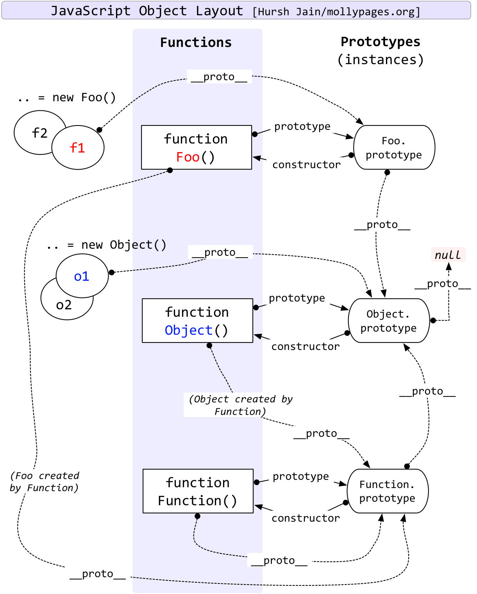
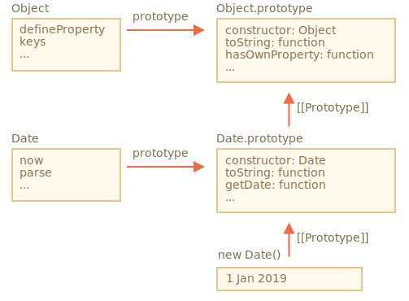
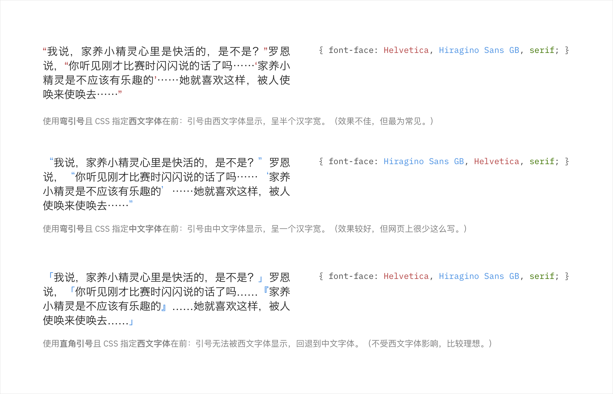

# Full Stack Syntax

[TOC]

## 1 FRONT-END

### 1.1 Markup & Stylesheet

#### 1.1.1 HTML

##### （一）HTML 规则

1. 一个普通的 HTML 页面如下所示，Emmet 缩写 `!` 即可生成

    ```HTML
    <!DOCTYPE html>
    <html lang="en">
      <head>
        <meta charset="UTF-8">
        <meta http-equiv="X-UA-Compatible" content="IE=edge">
        <meta name="viewport" content="width=device-width, initial-scale=1.0">
        <title>Document Name</title>
      </head>
      <body>
        <p> Text </p>
      </body>
    </html>
    ```

2. HTML 中的预留字符必须被替换为字符实体，一些在键盘上找不到的字符也可以使用字符实体来替换

    | 符号       | 实体名称 | 描述                       |
    | ---------- | -------- | -------------------------- |
    | 小于号     | `&lt;`   | 小于号                     |
    | 大于号     | `&gt;`   | 大于号                     |
    | 不换行空格 | `&nbsp;` | 相当于按下空格键，可以累加 |
    | 半角空格   | `&ensp;` | 中文宽度的一半             |
    | 全角空格   | `&emsp;` | 与中文等宽                 |

3. HTML DOM：文档对象模型

    - 节点：HTML 中所有内容都是节点（包括属性，内容，注释）。一般来说，`document` 的子节点是 `html`，`html` 的子节点是 `head` 和 `body`
    - `document`：每个载入浏览器的 HTML 文档都会成为 Document 对象。Document 对象是 Window 对象的一部分，可通过 `window.document` 属性对其进行访问

4. 语义元素

    - 很多网站利用类似 `<div id="nav">`，`<div class="header">`，或 `<div id="footer">` 来定义网站的不同部分，但是 `<div>` 本身没有语义

    - HTML 5 定义了 `<header>`，`<nav>`，`<section>`，`<article>`，`<aside>`，`<figcaption>`，`<figure>`，`<footer>` 来明确网站不同部分的具体意义

        > 除了 `<figcaption>`，其余均为块级元素

5. 引入样式表和脚本

    - 内部样式表：使用标签 `<style> </style>`，然后直接写属性和值

    - 外部样式表：使用标签 `<link>`：在 `<head>` 中引入：

        ```html
        <head>
          <link rel="stylesheet" type="text/css" href="style.css">
        </head>
        ```

    - 引入脚本：使用标签 `<script> </script>`

        ```HTML
        <head>
          <script> console.log(window.document.chileNodes); </script>
          <script src="script.js"></script>
        </head>
        ```

##### （二）Emmet 缩写

1. 属性与内容规定

    - `#` 规定 id，`.` 规定 class，`[attr=cont]` 规定特定的属性， `{cont}` 规定内容

    - 例如，输入 `div.ui.grid#top[title=std]{Text}`，得到如下结果

        ```HTML
        <div class="ui grid" id="top" title="std">Text</div>
        ```

2. 元素关系

    - `sup>sub` 表示 `sub` 是 `sup` 的子元素；`sup+sub` 表示 `sup` 和 `sub` 是同级元；`sub^sup` 表示 `sup` 是 `sub` 的上级元素

    - 例如，输入 `ul.menu>li*4[a=#]{Text}+div.nil`，得到如下结果

        ```HTML
        <ul class="menu">
          <li a="#">Text</li>
          <li a="#">Text</li>
          <li a="#">Text</li>
          <li a="#">Text</li>
          <div class="nil"></div>
        </ul>
        ```

#### 1.1.2 CSS

##### （一）CSS 规则

1. 盒子模型：CSS 盒模型本质上是一个盒子，封装周围的 HTML 元素。可以在浏览器控制台的 Style 标签页的最下方看到这个模型

    - Margin（外边距）：边框外的区域，外边距是透明的

    - Border（边框）：围绕在内边距和内容外的边框

    - Padding（内边距）：清除内容周围的区域，内边距是透明的

    - Content（内容）：盒子的内容，显示文本和图像

        > Outline 是在 Border 外围，可以规定其属性。Outline 不占据盒子模型的空间

2. 单位：下表列出了部分长度单位，其中，只有 `px` 是绝对单位。一般而言，用 `em` 和 `rem` 单元可用于创建良好的可扩展布局

    | 单位   | 描述                     |
    | ------ | ------------------------ |
    | `px`   | 像素                     |
    | `em`   | 相对于元素的字体大小     |
    | `rem`  | 相对于根元素的字体大小   |
    | `vw`   | 相对于视口宽度的 1%      |
    | `vh`   | 相对于视口高度的 1%      |
    | `vmin` | 相对于视口较小尺寸的 1％ |
    | `vmax` | 相对于视口较大尺寸的 1％ |
    | `%`    | 相对于父元素             |

3. 私有前缀：加在某些属性前，暗示该 CSS 属性或规则尚未成为 W3C 标准的一部分
    - `-webkit`：Chrome、Safari
    - `-moz`：Moziila 的 Firefox
    - `-ms`： Microsoft 的 Internet Explorer
    - `-o`：Opera
    
4. 使用 `@media` 查询，可以针对不同的媒体类型定义不同的样式；例如 `@media` 可以针对不同的屏幕尺寸设置不同的样式，如下所示，若文档宽度小于 300 像素则修改背景颜色

    ```css
    @media screen and (max-width: 300px) {
      body {
        background-color: lightblue;
      }
    }
    ```

5. LESS / SCSS / SASS：兼容 CSS 的预处理器

##### （二）选择器

- 部分选择器的参考手册

    | 选择器              | 示例            | 例子描述                                                  |
    | ------------------- | --------------- | --------------------------------------------------------- |
    | `.class`            | `.intro`        | 选择 `class="intro"` 的所有元素。                         |
    | `.class1.class2`    | `.name1.name2`  | 选择 `class` 属性中同时有 `name1` 和 `name2` 的所有元素。 |
    | `.class1 .class2`   | `.name1 .name2` | 选择作为类名 `name1` 元素后代的所有类名 `name2` 元素。    |
    | `#id`               | `#firstname`    | 选择 `id="firstname"` 的元素。                            |
    | `*`                 | `*`             | 选择所有元素。                                            |
    | `element`           | `p`             | 选择所有 `<p>` 元素。                                     |
    | `element.class`     | `p.intro`       | 选择 `class="intro"` 的所有 `<p>`  元素。                 |
    | `element,element`   | `div, p`        | 选择所有 `<div>` 元素和所有 `<p>` 元素。                  |
    | `element element`   | `div p`         | 选择 `<div>` 元素内的所有 `<p>` 元素。                    |
    | `element>element`   | `div > p`       | 选择父元素是 `<div>` 的所有 `<p>` 元素。                  |
    | `element+element`   | `div + p`       | 选择紧跟 `<div>` 元素的首个 `<p>` 元素。                  |
    | `element1~element2` | `p ~ ul`        | 选择前面有 `<p>` 元素的每个 `<ul>` 元素。                 |
    | `[attribute]`       | `[target]`      | 选择带有 `target` 属性的所有元素。                        |
    | `:link`             | `a:link`        | 选择所有未访问链接                                        |
    | `:visited`          | `a:visited`     | 选择所有访问过的链接                                      |
    | `:active`           | `a:active`      | 选择正在活动链接                                          |
    | `:hover`            | `a:hover`       | 把鼠标放在链接上的状态                                    |

##### （三）文档流布局

1. 元素分类与文档流（Normal Flow）

    - HTML 的标签分为块级元素和内联元素。可以通过样式表的 `display` 属性修改 `block` 和 `inline` 来改变元素类别
        - 块级元素（如 `<div>`）：显示时通常以新行开始
        - 内联元素（如 `<span>`）：显示时通常不以新行开始

    - 文档流是文档中可显示对象在排列时所占用的位置

2. 脱离文档流：`float`，`absolute` 与 `fixed` 会脱离文档流

    - `position` 属性

        - `static`：HTML 元素的默认值，即没有定位，遵循正常的文档流对象

        - `relative`：相对定位元素的定位是相对其正常位置。移动相对定位元素，其原本所占的空间不会改变

        - `absolute`：绝对定位的元素的位置相对于最近的已定位父元素，如果元素没有已定位的父元素，那么它的位置相对于 `<html>`。注意：绝对定位元素会被从正常流中删除，并且能够交叠元素

        - `fixed`：元素的位置相对于浏览器窗口是固定位置。注意：Fixed 定位使元素的位置与文档流无关，因此不占据空间

            > 当元素的定位与文档流无关时，可以规定 `z-index` 属性
        
    - `float` 属性：使元素向左或向右移动，其周围的元素也会重新排列
    
        - 一个浮动元素会尽量向左或向右移动，直到它的外边缘碰到包含框或另一个浮动框的边框为止
        - 设置为 `none` 时即为不浮动，元素不会脱离文档流
    
3. 文字流（Text Flow）：文字流与文档流有区别，设置 `float` 属性不会使文字脱离文字流，但是 `absolute` 定位会使文字也脱离文字流

##### （四）弹性布局

1. 通过 `display: flex | inline-flex;` 指定为弹性布局容器。设为 Flex 布局以后，子元素的`float`、`clear` 和 `vertical-align` 属性将失效。容器中有一条主轴和与之垂直的交叉轴
2. 容器属性
    - `flex-direction: row | row-reverse | column | column-reverse;`：主轴的方向
    - `flex-wrap: nowrap | wrap | wrap-reverse;`：主轴是否换行
    - `flex-flow: <flex-direction> || <flex-wrap>;` 方向和换行的总和
    - `justify-content: flex-start | flex-end | center | space-between | space-around;`：在主轴上的对齐方式
    - `align-items: flex-start | flex-end | center | baseline | stretch;`：在交叉轴的对齐方式
    - `align-content: flex-start | flex-end | center | space-between | space-around | stretch;`：定义多根轴线的对齐方式。如果项目只有一根轴线，该属性不起作用
3. 项目属性
    - `order: <integer>;`：定义项目的排列顺序
    - `flex-grow: <number>;`：定义项目的放大比例，默认为 `0`，即如果存在剩余空间，也不放大
    - `flex-shrink: <number>;`：定义项目的缩小比例，默认为 `1`，即如果空间不足，该项目将缩小
    - `flex: none | [ <'flex-grow'> <'flex-shrink'>? || <'flex-basis'> ]`：其中，`auto` 为 `1 1 auto`，`none` 为 `0 0 auto`
    - `align-self: auto | flex-start | flex-end | center | baseline | stretch;`：允许单个项目有与其他项目不一样的对齐方式。默认值为 `auto`，表示继承父元素的 `align-items` 属性

### 1.2 JavaScript

#### 1.2.1 ECMAScript

##### （一）变量与类型

1. 数据类型

    - 基本数据类型：`number, bigint, string, boolean, null, undefined, symbol`

    - 引用数据类型：`object`

        > 使用 `typeof x` 或 `typeof(x)` 可以输出字符串的类型
        >
        > - `typeof null` 的结果是 `object` 是 `typeof` 的行为上的错误
        > - `typeof alert` 的结果是 `function` 是来自于 JavaScript 语言早期的问题。在 JavaScript 中没有 `function` 类型，函数隶属于 `object` 类型

2. 类型转换规则

    - 其他类型转换为 Number 类型：

        | 类型        | 值                                                                                  |
        | ----------- | ----------------------------------------------------------------------------------- |
        | `true`      | `1`                                                                                 |
        | `false`     | `0`                                                                                 |
        | `null`      | `0`                                                                                 |
        | `undefined` | `NaN`                                                                               |
        | string      | 首先去除首尾空格，考察剩余部分。如果是空串转化成 `0`， 否则转化成对应数字或者 `NaN` |

    - 其他类型转化为布尔值：`""`，`null`，`undefined`，`0`， `NaN` 转化为 `false`；其他值转化为 `true`（包括所有对象）

3. 隐式类型转换

    - 运算表达式，字符串会被转化为数字参与运算；但是对于加法，JavaScript 优先转化数字为字符串做拼接运算

    - 对于比较运算，如果是相同类型，则直接比较（比如字符串按照字典序比较）；如果是不同类型，转化为数字后比较

        > 对于两个对象的相等比较，只有为相同引用时相等；如果只有一边为对象，该对象会被转换为原始值后再比较
        >
        > `===` 和 `!==` 是类型安全的严格相等运算符
        >
        > 使用相等 `==` 比较时， `null` 和 `undefined` 只和自己与对方相等；使用严格相等时，两者不等；使用大于等其他运算符时，JavaScript 转化会将之为数字再比较

    - `+` 和 `!!` 可以将变量转化为数字类型和布尔类型

    - `&&` ， `||` 和 `??` 事实上不会做类型转换，`&&` 返回第一个转换成布尔值后为 `false` 的原始表达式；`||` 返回第一个转换成布尔值后为 `true` 的原始表达式；`??` 返回第一个不为 `null` 或 `undefined` 的表达式。对于上述运算符，如果都不存在这样的表达式，则返回最后一个原始表达式的值

        > 依照上述规则，`console.log(console.log(1) && console.log(2));` 会先输出 `1`，然后输出 `undefined`
        >
        > 出于安全原因，JavaScript 禁止将 `??` 运算符与 `&&` 和 `||` 运算符一起使用，除非使用括号明确指定了优先级

4. 对象类型转换

    - 调用 `obj[Symbol.toPrimitive](hint)`：带有 Symbol 键 `Symbol.toPrimitive` 的方法（如果这个方法存在）

        ```javascript
        let alice = {
          name: "Alice",
          age: 14,
          // CANNOT be (hint) => { ... }
          [Symbol.toPrimitive]: function(hint) {
            console.log(hint);
            return hint == "string" ? this.name : this.age;
          }
        };
        
        console.log(String(alice)); // "string"  -> "Alice"
        console.log(+alice);        // "number"  -> 14
        console.log(alice + 1);     // "default" -> 15
        ```

    - 否则，如果 `hint` 是 `"string"`：先尝试 `obj.toString()` ，再尝试 `obj.valueOf()`；如果 `hint` 是 `"number"` 或 `"default"` ：先尝试 `obj.valueOf()` ，再尝试 `obj.toString()`

    - 默认情况下，普通对象具有 `toString` 和 `valueOf` 方法：`toString` 方法返回一个字符串 `"[object Object]"`，`valueOf` 方法返回对象自身

        ```javascript
        let alice = {
          name: "Alice",
          age: 14,
          [Symbol.toPrimitive]() { return this.name; }
        };
        
        console.log(alice.toString());           // "[object Object]"
        console.log(alice.valueOf() === alice);  // true
        ```

        > 在没有 `Symbol.toPrimitive` 的情况下，按照 `hint` 的种类按顺序考察 `toString` 和 `valueOf`，如果两者的返回值都不是原始值则会报错
        >
        > - 如果定义了新的 `toString` 和 `valueOf`，那么默认的两个方法会被覆盖（因为在 Object 原型中）
        >
        > - 定义的两个方法必须返回一个原始值，如果返回了一个对象则会被忽略
        >
        >     ```javascript
        >     const obj = {
        >       toString: () => ({ }),
        >       valueOf: () => 0
        >     };
        >     console.log(String(obj)); // 0
        >     obj.valueOf = () => ({});
        >     console.log(String(obj)); // ERROR
        >     ```

5. 变量作用域

    - `let` 作用域为语句所在的代码块内，不允许在块内重复声明，不存在变量提升；

        - 可以看出，`let` 的行为与 C 中的基本一致，但是 `let` 有暂存死区的概念

            ```javascript
            let temp = 0;
            console.log(temp);    // 2
            if (true)
            {
              // temporary dead zone here
              console.log(temp);  // Reference Error
              let temp = 1;
              console.log(temp);  // 1
            }
            console.log(temp);    // 2
            ```

        - 这个概念的出现与作用域链有关，如果在当前作用域找不到变量（`var`， `let` 或 `const`），就会到上级作用域找同名变量；但是使用 `let` 时，由于作用域内存在该变量但是还没有被定义，所以就会出现一段死区

    - `var` 作用域为语句所在的函数内，允许在块内重复声明，存在变量提升

        - 在函数内的变量只能在函数内使用，在函数外定义的变量（比如在 `if` 语句内）可以全局使用
        - 按照 `var temp; temp = 0;` 方式定义的变量， `var temp;` 会被提升到顶端；按照 `var temp = 0;` 方式定义的变量，顶端会有一个  `var temp;` ，直到 `temp` 被赋值为 `0` 之前，`temp` 的值一直是 `undefined`

        > 在非严格模式下，未经过声明而直接赋值的变量被视作是顶级对象的一个属性；严格模式下，此种做法会报错
        >
        > 在浏览器下，利用 `var` 声明的变量成为 `window` 的一个属性

##### （二）控制语句

1. 在循环语句前定义标签，可以使用 `break <tag>` 跳出特定的循环

    ```javascript
    const targetSum = 13;
    let partFirst = [1, 3, 5, 7, 9], partSecond = [2, 4, 6, 8, 10];
    outerLoop: for (let index = 0; index < partFirst.length; index += 1)
      for (let subIndex = 0; subIndex < partSecond.length; subIndex += 1)
        if (targetSum === partFirst[index] + partSecond[subIndex]) {
          console.log(index, subIndex);
          break outerLoop;
        }
    ```

2. `switch` 语句至少有一个 `case`， `default` 可选；

    - `case` 充当 `switch` 入口的功能，`break` 会跳出 `switch`，否则会继续执行
    - `switch` 和 `case` 可以是任何表达式，采用严格相等的比较方式
    
3. 异常处理：用 `try ~ catch ~ finally` 语句捕捉运行时错误（Runtime Error）

    - `catch (err)` 只接受 `try` 语句内抛出的错误，如果在 `catch` 内抛出错误，只能在外层的 `catch` 接收。注意：不需要 `err` 时，`(err)` 可以省略

        ```javascript
        try {
          try {
            func();
          } catch (err) {
            if (err instanceof ReferenceError) {
              console.log(err.message);
              throw new SyntaxError("Rethrow");
            }
          }
        } catch (err) {
          console.log(err.name, err.message);
        }
        
        // func is not defined
        // SyntaxError Rethrow
        ```

        > Node.JS 的 `process.on("uncaughtException")`与浏览器环境下的 `window.onerror` 属性在未捕获的异常来到全局环境下会被上述内容捕捉，即「全局 `catch`」

    - `throw <errObj>` 可以将任何数据作为错误对象，但最好使用具有 `name` 和 `message` 属性的对象（例如内建 Error 对象）

    - `finally`：无论出现什么情况都要完成完成某个任务

        - `finally` 子句适用于 `try..catch` 的任何出口，包括显式的 `return`。例如，在 `try` 中有一个 `return`。在这种情况下，`finally` 会在控制转向外部代码前被执行
        - 没有 `catch` 子句的 `try..finally` 结构保证 `try` 执行错误的前提下不处理错误，但是会执行完 `finally` 内的语句（需要在外层接收错误）

##### （三）函数

1. 定义：形参列表表明这个函数最多可以接受多少个参数，实际调用传入的参数个数也可以不同。多余的实参会被忽略，不足的实参视作 `undefined`

    - 参数列表用 `=` 规定实参为 `undefined` 时的默认值，用 `...args` 收集多余的参数

        > 在非箭头函数中， `argument` 数组收集了所有的参数

    - 函数表达式 `const f = function() { };` 与函数声明等效，但是函数表达式不会变量提升

2. 闭包：在 JavaScript 中，每个运行的函数，代码块 `{...}` 以及整个脚本，都有一个被称为词法环境的内部隐藏的关联对象。词法环境对象由「环境记录」和「对外部词法环境的引用」两部分组成

    - 当脚本开始运行，词法环境预先填充了所有声明的变量。一个变量是环境记录这个特殊的内部对象的一个属性，在 `let` 声明前，该变量处于「未初始化」状态
    - 当代码要访问一个变量时，首先会搜索内部词法环境，然后搜索外部环境，然后搜索更外部的环境，以此类推，直到全局词法环境
    - 所有的函数都有 `[[Environment]]` 隐藏属性，该属性保存了对创建该函数的词法环境的引用。注意：词法环境仅在可达时才会被保留在内存中

3. 函数对象

    - 属性：`name` 和 `length`（参数个数，不包括 `...rest`）
    - 可以利用 `new Function` 创建函数，但是此时创建的新函数的 `[[Environment]]` 指向全局环境
    

##### （四）对象

1. 对象的属性值为字符串或 Symbol，可以是任何保留字；其他类型会转化为字符串

    - 用 `name` 简写 `name: name`，用 `[]` 包围变量

        ```javascript
        const name = "Alice";
        const id = Symbol("id");
        const alice = {
          [id]: 1,
          name,
          age: 14
        };
        ```

    - 用 `in` 测试属性是否存在，用 `delete` 删除一个键值对

        ```javascript
        const alice = {
          name: "Alice",
          age: undefined
        };
        console.log("age" in alice)    // true
        console.log("salary" in alice) // false
        ```

    - 在对象内部，具有整数属性的键会升序排列，其他键会按照添加顺序排列

2. `new`：当构造函数被使用 `new` 执行时，执行以下步骤

    - 一个新的空对象被创建并分配给 `this`，执行函数体

    - 返回 `this` 的值（如果显示地写了 `return` 并返回了一个对象，那么返回这个对象，否则都返回 `this`）

        ```javascript
        function Person(name, age) {
           if (!new.target) {
            return new Person(name, age);
          }
          this.name = name;
          this.age = age;
        }
        
        const alice = new Person("Alice", 14);
        ```

        > `new.target` 可以检测该函数是否是被通过 `new` 调用的。如果构造函数没有参数，可以省略 `new` 后的括号

3. `this`：箭头函数里没有 `this`，如果访问 `this`，则会从外部获取

    - 在对象中定义的方法中，`this` 指向这个对象（即 `obj.met()` 的 `obj`）

    - 在全局函数中，`this` 指向全局对象 `window`（`use strict` 模式下为 `undefined`）

    - 在函数外，`this` 指向全局对象

    - 在构造函数中，`this` 指向新建对象

        > 将一个方法以函数的方式调用出来，会导致 `this` 指向改变：
        >
        > ```javascript
        > let alice = {
        >     name: "Alice",
        >     age: 14,
        >     printThis: function() { console.log(this); }
        > };
        > 
        > const globalFunction = alice.printThis;
        > const bindFunction = globalFunction.bind(alice);
        > alice.printThis();          // alice
        > globalFunction();           // globalThis
        > globalFunction.call(alice); // alice
        > bindFunction();             // alice
        > ```
        >
        > 注意，如果 `printThis` 是箭头函数，那么 `alice.printThis()` 也输出 `globalThis`
        >
        > 这是因为，点运算符会得到被称为 Reference Type 的一个三元组，`alice.printThis` 得到 `(alice, "printThis", false)`，其中第三个值表明是否在 `use strict` 模式下。此时赋值会将这些信息丢失，只留下 `printThis` 本身，只有 `obj.method()` 或方括号 `obj['method']()` 能保留这个信息

4. 可选链：用 `?.`，`?.[]`，`?.()` 调用可能不存在的键值对或者函数

    - `obj?.prop`：如果 `obj` 存在则返回 `obj.prop`，否则返回 `undefined`

    - `obj.method?.()`：如果 `obj.method` 存在则调用 `obj.method()`，否则返回 `undefined`

        ```javascript
        const user = null;
        let counter = 0;
        
        user?.func(counter++);
        console.log(counter)   // 0
        ```

    - 可以利用 `?.` 安全地读取或者删除，但不能写入，即不能用在赋值语句的左侧

5. 包装类：使原始类型可以调用 `String`、`Number`、`Boolean` 和 `Symbol` 的函数。在调用 `str.toUpperCase()` 时，JavaScript 引擎实现了以下步骤

    - 创建一个包含字符串字面值的特殊对象，并且具有有用的方法如 `toUpperCase()`
    - 该方法运行并返回一个新的字符串，随后特殊对象被销毁，留下原始值 `str`

6. 全局对象：包含应该在任何位置都可见的变量，比如内建方法或环境特定（例：`window.innerHeight`）

    - 全局对象称作 `globalThis`，浏览器中称作 `window`，Node.js 中称作 `global`

7. 解构赋值：`property: variable`，用 `=` 设置默认值，`...rest` 表示剩余值赋给 `rest`。解构赋值的位置可以被写到函数形参列表

    ```javascript
    let defaultTitle = () => "null";
    let options = {
      title: "Menu",
      width: 100,
      height: 200
    };
    
    let {width: w = 100, height: h, title = defaultTitle()} = options;
    console.log(title, w, h);
    ```

    > 注意：问题在于 JavaScript 把主代码流（即不在其他表达式中）的 `{...}` 当做一个代码块，所以需要用括号将已赋值的变量括起来
    >
    > ```javascript
    > let title, width, height;
    > ({title, width, height} = {title: "Menu", width: 200, height: 100});
    > ```

8. 对象的属性和标志

    - 对象的属性除了 `value` 外，还有三个

        - `writable`：值是否可以被修改；`enumerable`：是否在循环中列出；`configurable`：是否可以被删除和修改。一旦被设置为不可配置，就不能被取消
        - 可以用 `Object.getOwnPropertyDescriptor` 获取标志状态，用 `Object.defineProperty` 修改标志

    - 访问器属性：`get` 与 `set` 分别用于访问某一属性，即用属性的方式调用某一函数

        ```javascript
        let alice = {
          name: "Alice",
          surname: "Margatroid",
          age: 14,
          get fullName() {
            return `${this.name} ${this.surname}`
          },
          set fullName(param) {
            [this.name, this.surname] = param.split(" ");
          }
        };
        
        alice.fullName="Alice Ignace"
        ```

9. Prototype：原型，相当于超类。原型引用不能成闭环，且只能为对象或者 `null`

    - `__proto__` 是 `[[Prototype]]` 的 `getter` 和 `setter`，现代规范建议使用函数 `Object.getPrototypeOf` 和 `Object.setPrototypeOf` 来取代 `__proto__`

    - 构造函数 `Func` 的 `prototype` 属性是一个用 `new` 创建新对象时赋值给 `[[Prototype]]` 的变量，默认为 `{ constructor: Func }`

    - `Array.prototype`，`Number.prototype`，`Funtion.prototype` 的原型都是 `Object.protptype`，而 `Object.prototype` 的原型为 `null`，即为顶端

        > 利用 `Array.prototype.func = function() { ... }` 的方法，可以向这个类添加方法，一般用于 Polyfilling
        >
        > `Object`，`Function` 和 `Function.prototype` 的代码不是 JavaScript 实现的（Native Code），所以「Object 是一个 Function 的实例，而 Object 作为 Function 实例同时也是一个 Object 实例」这种从属关系是 `instanceof` 运算的结果，不代表实际构建中逻辑关系的绝对次序
        >
        > 
    
    - `obj instanceof Class` 的计算过程
        - 如果 Class 有静态方法 `Symbol.hasInstance`，那就直接调用这个方法
        - 大多数 Class 没有 `Symbol.hasInstance`，此时 `obj instanceof Class` 将检查 `Class.prototype` 是否等于 `obj` 的原型链中的原型之一

##### （五）异步

1. 单线程异步模型

    - 同步、异步；阻塞、非阻塞
        - 阻塞与非阻塞一般都是同步的。阻塞同步在调用函数后等待返回值，非阻塞同步在调用函数后立即返回，然后用其他方法检测是否有返回值（比如轮询）
        - 异步在调用函数后立即返回，但是返回值交由回调函数执行。主进程**不再理会**函数的返回值情况，这是与同步的根本区别
    - JavaScript 的单线程指 JavaScript 引擎线程，除此之外还有四个线程：事件触发线程，定时器触发线程，异步 HTTP 请求线程，GUI 渲染线程
    - 事件循环与消息队列
        - 消息队列：异步函数在线程池中执行完毕后，将消息压入队列
        - 事件循环：执行栈不会空时，引擎线程正在工作，事件循环被暂停
            - 当执行栈为空时，JavaScript 引擎线程空闲。事件触发线程会从消息队列中取出一个任务（异步函数的回调函数）放入执行栈中执行
            - 执行完毕后执行栈再次为空。事件触发线程会重复上一步操作，继续从消息队列中取出一个任务。如果消息队列中没有消息，则等待直到队列中有消息

2. Promise: `new Promise(executor)`

    - `executor` 是一个函数，接受两个函数参数，第一个是成功运行的回调，第二个是出错时的回调；·这两个函数最多接受一个参数；当 `new Promise` 被创建，`executor` 会自动运行

    - 由 `new Promise` 构造器返回的 `Promise` 对象具有以下内部属性：

        - `state`：最初是 `"pending"`，然后在 `resolve` 被调用时变为 `"fulfilled"`，或者在 `reject` 被调用时变为 `"rejected"`
        - `result`：最初是 `undefined`，然后在 `resolve(value)` 被调用时变为 `value`，或者在 `reject(error)` 被调用时变为 `error`
        - 一旦调用 `resolve` 或 `reject`，这个 `promise` 被称为 `settled`。而且会忽略后面的 `resolve` 或 `reject`

    - 可以将函数 Promise 化，在 Node.js 中，有一个内建的 promisify 函数 `util.promisify`

        ```javascript
        const promisify = (asyncFunction) => function (...args) {
          return new Promise((resolve, reject) => {
            args.push((err, ...res) => err ? reject(err) : resolve(...res));
            asyncFunction.call(this, ...args);
          });
        };
        
        // in Node.js
        const fs = require("fs");
        promisify(fs.readFile)("fileName").then(console.log, console.log)
        ```

3. Promise 的消费者

    - `then/catch`：接受 `resolve` 函数的参数，相当于 `Promise` 的订阅列表。此外，`then` 中函数的第二个参数或者 `catch` 中函数的参数接收 `reject` 函数的参数

        ```javascript
        let promise = new Promise((resolve) => {
          setTimeout(resolve, 1000, Math.random());
        })
        
        promise.then(console.log);
        promise.then((param) => console.log(param * 2));
        ```

        > 注意，如果 Promise 中的函数已经执行完毕，再有新的 `promise.then` 订阅，由于已经执行完并得到结果，所以会立即执行订阅的内容

4. Promise 链

    - 在 `then/catch` 中的返回值会成为下一个 `then` 的结果，这说明这个句柄是忽略异步函数的执行结果的，如果有错误，可以用 `throw` 控制

    - 在  `then/catch`  中返回 Promise 可以进一步控制异步函数执行，而且控制错误处理。返回一个带 `then` 的 `Promise` 会将返回值作为下一个 `then` 的参数

    - 抛出错误或者调用 `reject` 后，会向下找第一个 `catch`，然后继续执行下面的链。写在 `then` 的第二个函数相当于紧接在这个 `then` 后面的 `catch` 函数

    - `finally`：无论执行是否成功都会执行。 `finally` 不接受参数，只会把 `Promise` 的参数传给后面的调用链

        ```javascript
        // try -1 ~ 2 for initNum
        const initNum = 0;
        const errorString = (err) => {
          if (err instanceof Error) return `${err}`;
          else return `Error: ${err}`;
        }
        
        new Promise((resolve, reject) => {
          if (initNum > 0) resolve(initNum * 2);
          else setTimeout(reject, 1000, initNum < 0);
        }).then((num) => {
          console.log(`[1] ${num}`);
          return new Promise((resolve, reject) => {
            setTimeout(() => {
              if (num === 2) reject(true);
              else resolve(num * 2);
            }, 1000);
          })
        }).finally(() => {
          console.log(`[2] Finally`)
        }).catch((err) => {
          console.log(`[3] ${errorString(err)}`)
          if (err) throw Error(-1);
          else return Promise.resolve().then(() => 0);
        }).then((num) => {
          console.log(`[4] ${num}`);
          return new Promise((resolve) => {
            if (num) resolve(num * 2);
          })
        }, (err) => {
          console.log(`[5] ${err}`);
          return err;
        }).then((info) => {
          console.log(`[6] from error = ${info instanceof Error}`)
        });
        ```

5. Promise 函数

    - `Promise.all([...promises...])`：接受一个 `promise` 数组作为参数，返回一个新的 `promise`
        - 如果其中一个 `promise` 被 `reject`，`Promise.all` 就会立即被 `reject`
        - `Promise.all` 可以接受 `promise` 的可迭代对象，如果这些对象中的任何一个不是 `promise`，那么它将被按原样传递给结果数组
    - `Promise.allSettled(iterable)`：等待所有 `promise` 达到 `settled` 状态，返回每个 `promise` 的状态和参数值
    - `Promise.race(iterable)`：与 `Promise.all` 类似，但只等待第一个 `settled` 的 `promise` 并获取其结果（或 `error`）
    - `Promise.resolve(value)`：用结果 `value` 创建一个 `resolved` 的 `promise`。相当于 `new Promise(resolve => resolve(value))`

##### （六）类型实例

1. 数字类型：

    - 调用 number 的方法需要带括号或者多加一个点

        ```javascript
        console.log(123456..toString(36)) // 2n9c
        ```

    - `NaN` 不与任何值相等，包括它自己。需要用 `isNaN` 或者 `Object.is(left, right)` 判定；后者除了可以判定 `NaN` 与 `NaN` 相同，以及 `0` 和 `-0` 不同外，与 `===` 没有其他区别

    - 创建 `bigint` 的方式有两种：在一个整数字面量后面加 `n` 或者调用 `BigInt` 函数，其行为类似于 Ruby 中的 Integer

2. 字符串类型：字符串的内部格式始终是 UTF-16，不依赖于页面编码

    - 转义字符：

        | 字符                                    | 描述                                                                                                                          |
        | :-------------------------------------- | :---------------------------------------------------------------------------------------------------------------------------- |
        | `\b`, `\f`, `\v`                        | 退格，换页，垂直标签 —— 为了兼容性，现在已经不使用了。                                                                        |
        | `\xXX`                                  | 具有给定十六进制 Unicode `XX` 的 Unicode 字符，例如 `'\x7A'` 和 `'z'` 相同。                                                  |
        | `\uXXXX`                                | 以 UTF-16 编码的十六进制代码 `XXXX` 的 unicode 字符，例如 `\u00A9` 是版权符号 `©` 的 unicode。它必须正好是 4 个十六进制数字。 |
        | `\u{X…XXXXXX}`（1 到 6 个十六进制字符） | 具有给定 UTF-32 编码的 unicode 符号。一些罕见的字符用两个 unicode 符号编码，占用 4 个字节。这样我们就可以插入长代码了。       |

    - 代理对：所有常用的字符都是一个 2 字节的代码，稀有的符号被称为「代理对」的一对 2 字节的符号编码。如果一个字符的代码在 `0xd800 ~ 0xdbff` 的范围内，那么它是代理对的第一部分；第二部分必须在 `0xdc00 ~ 0xdfff` 的范围中，这些范围是按照标准专门为代理对保留的

3. 符号类型：使用带有可选描述 `name` 的 `Symbol()` 调用创建的对象

    - 对 Symbol 的描述相同也不是同一个对象

        ```javascript
        const idFirst = Symbol("id");
        const idSecond = Symbol("id");
        
        console.log(idFirst == idSecond);  // false
        ```

        > 对象中的 Symbol 属性不参与 `for` 循环和 `Object.keys` 的结果；但是 `Object.assign` 会复制 Symbol 属性（且是同一个引用），`Object.getOwnPropertySymbols` 可以获取所有 Symbol
        >
        > Symbol 不支持字符串的隐式类型转换

    - **全局 Symbol 注册表**：保证访问相同描述的 Symbol 时，返回相同的引用。注册表内的 Symbol 称为全局 Symbol

        - 使用 `Symbol.for(key)` 在注册表中读取（不存在则创建）Symbol

        - 使用 `Symbol.keyFor(sym)` 通过全局 Symbol 返回一个名字；对于局部 Symbol，`keyFor` 返回 `undefined`

            ```javascript
            const globalSymbol = Symbol.for("name");
            const localSymbol = Symbol("name");
            
            console.log(Symbol.keyFor(globalSymbol)); // name
            console.log(Symbol.keyFor(localSymbol));  // undefined
            console.log(localSymbol.description);     // name
            ```

    - **系统 Symbol**：可以使用它们来改变一些内置行为

4. 数组类型：数组是一种特殊的对象，将数字用作键

    - JavaScript 引擎针对数组做了许多优化，例如尝试把元素存储在连续的内存区域

        - 但如果像使用常规对象一样使用数组（添加一个非数字的属性，制造空洞或倒序填充数组），那么对应的优化就会被关闭

            ```javascript
            let arr = [];
            arr[1048576] = 0;
            arr.name = "Alice";
            ```

        - 此外，`for ... of` 针对作为数组的对象遍历做了优化，而用遍历普通对象的 `for ... in` 遍历数组，则速度较慢，而且会遍历数组的所有属性（比如 `length`）

    - `length` 是属性，手动增加 `length` 值不会发生任何事，减少 `length` 相当于截断数组，特别地，将 `length` 设为 `0` 相当于清空数组

    - 数组没有 `Symbol.toPrimitive`，也没有 `valueOf`，`toString` 转换为逗号分隔的元素列表

        ```javascript
        console.log([] + 1);        // "1"
        console.log([1,2] + 1); // "1,21"
        ```

5. 可迭代对象：可以被定制为可在 `for..of` 循环中使用的对象

    - 为对象添加一个名为 `Symbol.iterator` 的方法，当 `for..of` 循环启动时，它会调用这个方法，返回一个迭代器对象

    - 迭代器对象有 `next` 方法，当 `for..of` 循环希望取得下一个数值，它就调用这个对象的 `next()` 方法。方法返回的结果的格式必须是 `{ done: Boolean, value: any }`，当 `done=true` 时，表示迭代结束，否则 `value` 是下一个值

        ```javascript
        function Range(from, to) {
          this.from = from;
          this.to = to;
          this[Symbol.iterator] = function() {
            return {
              current: this.from,
              last: this.to,
              next() {
                if (this.current < this.last) {
                  return { done: false, value: this.current++ };
                } else {
                  return { done: true };
                }
              }
            };
          }
        }
        
        for (let index of new Range(0, 5)) {
          // index is in [0, 5)
          console.log(index);
        }
        ```

    - 利用 `Array.from` 可将可迭代对象或类数组（有索引和 `length` 属性的对象）转化为数组：

        ```javascript
        const arrayLike = {
          0: "First",
          1: "Second",
          2: "Third",
          length: 3
        }
        const arrIter = Array.from(new Range(0, 5), item => item * item);
        const arrLike = Array.from(arrayLike);
        
        console.log(arrIter);  // [0, 1, 4, 9, 16]
        console.log(arrLike);  // ['First', 'Second', 'Third']
        ```

    - 任何可迭代对象可以被解构赋值。多余的值为 undefined，默认使用 `=`

        ```javascript
        let bit = { };
        [bit.a, bit.b, bit.c, bit.d, bit.e] = new Range(0, 5);
        const [a, b, ...r] = new Range(0, 5);
        
        console.log(bit);      // { a: 0, b: 1, c: 2, d: 3, e: 4 }
        console.log(a, b, r);  // 0 1 [ 2, 3, 4 ]
        ```

6. Error 对象：

    - Error 对象包括名称、描述和调用栈三个属性
    
        ```javascript
        try {
          func();
        } catch (err) {
          console.log(err.name);     // ReferenceError
          console.log(err.message);  // func is not defined
          console.log(err.stack);
          // ReferenceError: func is not defined
          //   at Module._compile (internal/modules/cjs/loader.js:1063:30)
          //   ...
        }
        ```
    
    - Error 对象的名称与构造器的名称相同，描述来自初始化时的参数
    
        ```javascript
        const err = new SyntaxError("This is Message");
        // SyntaxError This is Message
        console.log(err.name, err.message);
        ```
    
7. 映射对象区别于对象，`Map` 对象的「键」可以是任何值；方括号访问的是 `Map` 对象的平凡属性

    - 弱映射的「键」必须是对象，如果在 `WeakMap` 中使用一个对象作为键，并且没有其他对这个对象的引用，那么该对象将会被从内存（和 `Map`）中自动清除。同理，弱集合类似于弱映射

8. `ArrayBuffer`：对固定长度的连续内存空间的引用。`new ArrayBuffer(n)` 会分配一个 `n` 字节的连续内存空间，并用 0 进行预填充

    - `TypedArray`：视图对象的总称，用它解释存储在 `ArrayBuffer` 中的字节
        - `Uint8Array` ：将 `ArrayBuffer` 中的每个字节视为 0 到 255 之间的单个数字，称为「8 位无符号整数」
        - `Uint16Array`：将每 2 个字节视为一个 0 到 65535 之间的整数，称为「16 位无符号整数」
        - `Uint32Array`：将每 4 个字节视为一个 0 到 4294967295 之间的整数，称为「32 位无符号整数」
        - `Float64Array`：将每 8 个字节视为一个 `5.0x10-324` 到 `1.8x10308` 之间的浮点数
    - `DataView` 是在 `ArrayBuffer` 上的一种特殊的灵活「未类型化」视图。它允许以任何格式访问任何偏移量的数据
        - 对于类型化的数组，构造器决定了其格式。整个数组应该是统一的。第 `i` 个数字是 `arr[i]`
        - 通过 `DataView`，可以使用 `.getUint8(i)` 或 `.getUint16(i)` 之类的方法访问数据。此时格式在调用方法时选择，而不是在构造时
    - `Blob` 由一个可选的字符串 `type`（通常是 MIME 类型）和 `blobParts`（一系列其他 `Blob` 对象，字符串和 `BufferSource`）组成
        - `File` 对象继承自 `Blob`，并扩展了与文件系统相关的功能

##### （七）正则表达式

1. 定义

    - `new RegExp("pattern", "flags")`
    - `regexp = /pattern/g`，修饰符有五个：
        - `i`：搜索时不区分大小写
        
        - `g`：搜索时查找所有的匹配项，而不只是第一个
        
        - `m`：多行模式，仅对 `^` 和 `$` 有效
        
        - `u`：开启完整的 Unicode 支持（修正对于代理对的处理）并支持 `\p{...}`
        
        - `y`：粘滞模式，从位置 `regexp.lastIndex` 开始搜索指定模式
        
            ```javascript
            let str = 'let varName = "value"';
            let regexp = /\w+/y;
            regexp.lastIndex = 3;
            console.log(regexp.exec(str)?.[0]);  // undefined
            regexp.lastIndex = 4;
            console.log(regexp.exec(str)?.[0]);  // varName
            ```

2. 与正则表达式有关的方法

    - `str.match(regexp)` ：在字符串 `str` 中找到匹配 `regexp` 的字符

        - 如果 `regexp` 不带有 `g` 标记，则它以数组的形式返回第一个匹配项，其中包含分组和属性 `index`（匹配项的位置）、`input`（输入字符串）
        - 如果 `regexp` 带有 `g` 标记，则它将所有匹配项的数组作为字符串返回，而不包含分组和其他详细信息
        - 如果没有匹配项，则无论是否带有标记 `g` ，都将返回 `null`

    - `str.matchAll(regexp)` ： `str.match` 的变体

        - 它返回包含匹配项的可迭代对象，而不是数组。可以用 `Array.from` 从中得到一个常规数组
        - 每个匹配项均以包含分组的数组形式返回（返回格式与不带 `g` 标记的 `str.match` 相同）
        - 如果有结果，则返回的不是 `null`，而是一个空的可迭代对象

    - `str.split(regexp|substr, limit)`：使用正则表达式或子串作为分隔符来分割字符串

    - `str.search`：查找模式并返回匹配项在字符串中的位置，没有找到返回 `-1`

    - `str.replace(reg, dst)`：替换 `str` 中所有符合 `reg` 模式为 `dst`

        - 当 `dst` 为字符串时，替换成目标串，可以使用以下特殊字符

            | 变量名          | 代表值                                    |
            | --------------- | ----------------------------------------- |
            | `$$`            | `$`                                       |
            | `$&`            | 匹配的子串                                |
            | <code>$`</code> | 匹配的子串左边的内容                      |
            | `$'`            | 匹配的子串右边的内容                      |
            | `$n`            | 第 `n` 个括号匹配的字符串（`n` 小于 100） |
            | `$<Name>`       | 命名组                                    |

        - 当 `dst` 为函数时，传入 `dst` 的参数列表如下，替换为该函数的返回值：

            | 变量名              | 代表值                               |
            | ------------------- | ------------------------------------ |
            | `match`             | 匹配的子串                           |
            | `p1,p2, ...`        | 第 `n` 个括号匹配的字符串            |
            | `offset`            | 匹配到的子字符串在原字符串中的偏移量 |
            | `string`            | 被匹配的原字符串                     |
            | `NamedCaptureGroup` | 命名捕获组匹配的对象                 |
        
    - `regexp.exec(str)` ：返回字符串 `str` 中的 `regexp` 匹配项

        - 如果没有 `g`，那么 `regexp.exec(str)` 返回的第一个匹配与 `str.match(regexp)` 完全相同。这没什么新的变化
        - 但是，如果有标记 `g`，则调用 `regexp.exec(str)` 会返回第一个匹配项，并将紧随其后的位置保存在属性 `regexp.lastIndex` 中。 -下一次同样的调用会从位置 `regexp.lastIndex` 开始搜索，返回下一个匹配项，并将其后的位置保存在 `regexp.lastIndex` 中。如果没有匹配项，则 `regexp.exec` 返回 `null`，并将 `regexp.lastIndex` 重置为 `0`

    - `regexp.test(str)`：检查是否有指定的模式，返回布尔值

3. 元字符

    - 集合和范围 `[...]`，排除，字符类及其反向类

        - `\d`：从 `0` 到 `9` 的字符，相当于 `[0-9]`

        - `\s`：包括空格，制表符 `\t`，换行符 `\n` 和其他少数稀有字符，例如 `\v`，`\f` 和 `\r`，相当于 `[\t\n\v\f\r ]`

        - `\w`：拉丁字母，数字或下划线 `_`，相当于 `[a-zA-Z0-9_]`

        - `\D`，`\S` 和 `\W`：是 `\d`，`\s` 和 `\w` 的补集。例如，`\D` 相当于 `[^0-9]`

            > 在方括号内不需要转义，但也可以转义

        - 词边界 `\b`：有三种不同的位置可作为词边界。例如 `/\bJava\b/` 匹配 `"Hello, Java!"`，但不匹配 `"Hello, JavaScript!"`

            - 在字符串开头，如果第一个字符是单词字符 `\w`
            - 在字符串中的两个字符之间，其中一个是单词字符 `\w`，另一个不是
            - 在字符串末尾，如果最后一个字符是单词字符 `\w`

    - 转义字符：`\[`，`\\`，`\^`，`\$`，`\.`，`\|`，`\?`，`\*`，`\+`，`\(`和`\)`

        - 在 `/.../` 内部（但不在 `new RegExp` 内部），还需要转义 `/`
        - 传递一个字符串给 `new RegExp` 时，需要双倍反斜杠 `\\`

    - 量词

        - 重复，比如 `\d{4}` 为四位数，`\d{2,}` 为两位以上的数字
        - 贪婪匹配：`+`：至少一个，相当于 `{1,}`，`*`：任意个，相当于 `{0,}`，`?`：最多一个，相当于 `{0,1}`
        - 懒惰匹配：`+?`，`*?`，`??`：尽可能少地匹配字符

    - 捕获组 `(...)`：在 `match` 下使用不带全局修饰符的正则表达式，在 `matchAll` 下使用带全局修饰符的正则表达式，返回捕获组得到的可迭代对象，每当对它进行迭代时才会执行搜索

        - 括号可以嵌套，结果按照开符号顺序给出

            ```javascript
            let str = '<span class="my">';
            // ['<span class="my">', 'span class="my"', 'span', 'class="my"']
            console.log(str.match(/<(([a-z]+)\s*([^>]*))>/));
            ```

        - 命名组：以 `(?<name>...)` 的形式对组命名

            ```javascript
            let dateRegexp = /(?<year>[0-9]{4})-(?<month>[0-9]{2})-(?<day>[0-9]{2})/;
            // { year: '2019', month: '04', day: '30' }
            console.log("2019-04-30".match(dateRegexp).groups);
            ```

        - 反向引用：在模式本身中使用捕获组的内容，保证找到的内容与第一次的相同，下面的例子中，只会寻找一对单引号或双引号围起来的内容。如果是命名组，也可以用 `\k<name>`：

            ```javascript
            let str = `He said: "She's the one!".`;
            console.log(str.match(/(['"])(.*?)\1/g))  // [`"She's the one!"`]
            ```

        - 作为整体，比如将 `(...)?` 作为可选组，或者 `before(XXX|YYY)after` 作为选择，此时如果不想让结果出现在结果中，可以以 `(?:...)` 的形式排除这一组

    - 通配符`.`：与「除换行符之外的任何字符」匹配

        > 如果想要匹配任何字符，可以用其他方法
        >
        > - `[\s\S]` 或 `[^]` 等模式可以匹配任何字符，其中
        > - `/./s` 在部分浏览器可以支持匹配任何字符

    - 锚点符 `^` 和 `$` ：匹配文本开头和末尾。在多行模式下，它们不仅仅匹配文本的开始与结束，还匹配每一行的开始与结束

    - 前瞻断言与后瞻断言

        | 模式      | 类型         | 匹配                      |
        | :-------- | :----------- | :------------------------ |
        | `x(?=y)`  | 前瞻肯定断言 | `x` ，仅当后面跟着 `y`    |
        | `x(?!y)`  | 前瞻否定断言 | `x` ，仅当后面不跟 `y`    |
        | `(?<=y)x` | 后瞻肯定断言 | `x` ，仅当跟在 `y` 后面   |
        | `(?<!y)x` | 后瞻否定断言 | `x` ，仅当不跟在 `y` 后面 |

    - Unicode 属性 `\p{...}` ：寻找具有描述性质的符号，例如用 `\p{sc=Han}` 寻找汉字，用 `\p{Sm}` 寻找数学符号

##### （八）类与继承

1. `class` 关键字：`class` 得到一个构造函数，所以可以作为返回值

    - 声明的函数在 `prototype` 中，`new` 调用定义的 `constructor` 函数

        - 声明的函数可以是 `getter` / `setter`

        - 使用中括号 `[...]` 可以动态计算方法名称（不可以用该类的 `this`）

            ```javascript
            const typeFormatted = (type) =>
              type.slice(0, 1).toUpperCase() + type.slice(1).toLowerCase();
            
            function detailPerson(type) {
              return class Person {
                constructor(name, age, typeValue) {
                  this.name = name;
                  this.age = age;
                  this[type] = typeValue;
                }
            
                show() {
                  console.log(this);
                }
                showAge() {
                  console.log(this.age);
                }
                ["show" + typeFormatted(type)]() {
                  console.log(this[type]);
                }
              }
            }
            
            const Student = detailPerson("score");
            const alice = new Student("Alice", 14, 96);
            alice.showScore();
            ```

    - 类字段定义的值不在 `prototype` 中，而在每个新建的函数中都有一份该字段的内容。下例中，每一个 Button 对象的 `click` 都和这个对象绑定（必须要用箭头函数，否则仍是 `undefined`），相当于 `constructor` 内的 `innerClick` 函数

        ```javascript
        class Button {
          constructor(value) {
            this.value = value;
            this.innerClick = function() {
              console.log(this.value);
            }.bind(this);
          }
          click = () => {
            console.log(this.value);
          }
        }
        
        let button = new Button("Hello.");
        setTimeout(button.click, 1000);
        ```

    - `class` 定义的类型与构造函数有一定区别：

        - 通过 `class` 创建的函数具有特殊的内部属性标记 `[[IsClassConstructor]]: true`
        - 类定义将 `"prototype"` 中的所有方法的 `enumerable` 标志设置为 `false`，所以类方法不可枚举
        - 类构造中的所有代码都将自动进入严格模式

2. 类的继承

    - 使用 `extends` 与 `super` 关键字构造子类，下例中 Student 类的 `prototype` 的 `[[prototype]]` 属性是 `Person.prototype`

        ```javascript
        class Person {
          constructor(name, age) {
            this.name = name;
            this.age = age;
          }
        
          show() {
            console.log(this);
          }
          showAge() {
            console.log(this.age);
          }
        }
        
        class Student extends Person {
          constructor(name, age, score) {
            super(name, age);
            this.score = score;
          }
        
          showScore() {
            console.log(this.score);
          }
        }
        ```

        > 这个过程用 `prototype` 的写法类似如下过程，在 Student 的构造函数中，不使用 `new` 调用 `Person` 且传入 `Student` 新建的对象作为 Person 的 `this`，这个过程模仿了 `super`
        >
        > ```javascript
        > function Person(name, age) {
        >   this.name = name;
        >   this.age = age;
        > }
        > 
        > Person.prototype = {
        >   show: function () {
        >     console.log(this);
        >   },
        >   showAge: function () {
        >     console.log(this.age);
        >   }
        > }
        > 
        > function Student(name, age, score) {
        >   Person.call(this, name, age);
        >   this.score = score;
        > }
        > 
        > Student.__proto__ = Person;
        > Student.prototype = {
        >   showScore: function () {
        >     console.log(this.score);
        >   },
        >   __proto__: Person.prototype
        > }
        > 
        > const alice = new Student("Alice", 14, 96);
        > alice.showAge();  // 14
        > console.log(
        >   alice.__proto__.__proto__.__proto__ === Object.prototype
        > );                // true
        > ```
        >
        > `Student extends Person` 创建了两个 `[[Prototype]]` 引用：
        >
        > 1. `Student` 函数原型继承自 `Person` 函数
        > 2. `Student.prototype` 原型继承自 `Person.prototype`

        - `extends` 关键字后可以指定任意表达式，例如一个返回 `class` 的 `function`
        - `super` 关键字：执行 `super.method(...)` 来调用一个父类方法，执行 `super(...)` 来调用一个父类 `constructor`（只能在 `constructor` 中）
            - 箭头函数没有 `super`，如果在方法内的普通函数使用 `super` 会报错

    - 重写 `constructor`：子类的 `constructor` 必须调用 `super(...)`，并且一定要在使用 `this` 之前调用。如果不指定 `constructor`，将自动生成一个如下类

        ```javascript
        class Student extends Person {
          constructor(...args) {
            super(...args);
          }
        }
        ```

        > 在 JavaScript 中，子类的构造器具有特殊的内部属性 `[[ConstructorKind]]:"derived"`，当通过 `new` 执行一个常规函数时，它将创建一个空对象，并将这个空对象赋值给 `this`；但是当继承的 `constructor` 执行时，它不会执行此操作。它期望父类的 `constructor` 来完成这项工作

    - 重写类字段：对于类字段，父类构造器总是使用父类的字段，这是因为类字段的初始化方式不同

        - 对于父类（未继承任何类），在构造函数调用前初始化
        - 对于子类，在 `super()` 后立刻初始化

        ```javascript
        class Person {
          name = "PersonName";
          constructor() {
            console.log(this.name);
            this.show();
          }
          show() {
            console.log("from Person");
          }
        }
        
        class Student extends Person { 
          name = "StudentName";
          show() {
            console.log("from Student");
          }
        }
        
        new Person();   // PersonName from Person
        new Student();  // PersonName from Student
        ```

3. 类的静态属性和静态方法

    - 类中以 `static` 开头的函数将方法赋予给类函数本身，以 `static` 开头的变量将将值赋予给类函数

    - 静态属性和方法是可被继承的，子类的构造函数 `[[prototype]]` 指向父类的构造函数

        > 内建类相互间不继承静态方法。例如 `Date.prototype.__proto__` 是 `Object.prototype`，但是 `Date.__proto__` 不指向 `Object`
        >
        > 

4. 受保护的属性与私有属性

    - 一般约定以 `__varname` 的形式定义受保护的属性，然后利用 `setter` / `getter` 读写这个属性

    - 私有属性和方法应该以 `#` 开头，它们只在类的内部可被访问，而无法从外部或从继承的类中访问它

        ```javascript
        class CoffeeMachine {
          #waterAmount = 0;
          get waterAmount() {
            return this.#waterAmount;
          }
          set waterAmount(value) {
            if (value < 0) throw new Error("Negative water");
            this.#waterAmount = value;
          }
        }
        
        let machine = new CoffeeMachine();
        machine.waterAmount = 100;
        console.log(machine.#waterAmount);  // Error
        ```

        - 私有字段与公共字段不会发生冲突
        - 私有字段不能通过 `this[name]` 访问

5. Mix-in 模式：一个包含可被其他类使用而无需继承的方法的类，即提供了实现特定行为的方法，但是不单独使用它，而是使用它来将这些行为添加到其他类中的一种模式

##### （九）模块

1. 核心功能
    - 如果同一个模块被导入到多个其他位置，那么它的代码仅会在第一次导入时执行，然后将导出的内容提供给所有的导入
    - 模块始终默认使用 `use strict`
    - 每个模块都有自己的顶级作用域，且在一个模块中，顶级 `this` 是 `undefined`
2. 构建工具：在实际开发中，浏览器模块很少被以原始形式进行使用。通常会使用一些特殊工具（例如 Webpack），将它们打包在一起，然后部署到生产环境的服务器
    - 构建工具的功能
        - 从一个打算放在 HTML 中的 `<script type="module">` 主模块开始
        - 分析依赖：它的导入，以及它的导入的导入等
        - 使用所有模块构建一个文件（或者多个文件），并用打包函数替代原生的 `import` 调用，以使其正常工作。还支持像 HTML/CSS 模块等特殊的模块类型
    - 构建工具的优化
        - 删除无法访问的代码，未使用的导出以及特定于开发的语句（例如 `console` 或 `debugger`）
        - 使用 Babel 等工具将前沿的现代 JavaScript 语法转换为具有类似功能的旧语法
        - 压缩生成的文件（删除空格，用短的名字替换变量等）
    - 最终打包好的脚本中不包含任何 `import` / `export`，也不需要 `type="module"`，二十可以将其放入常规的 `<script src="bundle.js" />`

3. 导入与导出

    - 导出：在声明之前放置 `export` 来标记任意声明为导出，或者将 `export` 分开放置

        ```javascript
        // api.js
        export let seasons = ["Spring", "Summer", "Fall", "Winter"];
        export const STANDARD_YEAR = 2015;
        
        export class Person {
          constructor(name, age) {
            this.name = name;
            this.age = age;
          }
        }
        
        function sum(left, right) {
          return left + right;
        }
        function mul(left, right) {
          return left * right;
        }
        export { sum, mul as multiple };
        ```

    - 导入：利用 `import * as` 将所有内容导入为一个对象

        ```javascript
        // main.js
        import { sum, multiple as mul } from "./api";
        import * as api from "./api";
        
        console.log(mul(2, 2)); // 4
        ```

    - `export default` 导出默认的变量，需要以 `import obj from "..."` 的形式导入。注意：导入不需要加大括号，导入的名字就是导入模块的别名

        ```javascript
        export default ["Spring", "Summer", "Fall", "Winter"];
        export default class {
          constructor() {
            // do_something();
          }
        }
        export default function(user) { // 没有函数名
          // do_something();
        }
        ```

        > 在某些情况下，`default` 关键词被用于引用默认的导出
        >
        > ```javascript
        > // api.js
        > function showThis() {
        >   console.log(this);
        > }
        > 
        > export { showThis as default };
        > 
        > // main.js
        > import { default as showThis } from "./api";
        > import * as api from "./api";
        > 
        > showThis();
        > api.default();
        > ```

    - 重新导出语法 `export ... from ...` 允许导入内容，并立即将其导出，适用于包开发。例如，下面是重新导出命名导出和默认导出

        ```javascript
        export * from "./api";
        export { default } from "./api";
        ```

4. 动态导入：`import(module)` 表达式（不是函数）加载模块并返回一个 `promise`，该 `promise` 的 `resolve` 为一个包含其所有导出的模块对象，可以在代码中的任意位置调用这个表达式

#### 1.2.2 TypeScript

##### （一）类型

1. 变量声明：数字、字母、下划线和美元符号，不能以数字开头

    - 声明变量的类型，但没有初始值，变量值会设置为 `undefined`

    - 声明变量并初始值，但不设置类型，该变量可以是任意类型（如果可以推断，则推断为某种类型，否则为 `any`）

        ```typescript
        var one:string = "String";  // string, "String"
        var two:string;             // string, undefined
        var three = "String";       // string, "String"
        var four;                   // any, undefined
        ```

2. 变量类型

    - JavaScript 原生类型，其中，`undefined` 与 `null` 是其他类型的子类型

        | 数据类型    | 描述                       |
        | ----------- | -------------------------- |
        | `number`    | 双精度 64 位浮点数         |
        | `string`    | 字符串                     |
        | `boolean`   | 布尔值                     |
        | `undefined` | 初始化变量为一个未定义的值 |
        | `null`      | 对象值缺失                 |
        | `Array`     | 一系列同类型的数据         |

        ```typescript
        let arr: number[] = [1, 2];
        let arr: Array<number> = [1, 2];
        ```

    - TypeScript 新增类型

        | 数据类型 | 描述                                                         |
        | -------- | ------------------------------------------------------------ |
        | `enum`   | 数值集合                                                     |
        | `any`    | 任意类型                                                     |
        | `void`   | 用于标识方法返回值的类型，表示该方法没有返回值               |
        | `never`  | 其它类型的子类型，代表从不会出现的值                         |
        | `Tuple`  | 已知元素数量和类型的数组各元素的类型不必相同，对应位置的类型需要相同 |

        ```typescript
        enum Color { Red, Green, Blue };
        let blue: Color = Color.Blue;
        let input: any = null;
        let tup: [string, number] = ["Alice", 14];
        function echo(str: string): void { console.log(str); }
        ```

3. 联合类型：利用管道符将变量设置多种类型

    ```typescript
    let times: number|boolean = 1;
    console.log(times = false);
    console.log(times = 0);
    ```

##### （二）函数与类

1. 函数（包括箭头函数）在参数列表内和其后用 `:` 示意值类型，用 `?` 表示可选参数

    ```typescript
    function catName(firstName: string, lastName?: string): string {
      return firstName + " " + (lastName ?? "");
    }
    console.log(catName("Alice", "Ignace"));
    ```

    - 可以用 `=` 设置默认参数，用 `...` 接受剩余参数
    - 由于 TypeScript 有类型系统，所以函数可以重载，即参数列表类型的同名函数

2. 类的数据成员：字段（类里面声明的变量，字段表示对象的有关数据），构造函数（类实例化时调用，可以为类的对象分配内存），方法（为对象要执行的操作）

    ```typescript
    class Person {
      name: string;
      age: number;
      constructor(name: string, age: number) {
        this.name = name;
        this.age = age;
      }
      changeName(newName: string): string {
        let previousName = this.name;
        this.name = newName;
        return previousName;
      }
    }
    
    let alice: Person = new Person("Alice", 14);
    alice.changeName("Elise");
    console.log(alice.name);
    ```

    - 类继承使用关键字 `extends`，子类除了不能继承父类的私有成员和构造函数，其他的都可以继承

        ```typescript
        class Student extends Person {
          score: number;
          updateScore(newScore: number): number {
            let previousScore = this.score;
            this.score = newScore;
            return previousScore;
          }
        }
        
        let alice: Student = new Student("Alice", 14);
        alice.changeName("Elise");
        alice.updateScore(96);
        console.log(alice.score);
        ```

##### （三）接口

1. 接口：只存在于 TypeScript，用于编译的语法

    ```typescript
    interface RunOptions { 
      program: string; 
      commandLine: string[]|string|(()=>string); 
    }
    options = {
      program: "main",
      commandline: ["Hello", "World"]
    };
    ```

    - 接口可以用于定义数组

        ```typescript
        interface names {
          [index: number]: string
        }
        interface ages {
          [index: string]: number
        }
        
        let nameList: names = ["Alice", "Lia"]
        let ageList: ages;
        ageList["Alice"] = 14
        ```

    - 接口也可以通过 `extends` 继承

2. 模块：通过 `export interface` 导出接口，利用声明文件 `d.ts`，就可以对引入的依赖函数进行语法检查

    ```typescript
    // lib.d.ts
    declare module Lib {
      export class Calc {
        sum(left: number, right: number): number;
      }
    }
    
    // main.ts
    /// <reference path = "lib.d.ts" />
    var obj = new Lib.Calc();
    console.log(obj.sum(1, 2));
    ```

#### 1.2.3 jQuery

##### （一）jQuery 规则

1. 入口函数：为了防止文档在完全加载之前运行 jQuery 代码，即在 DOM 加载完成后才可以对 DOM 进行操作

    ```javascript
    $(document).ready(function(){
      // jQuery code here
    });
    // or more simple
    $(function(){
      // jQuery code here
    });
    ```

2. jQuery 链允许在在相同的元素上用一条语句中运行多个 jQuery 方法，例如 `$("#para").fadeOut().fadeIn();` 将会按顺序执行淡入和淡出

##### （二）选择器

- jQuery 使用的语法是 XPath 与 CSS 选择器语法的组合，`$` 是 jQuery 的 `querySelector` 函数

    | 语法实例                   | 描述                                                           |
    | -------------------------- | -------------------------------------------------------------- |
    | `$("*")`                   | 选取所有元素                                                   |
    | `$(this)`                  | 选取当前 HTML 元素                                             |
    | `$("p.intro")`             | 选取 `class` 为 `intro` 的 `<p>` 元素                          |
    | `$("p:first")`             | 选取第一个 `<p>` 元素                                          |
    | `$("ul li:first")`         | 选取第一个 `<ul>` 元素的第一个  `<li>` 元素                    |
    | `$("ul li:first-child")`   | 选取每个 `<ul>` 元素的第一个  `<li>` 元素                      |
    | `$("[href]")`              | 选取带有 `href` 属性的元素                                     |
    | `$("a[target='_blank']")`  | 选取所有 `target` 属性值等于  `"_blank"` 的 `<a>` 元素         |
    | `$("a[target!='_blank']")` | 选取所有 `target` 属性值不等于  `"_blank"` 的 `<a>` 元素       |
    | `$(":button")`             | 选取所有 `type="button"` 的  `<input>` 元素 和 `<button>` 元素 |

### 1.3 Front-end Framework

#### 1.3.1 Webpack

#### 1.3.2 React.js

React 和 Material UI 的初始化较为缓慢，建议直接使用 [CodeSandbox](https://codesandbox.io/) 等网站进行 Snippet 测试

##### （一）构建与理念

1. 使用 `create-react-app` 可以直接构建单页应用的脚手架，默认目录如下：

    ```shell
    app
    ├── README.md
    ├── node_modules
    ├── package.json
    ├── .gitignore
    ├── public
    │   ├── favicon.ico
    │   ├── index.html
    │   └── manifest.json
    └── src
        ├── App.css
        ├── App.js
        ├── App.test.js
        ├── index.css
        ├── index.js
        ├── logo.svg
        └── serviceWorker.js
    ```

2. React 理念：组合优于继承

    - 因为前端的逻辑性和复用性较弱，只需组合就可以满足日常的业务需求

    - 继承：所有标签内的内容在 `props.children` 中

        ```jsx
        function Root(props) {
          const { children } = props;
          return (
            <main style={{ display: "flex" }}>
              {children}
            </main>
          );
        }
        ```

##### （二）props 与 state

1. `props` 在组件定义中充当常量的作用，组件无论是使用函数声明还是通过 `class` 声明，都决不能修改自身的 `props`。对于布尔值，只要写下值就是 `true`

    ```jsx
    import React from 'react'
    import ReactDOM from 'react-dom';
    
    function Welcome(props) {
      return <h1>Hello{props.append ? `, ${props.name}!` : "!"}</h1>;
    };
    
    ReactDOM.render(
      <Welcome append name="Alice"/>,
      document.getElementById('root')
    );
    ```

    函数也可以写成类的形式

    ```jsx
    class Welcome extends React.Component {
      render() {
        return <h1>Hello{this.props.append ? `, ${this.props.name}!` : "!"}</h1>;
      }
    }
    ```

2. `state` 和 `props` 不同，它的内容可以被改变。并且，除了拥有并设置了它的组件，其他组件都无法访问 `state` 。下面的例子中构建了一个简单的时钟，使用了 `state` 定时变化的特性。从下例可以看出 `state` 相关的一些要点

    ```jsx
    class Clock extends React.Component {
      constructor(props) {
        super(props);
        this.state = {date: new Date()};
      }
    
      componentDidMount() {
        this.timerID = setInterval(
          () => this.tick(),
          1000
        );
      }
    
      componentWillUnmount() {
        clearInterval(this.timerID);
      }
    
      tick() {
        this.setState({
          date: new Date()
        });
      }
    
      render() {
        return (
          <div>
            <h1>Hello, world!</h1>
            <h2>It is {this.state.date.toLocaleTimeString()}.</h2>
          </div>
        );
      }
    }
    
    ReactDOM.render(
      <Clock />,
      document.getElementById('root')
    );
    ```

    - `constructor()` 函数的 `props` 必须继承 `React.Component` 类的初始化方法，但是 `state` 可以自由定义。类中除了 `props` 和 `state` 之外，还可以自定义其他的成员（比如 例子中的 `timerID`）

    - `componentDidMount()` 和 `componentWillUnmount()` 分别在组件建立和销毁时自动调用，两个函数不接受参数

    - 通过 `setState()` 改变 `state`，React 重新调用 `render()` 方法来确定页面上的显示内容

        - `state` 的更新可能是异步的，如果更新依赖上一次的 `state` 值，应该使用以下的匿名函数作为参数

            ```jsx
            this.setState((state, props) => ({
              counter: state.counter + props.increment
            }));
            ```

        - `state` 的更新会被合并
        
    - 将如果子元素的 `state` 是由父元素的 `state` 通过 `props` 传递而来，要将子元素的状态变化传递上去，需要使用到变量提升的技术（此时 `props` 提供的函数相当于一个父元素提供用于改变状态的接口）

4. 设计时，通过检查以下问题来确定目标参数不是 `state`：

    - 该数据是否是由父组件通过 `props` 传递而来的
    - 该数据是否随时间的推移而保持不变
    - 能否根据其他 `state` 或 `props` 计算出该数据的值

##### （三）组件控制

1. 利用与运算符可以很方便地进行条件渲染，这是因为在 JavaScript 中，`true && expression` 总是会返回 `expression`, 而 `false && expression` 总是会返回 `false`

    ```jsx
    function Mailbox(props) {
      const unreadMessages = props.unreadMessages;
      return (
        <div>
          <h1>Hello!</h1>
          {unreadMessages.length > 0 &&
           <h2> You have {unreadMessages.length} unread messages. </h2>}
        </div>
      );
    }
    
    const messages = ['React', 'Re: React', 'Re:Re: React'];
    ReactDOM.render(
      <Mailbox unreadMessages={messages} />,
      document.getElementById('root')
    );
    ```

2. 批量渲染类似的元素可以采用数组的形式，如下例所示。注意，创建一个元素时，建议包括一个特殊的 `key` 属性

    ```jsx
    function Bat(props) {
      return(
      <ul>
        {Array(props.size)
           .fill(props.size)
           .map((_, i) =>
                <li key={i}>{i}</li>
            )}
      </ul>);
    };
    
    ReactDOM.render(
      <Bat size={16}/>,
      document.getElementById('root')
    );
    ```
    
    > JavaScript 的基本类型中，React 会渲染 `number`，`string`（以及其对应的类），而忽略 `boolean`，`null`，`undefined`，`symbol`；在对象中，React 会渲染 Array，但遇到一般对象会报错
    
3. 使 React 的 `state` 成为唯一数据源，渲染表单的 React 组件还控制着用户输入过程中表单发生的操作，被 React 以这种方式控制取值的表单输入元素就叫做受控组件。下例中，`onChange={handleChange}` 让 `textarea` 的内容可以实时变化，`value` 存储了文本框的值

    ```jsx
    function EssayForm() {
      const [value, setValue] = React.useState(
        "Please write an essay about your favorite DOM element."
      );
      const handleChange = (event) => {
        setValue(event.target.value);
      };
    
      const handleSubmit = (event) => {
        event.preventDefault();
        console.log(value);
      };
    
      return (
        <form onSubmit={handleSubmit}>
          <label>
            Essay:
            <textarea value={value} onChange={handleChange} />
          </label>
          <input type="submit" value="Submit" />
        </form>
      );
    }
    ```

##### （四）React Hook

1. `useState` 允许在函数中使用状态。`useState(default)` 创建了一个状态 `count` 和用于设置状态值的接口 `setCount`，并设置了状态的初始值

    ```jsx
    import React from 'react';
    
    function Example() {
      const [count, setCount] = React.useState(0);
    
      return (
        <div>
          <p>You clicked {count} times</p>
          <button onClick={() => setCount(count + 1)}>
            Click me
          </button>
        </div>
      );
    }
    ```

    - 建议将状态设置为 `const`，每次仅通过 `setState` 改变状态，而不通过赋值状态
    - 对于对象（Object 和 Array 等），`React` 通过 `===` 比对状态是否改变，所以设置改变必须要改变状态的引用

2. `React.useEffect()` 相当于 `componentDidUpdate`，通过 `return` 设置清除副作用的函数

    ```jsx
    useEffect(() => {
      const subscription = props.source.subscribe();
      return () => {
        subscription.unsubscribe();
      };
    }, [props.source]);
    ```

    - `useEffect` 的第二个参数是一个数组，当且仅当数组内的值发生改变后会执行第一个函数。如果想执行只运行一次的 effect（仅在组件挂载和卸载时执行），可以传递一个空数组作为第二个参数（不推荐）

        > 如果要使用此优化方式，需要确保数组中包含了所有外部作用域中会随时间变化并且在 `effect` 中使用的变量，否则代码会引用到先前渲染中的旧变量（因为当 `effect` 执行时会创建一个闭包）

3. `useContext`：在组件外用 `React.createContext` 创建一个 Context，并传入默认值。在组件内用 `ThemeContext.Provider` 的 `value` 提供 Context 内容，如果为空则使用默认值；使用 `useContext` 获得 Context 的具体值

    ```jsx
    const themes = {
      light: {
        foreground: "#000000",
        background: "#eeeeee"
      },
      dark: {
        foreground: "#ffffff",
        background: "#222222"
      }
    };
    
    const ThemeContext = React.createContext(themes.light);
    
    function App() {
      return (
        <ThemeContext.Provider value={themes.dark}>
          <Toolbar />
        </ThemeContext.Provider>
      );
    }
    
    function Toolbar(props) {
      return (
        <div>
          <ThemedButton />
        </div>
      );
    }
    
    function ThemedButton() {
      const theme = useContext(ThemeContext);
      return (
        <button style={{ background: theme.background, color: theme.foreground }}>
          I am styled by theme context!
        </button>
      );
    }
    ```

4. `useCallback`：把内联回调函数及依赖项数组作为参数传入 `useCallback`，返回该回调函数的 `memoized` 版本，该回调函数仅在某个依赖项改变时才会更新

    ```jsx
    const memoizedCallback = useCallback(() => {
      doSomething(a, b);
    }, [a, b]);
    ```

5. `useMemo`：把创建函数和依赖项数组作为参数传入 `useMemo`，它仅会在某个依赖项改变时才重新计算 memoized 值。这种优化有助于避免在每次渲染时都进行高开销的计算

    ```jsx
    const memoizedValue = useMemo(() => {
      computeExpensiveValue(a, b);
    }, [a, b]);
    ```

### 1.4 UI Framework

#### 1.4.1 Bootstrap

Bootstrap 适合短时间开发简单的静态网站

##### （一）安装

1. 下载 Bootstrap 和  jQuery 文件，得到如下结构的文件夹。然后引入到 HTML 中，其中，`min` 表示发行版，源码经过压缩

    ```
    src
     ├───Bootstrap 
     │   ├───css   
     │   ├───fonts 
     │   └───js    
     └───jQuery
    ```

2. HTML 部分，注意：jQuery 的引入必须要比 Bootstrap 的 JavaScript 引入早

    - `width=device-width` 表示宽度是设备屏幕的宽度

    - `initial-scale=1` 表示初始的缩放比例

    - `shrink-to-fit=no` 自动适应手机屏幕的宽度

    ```HTML
    <link rel="stylesheet" href="src/Bootstrap/css/bootstrap.min.css">
    <script src="src/jQuery/jquery-3.6.0.min.js"></script>
    <script src="src/Bootstrap/js/bootstrap.min.js"></script>
    <meta name="viewport" content="width=device-width, initial-scale=1, shrink-to-fit=no">
    ```

##### （二）网格系统

1. Bootstrap 4 需要一个容器元素来包裹网站的内容

    - `.container` 类用于固定宽度并支持响应式布局的容器

        ```HTML
        <body>
          <div class="container">
            <p>Text</p> 
          </div>
        </body>
        ```

    - `.container-fluid` 类用于 100% 宽度，占据全部视口的容器

2. Bootstrap 4 网格系统有 5 个类

    | 类名      | 描述                                      |
    | --------- | ----------------------------------------- |
    | `.col`    | 针对所有设备                              |
    | `.col-sm` | 平板；屏幕宽度等于或大于 576px            |
    | `.col-md` | 桌面显示器；屏幕宽度等于或大于 768px      |
    | `.col-lg` | 大桌面显示器；屏幕宽度等于或大于 992px    |
    | `.col-xl` | 超大桌面显示器；屏幕宽度等于或大于 1200px |

3. 网格系统规则

    - 网格每一行需要放在设置了 `.container` 或 `.container-fluid` 类的容器中

    - 使用行来创建水平的列组，只有列可以是行的直接子节点

    - 内容需要放置在列中，没有指定宽度的网格列将自动设置为等宽与等高列

        ```HTML
        <div class="container">
          <h1> Column </h1>
          <div class="row">
            <div class="col">.col</div>
            <div class="col">.col</div>
            <div class="col">.col</div>
          </div>
        </div>
        ```

4. 偏移列：用 `.offset` 把一个列的左外边距增加若干列

#### 1.4.2 Material UI

##### （一）安装

1. 安装的核心库不包括图标

    ```shell
    npm install @material-ui/core
    npm install @material-ui/icons
    ```

2. 如果需要实验性功能或者 `<Alert>`（Material Design 已不再涉及）的内容，需要额外安装 `lab`。如果需要时间选择器，还需要安装 `pickers`，如果 `pickers` 版本不超过 4，那么需要安装不超过版本 1的 `@date-io`

    ```shell
    npm install @material-ui/lab
    npm install @material-ui/pickers
    npm install @date-io/date-fns@1.x date-fns
    ```

##### （二）布局

1. Box：相当于一个容器
    - Box 组件能够封装组件，它创建了一个新的 DOM 元素，默认情况下为 `<div>`，并可以通过组件的属性进行更改
2. Container：通过容器组件，页面的内容会呈现水平居中
    - 过 `maxWidth` 属性的值来设置一个 fluid 容器的最大宽度
    - 通过设置 `fixed` 属性，您可以设计固定的大小而不是尝试完全流体布局的视口。 `max-width` 和当前断点的 `min-width` 则相同
3. Grid：Material Design 响应式布局的栅格可适应屏幕大小和方向，确保布局在不同尺寸之间的一致性
    - 两个网格项之间的间距遵循这样的线性函数： `output(spacing) = spacing * 8px`
    - 流式网格可以通过列来缩放和调整内容的大小。 而其布局则可以通过使用断点来决定布局是否需要进行较大的调整
    - 网格列表在一个系统的网格中展示了一系列的图像

##### （三）样式表

1. 从 `@material-ui/core/styles` 导出的内容带有默认样式，如果想要原有的不带主题的模块，从 `@material-ui/styles` 导出即可

2. 样式的基本用法

    - Hook API：利用 Hook 生成器 `makeStyles` 生成样式函数 Hook，在组件中利用此函数得到类名的对象（默认情况下，`@material-ui/core/styles` 生成的类名是不是固定值），其中键名与 `makeStyles` 规定的一致，值为字符串，可以利用 `clsx` 函数组合类名

        ```jsx
        import React from 'react';
        import { makeStyles } from '@material-ui/core/styles';
        import Button from '@material-ui/core/Button';
        
        const useStyles = makeStyles({
          root: {
            background: 'linear-gradient(45deg, #FE6B8B 30%, #FF8E53 90%)',
            border: 0,
            borderRadius: 3,
            boxShadow: '0 3px 5px 2px rgba(255, 105, 135, .3)',
            color: 'white',
            height: 48,
            padding: '0 30px',
          },
        });
        
        export default function Hook() {
          const classes = useStyles();
          // example of classes: { root: "makeStyles-root-1" }
          return <Button className={classes.root}>Hook</Button>;
        }
        ```

    - Styled components API：改变默认组件的样式，返回一个新的组件

        ```jsx
        import React from 'react';
        import { styled } from '@material-ui/core/styles';
        import Button from '@material-ui/core/Button';
        
        const MyButton = styled(Button)({
          background: 'linear-gradient(45deg, #FE6B8B 30%, #FF8E53 90%)',
          border: 0,
          borderRadius: 3,
          boxShadow: '0 3px 5px 2px rgba(255, 105, 135, .3)',
          color: 'white',
          height: 48,
          padding: '0 30px',
        });
        
        export default function StyledComponents() {
          return <MyButton>Styled Components</MyButton>;
        }
        ```

    - Higher-order component API：`withStyles(styles)` 得到的 `useStyles` 传入组件作为参数，返回一个传入 `classes` 作为 `props` 的组件

        ```jsx
        import React from 'react';
        import PropTypes from 'prop-types';
        import { withStyles } from '@material-ui/core/styles';
        import Button from '@material-ui/core/Button';
        
        const styles = {
          root: {
            background: 'linear-gradient(45deg, #FE6B8B 30%, #FF8E53 90%)',
            border: 0,
            borderRadius: 3,
            boxShadow: '0 3px 5px 2px rgba(255, 105, 135, .3)',
            color: 'white',
            height: 48,
            padding: '0 30px',
          },
        };
        
        function HigherOrderComponent(props) {
          const { classes } = props;
          return <Button className={classes.root}>Higher-order component</Button>;
        }
        
        HigherOrderComponent.propTypes = {
          classes: PropTypes.object.isRequired,
        };
        
        export default withStyles(styles)(HigherOrderComponent);
        ```

3. `makeStyles` 的 「CSS in JavaScript」

    - 在当前的组件内一个目标元素里嵌套样式选择器，嵌套均以 `& ` 开头，其余内容与 CSS 保持一致

        ```jsx
        const useStyles = makeStyles({
          root: {
            color: 'red',
            '& p': {
              color: 'green',
              '& span': {
                color: 'blue'
              }
            }
          },
        });
        ```

    - `makeStyles` 插值可用于在调用 `useStyles` 时才决定部分属性的样式

        ```jsx
        const useStyles = makeStyles({
          // style rule
          foo: props => ({
            backgroundColor: props.backgroundColor,
          }),
          bar: {
            // CSS property
            color: props => props.color,
          },
        });
        
        function MyComponent() {
          const props = { backgroundColor: 'black', color: 'white' };
          const classes = useStyles(props);
        
          return <div className={`${classes.foo} ${classes.bar}`} />
        }
        ```

4. 主题

    - 若想将主题传递到 React 组件树，添加 `ThemeProvider` 包装到应用程序的顶层，然后在样式函数中访问主题对象

        ```jsx
        import React from 'react';
        import { ThemeProvider, makeStyles } from '@material-ui/core/styles';
        
        const useStyles = makeStyles((theme) => ({
          root: {
            background: theme.background,
            borderRadius: 0
          },
        }));
        
        function DeepChild() {
          const classes = useStyles();
        
          return (
            <button type="button" className={classes.root}>
              Theming
            </button>
          );
        }
        
        const themeInstance = {
          background: 'linear-gradient(45deg, #FE6B8B 30%, #FF8E53 90%)',
        };
        
        export default function Theming() {
          return (
            <ThemeProvider theme={themeInstance}>
              <DeepChild />
            </ThemeProvider>
          );
        }
        ```

    - `useTheme` Hook 可以在组件内访问主题对象

        ```jsx
        import { useTheme } from '@material-ui/core/styles';
        
        function DeepChild() {
          const theme = useTheme();
          return <span>{`spacing ${theme.spacing}`}</span>;
        }
        ```

    - 断点：利用 `useMediaQuery` Hook 基于 JavaScript 中的断点值来更改 React 渲染树；或者利用 `theme.breakpoints` 的函数在 CSS 内实现响应式布局

        ```jsx
        const styles = theme => ({
          root: {
            padding: theme.spacing(1),
            [theme.breakpoints.down('sm')]: {
              backgroundColor: theme.palette.secondary.main,
            },
            [theme.breakpoints.up('md')]: {
              backgroundColor: theme.palette.primary.main,
            },
            [theme.breakpoints.only('lg')]: {
              backgroundColor: green[500],
            },
          },
        });
        ```

5. 覆盖默认样式

    - 使用一个高阶组件 `withStyles()`将自定义样式注入 DOM 之中，并通过它的 `classes` 属性将类名传递给 `ClassNames` 组件

    - 当 `className` 属性不足够时，需要访问更深层的元素，这时则可使用`classes` 对象属性，这样就能够自定义该组件中所有由 Material UI 注入的 CSS

        ```jsx
        import React from 'react';
        import { makeStyles } from '@material-ui/core/styles';
        import Button from '@material-ui/core/Button';
        
        const useStyles = makeStyles({
          root: {
            background: 'linear-gradient(45deg, #FE6B8B 30%, #FF8E53 90%)',
            borderRadius: 3,
            border: 0,
            color: 'white',
            height: 48,
            padding: '0 30px',
            boxShadow: '0 3px 5px 2px rgba(255, 105, 135, .3)',
          },
          label: {
            textTransform: 'capitalize',
          },
        });
        
        export default function ClassesNesting() {
          const classes = useStyles();
        
          return (
            <Button
              classes={{
                // class name, e.g. `classes-nesting-root-x`
                root: classes.root,
                // class name, e.g. `classes-nesting-label-x`
                label: classes.label
              }}
            >
              classes nesting
            </Button>
          );
        }
        ```

## 2 SERVER

### 2.1 Node

#### 2.1.1 Node.js

##### （一）包管理器

1. 安装，卸载和更新：`npm install|uninstall|update <Module Name>`

    - `-g`：是否全局安装

    - `--save` 和 `--save-dev`：安装到本地生产依赖或开发依赖

    - 版本指定：在模块名后面通过 `@` 指定版本号

        ```shell
        npm install <Module Name>@latest
        npm install <Module Name>@0.1.1
        npm install <Module Name>@">=0.1.0 <0.2.0"
        ```

2. 项目初始化与运行

    - `npm init`：初始化项目，生成一个 `package.json`

    - `npm start` 、`npm test` 或 `npm run <Script Name>`：执行 `package.json` 中的定义的命令行，除了前两个，其他的必须加上 `run` 。这里面的命令行可以使用 `node_modules` 中的 `bin` 命令，而直接使用命令行不可以

        > 如果不加任何参数，直接运行 `npm run`，会列出`package.json`里面所有可以执行的脚本命令

    - 用 `npm list --depth=0` 查看模块列表，指定深度可以减少输出内容

3. `npx`：`npm` 包执行器：运行的时候，在 `node_modules/.bin` 路径和环境变量 `$PATH` 里面，检查命令是否存在。例如，在 `mocha` 没有全局安装时，用 `npx mocha --version` 运行可执行文件

4. `nvm`：`npm` 的版本控制工具

    - `nvm list [available]`：查看本地安装的所有版本。有可选参数 `available`，显示所有可下载的版本
    - `nvm install|use|uninstall <version>`：安装，使用或卸载特定版本

5. `nrm`：`npm` 的镜像管理工具

    - `nrm ls`：查看所有可选的源
    - `nrm add <name> <url>`：增加一条定制的源
    - `nrm del|use <name>` ：删除或使用指定的源
    - `nrm test <name>`：测试相应源的响应速度

##### （二）模块

后端 Node.js 使用的是 Common JS 的模块规范，导出使用 `modules.exports` 或 `exports`，导入使用 `require`。而前端浏览器 JavaScript 或者前端框架使用 ES 6 模块规范。导出使用 `export` 或 `export default`，导入使用 `import`

1. 引入模块的方法：以 Electron 内置的模块为例，有三种引入对象或类的方法

    ```javascript
    const electron = require("electron");
    const app = electron.app;
    const BrowserWindow = electron.BrowserWindow;
    
    const app = require("electron").app;
    const BrowserWindow = require("electron").BrowserWindow;
    
    const {app, BrowserWindow} = require("electron");
    ```

2. 利用 `module.exports` 定义接口，如下例。也可以使用 `exports` 定义接口，可以定义多次。如果使用 `exports`，则不能使用 `module.exports`

    ```javascript
    // cite.js
    Cite = {
      quickPower: function (base, index, prime) {
        let res = 1;
        while (index)
        {
          if (index & 1) res = res * base % prime;
          index >>= 1;
          base = base * base % prime;
        }
        return res;
      },
      Person: function(name, age) {
        this.name = name;
        this.age = age;
        this.greet = function () {
          console.log(`${this.name}, ${age}`);
        }
      }
    }
    module.exports = Cite;
    
    // main.js
    const Cite = require("./cite");
    const Person = Cite.Person;
    const quickPower = Cite.quickPower;
    // another way to get function
    // const { Person, quickPower } = require("./cite");
    
    alice = new Person("Alice", 14);
    alice.greet();
    console.log(quickPower(2, 10, 101));
    ```

##### （三）Web 模块

1. Node.js 提供了 `http` 模块，`http` 模块主要用于搭建 HTTP 服务端和客户端

2. 服务端

    - `createServer` 返回新的 `http.Server` 实例，`listen` 监听特定的端口

    - `requestListener` 负责发回服务端的内容

    ```jsx
    // server.js
    var http = require('http');
    var fs = require('fs');
    var url = require('url');
    
    http.createServer(function (request, response) {
      var pathname = url.parse(request.url).pathname;
      console.log("Request for " + pathname + " received.");
    
      fs.readFile(pathname.substr(1), function (err, data) {
        if (err) {
          console.log(err);
          response.writeHead(404, { 'Content-Type': 'text/html' });
        } else {
          response.writeHead(200, { 'Content-Type': 'text/html' });
          response.write(data.toString());
        }
        response.end();
      });
    }).listen(8080);
    
    console.log('Server running at http://127.0.0.1:8080/');
    
    // index.html
    <!DOCTYPE html>
    <html lang="en">
    <head>
      <meta charset="UTF-8">
      <meta http-equiv="X-UA-Compatible" content="IE=edge">
      <meta name="viewport" content="width=device-width, initial-scale=1.0">
      <title>Document Name</title>
    </head>
    <body>
      <p> Text </p>
    </body>
    </html>
    ```

3. 客户端：客户端引入 `http` 模块，向服务端发送请求并处理响应的回调函数

    ```javascript
    var http = require('http');
    
    var options = { host: 'localhost', port: '8080', path: '/index.html' };
    var callback = function (response) {
      var body = '';
      response.on('data', function (data) { body += data; });
      response.on('end', function () { console.log(body); });
    }
    var req = http.request(options, callback);
    req.end();
    ```

#### 2.1.2 Express.js

##### （一）结构与路由

1. 以下是一个 Express 应用的基本结构

    ```javascript
    const express = require("express")
    const app = express()
    const port = 3000
    
    app.get('/', (req, res) => {
      res.send("Hello World!")
    })
    
    app.listen(port, () => {
      console.log(`Example app listening at http://localhost:${port}`)
    })
    ```

2. 路由：利用 `app.use('/first', firstRouter);` 将某一级为 `first` 的请求导出到 `firstRouter`

    ```javascript
    // firstRouter
    var router = express.Router();
    
    router.get('/second', (req, res) => {
      console.log(req.query);
      // do_something();
    })
    
    router.post('/another', (req, res) => {
      console.log(req.body);
      // do_anotherthing();
    })
    
    module.exports = router;
    ```

3. 回复请求：
    - `res.send(body)`：相当于 `res.status(200).send(body)`
    - `res.sendFile(filePath)`：发送文件（图片，HTML 等）
    - `res.render`：渲染模板引擎并发送结果 HTML

##### （二）中间件

1. 静态文件：利用 `express.static` 中间件来设置，例如 `app.use('/public', express.static('public'));`，则 `/public` 的文件可以被访问

2. CORS 配置：允许的跨域请求内容

    ```javascript
    app.use(cors({
      origin: ['http://localhost:3000'],
      methods: ["GET", "POST"],
      alloweHeaders: ['Conten-Type', 'Authorization', 'Accept', 'Origin'],
      exposeHeaders: ['WWW-Authenticate', 'Server-Authorization'],
      credentials: true,
    }));
    ```

3. `Cookie` 解析：`app.use(cookieParser())`

4. 限制请求体大小：`app.use(express.json({ limit: "1mb" }))`

### 2.2 C++

#### 2.2.1 STL

##### （一）\<iostream\>

1. `std::cout.setf(\_Fmtflags)/std::cout.unsetf(\_Fmtflags)`

    - 用 `<ios>` 中的成员函数 `std::cout.setf(std::ios::fixed);` 和 `std::cout.unsetf(std::ios::fixed);` 可以启用或关闭 `std::fixed` 的效果

    - 如果想要同时关闭多个操作符，可以用管道符，例如 `std::cout.unsetf(std::ios::fixed | std::ios::scientific);`

    - 也可以直接在 `std::ostream` 流中使用 `std::fixed`。注意，`std::fixed` 和 `std::ios::fixed` 不能混用，两者不是同一类型

        ```C++
        #include <iostream>
        
        int main()
        {
          std::cout.setf(std::ios::fixed);
          std::cout << 2.4 << "\n";          // -> 2.400000
          std::cout.unsetf(std::ios::fixed);
          std::cout << 2.4 << "\n";          // -> 2.4
          std::cout << std::fixed << 2.4;    // -> 2.400000
          return 0;
        }
        ```

2. `std::oct/std::dec/std::hex`

    - `std::oct/std::dec/std::hex` 分别按照八进制/十进制/十六进制的方式输出数字

    - 对于十六进制，使用 `std::uppercase/std::lowercase` 使字母强制大/小写

        ```C++
        #include <iostream>
        
        int main()
        {
          std::cout << std::hex << 15 << "\n"; // -> f
          std::cout << std::uppercase << 15;   // -> F
          return 0;
        }
        ```

3. `std::showbase/std::showpos/std::showpoint`

    - C++ 显示数据会以最简方式表示

    - 用 `std::showbase` 可以强制显示数制，用 `std::showpos` 强制显示正号，用 `std::showpoint` 强制显示小数点

        ```C++
        #include <iostream>
        
        int main()
        {
          std::cout << std::hex << std::showbase << 16 << "\n";
            // -> 0x10
          std::cout.unsetf(std::ios::showbase | std::ios::hex);
          std::cout << std::showpos << 16 << "\n";
             // -> +16
          std::cout.unsetf(std::ios::showpos);
          std::cout << (double)2 << " " << std::showpoint << (double)2;
            // -> 2 2.00000
          return 0;
        }
        ```

4. `std::fixed/std::scientific`

    - `std::fixed` 可以得到小数点位数固定的数字,`std::scientific` 用科学计数法表示数字

    - 以上两个操作符默认均为六位，可以通过 `<iomanip>` 中的 `std::setprecision(int)` 改变

        ```C++
        #include <iostream>
        
        int main()
        {
          std::cout << std::fixed << 2.4 << "\n";  // -> 2.400000
          std::cout.unsetf(std::ios::fixed);
          std::cout << std::scientific << 2.4;     // -> 2.400000e+00
          return 0;
        }
        ```

5. `std::left/std::right/std::internal`

    - 可以将输出的数字居左/居右/居中，与 `<iomanip>` 中的 `std::setw(int)` 配合使用

6. `std::cin` 相关

    - `std::cin` 的成员函数 `std::cin.eof()` 可以读取文件标准流，返回是否读取到结尾
    - 操作符 `std::skipws` 可以使 `std::cin` 忽略前导空白符，默认已经开启
    - 函数 `std::ios::sync_with_stdio(false);` 取消与 `stdio` 的同步，可以给 `std::cin` 提速

##### （二）\<iomanip\>

1. `std::setiosflags(\_Fmtflags)/std::resetiosflags(\_Fmtflags)`

    - 在 `std::ostrem` 中用 `<iomanip>` 的控制符 `std::setiosflags(std::ios::fixed);` 和 `std::resetiosflags(std::ios::fixed);` 也可以启用或关闭 `<ios>` 中的控制符 `std::fixed` 的效果

        ```C++
        #include <iostream>
        #include <iomanip>
        
        int main()
        {
          std::cout << std::setiosflags(std::ios::fixed) << 2.4 << "\n";
            // -> 2.400000
          std::cout << std::resetiosflags(std::ios::fixed) << 2.4;
            // -> 2.4
          return 0;
        }
        ```

2. `std::setbase(int)`

    - 参数可以是 8，10，16；效果与 `<ios>` 中的 `std::oct`/`std::dec`/`std::hex` 一致

        ```C++
        #include <iostream>
        #include <iomanip>
        
        int main()
        {
          std::cout << std::setbase(16) << 16;    // -> 10
          return 0;
        }
        ```

3. `std::setprecision(int)`

    - 最终结果会四舍五入

    - 直接使用时，指定有效数字最大位数

    - 与 `std::fixed` 合用时，强制指定小数点位数

    - 与 `std::scientific` 合用时，强制指定小数点位数，用科学计数法表示

        ```C++
        #include <iostream>
        #include <iomanip>
        
        int main()
        {
          std::cout << std::setprecision(3) << 2.718281828 << "\n";
            // -> 2.72
          std::cout << std::fixed << std::setprecision(2) << 2.0 << "\n";
            // -> 2.00
          std::cout << std::scientific << std::setprecision(2) << 2.0;
            // -> 2.00e+00
          return 0;
        }
        ```

4. `std::setw(int)/std::setfill(char)`

    - 用 `std::setw(int)` 指定输出宽度，用 `std::setfill(char)` 指定填充内容

    - 可以配合 `std::left/std::right/std::internal` 左/右/居中对齐

    - 当输出长度大于指定宽度时，`std::setw(int)` 不起作用

    - 两个符号都只能作用于紧随其后的内容

        ```C++
        #include <iostream>
        #include <iomanip>
        
        int main()
        {
          std::cout << std::setfill('0') << std::setw(3) << 16;
          std::cout << std::left << std::setfill('_') << std::setw(4) << 16;
          std::cout << 16;       // -> 01616__16
          return 0;
        }
        ```

##### （三）\<string\>

1. `std::string substr(int, int)`

    - `str.substr(int start, int length)` 返回一个从 `str[start]` 开始，向后 `length` 个字符的新子串对象

    - 当 `length` 超过字符串尾时，只会输出到 `str[str.size() - 1]` 的位置

        ```C++
        #include <iostream>
        #include <string>
        
        int main()
        {
          std::string str = "This_is_a_string.";
          std::cout << str.substr(5, 10) << "\n";    // -> is_a_strin
          std::cout << str.substr(5, 15);            // -> is_a_string.
          return 0;
        }
        ```

2. `replace(int, int, A(, B(, C)))/insert(int, A(, B(, C)))`

    - `str.replace(int start, int length, A(, B(, C)))` 可以替换从 `str[start]` 开始，向后 `length` 个字符的字串，返回自身引用

    - `str.insert(int start, A(, B(, C)))` 可以在 `str[start]` 处插入字串，返回自身引用

    - 后面的参数分别对应不同的替换方式，具体见下例

        ```C++
        #include <iostream>
        #include <string>
        
        int main()
        {
          std::string str[6];
          for (int i = 0; i < 6; i += 1)
            str[i] = "This_is_a_string.";
          std::cout << str[0].replace(2, 5, "+++++") << "\n";
            // -> Th+++++_a_string.
          std::cout << str[1].replace(2, 5, 4, '+') << "\n";
            // -> Th++++_a_string.
          std::cout << str[2].replace(2, 5, "12345", 3, 2) << "\n";
            // -> Th45_a_string.
          std::cout << str[3].insert(2, "+++++") << "\n";
            // -> Th+++++is_is_a_string.
          std::cout << str[4].insert(2, 4, '+') << "\n";
            // -> Th++++is_is_a_string.
          std::cout << str[5].insert(2, "12345", 3, 2);
            // -> Th45is_is_a_string.
          return 0;
        }
        ```

3. `erase(int(, int))`

    - `str.erase(int start, int length)` 删除从 `str[start]` 开始，向后 `length` 个字符的字串，返回自身引用

    - `str.erase(int start)` 删除从 `str[start]` 开始直到末尾的所有字符

        ```C++
        #include <iostream>
        #include <string>
        
        int main()
        {
          std::string str_a = "This_is_a_string.", str_b = str_a;
          std::cout << str_a.erase(5) << "\n";
            // -> This_
          std::cout << str_b.erase(5, 5);
            // -> This_string.
          return 0;
        }
        ```

4. 查找子串

    - 查找函数
        - `find/rfind`：从前往后/从后往前查找子串或字符出现的位置
        - `find_first_of/find_last_of`：从前往后/从后往前查找字串首次出现的位置
        - `find_first_not_of/find_last_not_of`：从前往后/从后往前查找首次出现未包含字符的位置
    - 如果查找不到，则返回 `string::npos`，这是 `string` 类中定义的静态变量

##### （四）容器

1. 共有成员：部分容器没有下表所示的一些函数

    - 类型成员

        | 成员                                         | 功能         |
        | :------------------------------------------- | :----------- |
        | `ContainerType\<T\>::size_type`              | 长度类型     |
        | `ContainerType\<T\>::value_type`             | 数据类型     |
        | `ContainerType\<T\>::reference`              | 引用类型     |
        | `ContainerType\<T\>::const_reference`        | 常引用类型   |
        | `ContainerType\<T\>::iterator`               | 迭代器       |
        | `ContainerType\<T\>::const_iterator`         | 常迭代器     |
        | `ContainerType\<T\>::reverse_iterator`       | 反向迭代器   |
        | `ContainerType\<T\>::const_reverse_iterator` | 反向常迭代器 |

    - 基本函数

        | 成员                               | 功能                                         |
        | :--------------------------------- | :------------------------------------------- |
        | `ContainerType\<T\> c`             | 生成一个空容器                               |
        | `ContainerType\<T\> c1(n)`         | 生成容量为 n，值为默认的容器                 |
        | `ContainerType\<T\> c1(n, t)`      | 生成容量为 n，值均为t的容器                  |
        | `ContainerType\<T\> c(begin, end)` | 复制 [begin, end) 区间内的元素，作为容器初值 |
        | `ContainerType\<T\> c1(c2)`        | 生成一个按值复制的容器                       |
        | `ContainerType\<T\> c1 = c2`       | 生成一个按值复制的容器                       |
        | `~ContainerType\<T\>()`            | 析构函数                                     |
        | `c1 = c2`                          | 将 c2 的元素复制给 c1                        |

    - 比较运算符

        | 成员       | 功能                    |
        | :--------- | :---------------------- |
        | `c1 == c2` | 判断是否 c1 等于 c2     |
        | `c1 != c2` | 判断是否 c1 不等于 c2   |
        | `c1 < c2`  | 判断是否 c1 小于 c2     |
        | `c1 > c2`  | 判断是否 c1 大于 c2     |
        | `c1 <= c2` | 判断是否 c1 小于等于 c2 |
        | `c1 >= c2` | 判断是否 c1 大于等于 c2 |

    - 迭代器与引用

        | 成员         | 功能                                         |
        | :----------- | :------------------------------------------- |
        | `c.begin()`  | 返回一个迭代器，指向第一个元素               |
        | `c.end()`    | 返回一个迭代器，指向最后一个元素的下一位置   |
        | `c.cbegin()` | 返回一个常迭代器，指向第一个元素             |
        | `c.cend()`   | 返回一个常迭代器，指向最后一个元素的下一位置 |
        | `c.rbegin()` | 返回一个迭代器，指向倒数第一个元素           |
        | `c.rend()`   | 返回一个迭代器，指向第一个元素的前一位置     |
        | `c.front()`  | 返回首元素的引用                             |
        | `c.back()`   | 返回尾元素的引用                             |

    - 插入与删除

        | 成员                      | 功能                                                                     |
        | :------------------------ | :----------------------------------------------------------------------- |
        | `c.clear()`               | 移除所有元素，令容器为空                                                 |
        | `c.insert(t)`             | 将 t 一个副本插入 c 中，用于无序或自动排序的容器                         |
        | `c.insert(it, t)`         | 将 t 一个副本插入到 it 处，返回值和 it 的意义并不相同                    |
        | `c.insert(it, n, t)`      | 将 t 一个 n 个副本插入到 it 处                                           |
        | `c.insert(it, begin,end)` | 将 [begin, end) 区间内元素的副本插入it处                                 |
        | `c.erase(it)`             | 移除 it 指向的元素                                                       |
        | `c.erase(begin,end)`      | 移除 [begin, end) 区间内的所有元素，某些容器会返回没有被移除的第一个元素 |
        | `c.push_front(t)`         | 在容器头部增加一个元素                                                   |
        | `c.pop_front()`           | 删除容器第一个元素                                                       |
        | `c.push_back(t)`          | 在容器最后增加一个元素，此时会调用 T 的复制构造函数                      |
        | `c.pop_back()`            | 删除容器最后一个元素                                                     |

    - 其他函数

        | 成员                     | 功能                                        |
        | :----------------------- | :------------------------------------------ |
        | `c.empty()`              | 判断容器是否为空                            |
        | `c.size()`               | 返回容器中的元素数量                        |
        | `c.max_size()`           | 返回容器最大的可以存储的元素                |
        | `c.capacity()`           | 返回容器当前能够容纳的元素数量              |
        | `at()/operator\[\]\(i\)` | 随机访问下标为i的位置,前者会检查是否越界    |
        | `c1.swap(c2)`            | 交换 c1 和 c2 的值，也可以用 `swap(c1, c2)` |
        | `c.get_allocator()`      | 返回容器的内存模型                          |

2. `<utility>`

    - 用 `std::pair<T, V>(T, V)` 初始化一个数对

    - `struct pair` 可以直接使用 `first/second` 访问成员变量

        ```c++
        #include <iostream>
        #include <utility>
        
        int main()
        {
          std::pair<int, int> point(2, 4);
          std::cout << point.first << " " << point.second;
            // -> 2 4
          return 0;
        }
        ```

3. `<array>`

    - 用 `std::array<T, size_t>` 初始化一个STL数组，这个数组的大小是固定的，大小必须要是一个常量

    - `fill(T)` 可以整体变化数组内所有数据

    - `data()` 或 `operator&` 都可以取到头指针

        ```c++
        #include <iostream>
        #include <array>
        
        int main()
        {
          std::array<int, 5> arr = {1, 2, 3, 4, 5};
          arr.fill(0);
          for (int i = 0; i < 5; i += 1)
            std::cout << arr[i] << " ";
            // -> 0 0 0 0 0
          std::cout << "\n" << arr.data() << " " << &arr;
            // -> 0x61fdf0 0x61fdf0
          return 0;
        }
        ```

4. `<set>`

    - 可以用大括号的形式初始化集合，也可以用 `insert(T)` 函数添加元素

    - `std::set_intersection()/std::set_union()/std::set_difference()/std::set_symmetric_difference()` 可以分别求集合的交、并、差、对称差

    - `<set>` 相对于 `<unordered_set>` ，内部的元素按升序排列

        ```C++
        #include <iostream>
        #include <string>
        #include <set>
        #include <iterator>
        #include <algorithm>
        
        int main()
        {
          std::set<int> a = {1, 2, 3, 4, 5};
          std::set<int> b = {2, 3, 4, 5, 6};
          a.insert(0);
          std::set<int> c;
          std::set_intersection(a.begin(), a.end(), b.begin(), b.end(), std::inserter(c, c.begin()));
          for (std::set<int>::iterator it = c.begin(); it != c.end(); it++)
            std::cout << *it << " ";  // -> 2 3 4 5
          return 0;
        }
        ```

5. `<map>`

    - 用 `std::map<T, V>` 初始化一个散列表，`std::map<T, V>::value_type` 就是 `std::pair<T, V>`

    - 用 `insert(std::pair<T, V>)` 或 `operator[](T, V)` 插入新的键值对；当插入的新键与 map 中有重复时，前者会添加失败，后者会覆盖对应的值

    - 用 `count(T)` 或 `find(T)` 寻找对应的值，前者返回个数（0 或 1），后者返回对应的迭代器，如果找不到，则返回 `end()`

    - 除了普通的 `erase`，`std::map` 还支持通过 key 值删除元素

        ```C++
        #include <iostream>
        #include <string>
        #include <map>
        
        int main()
        {
          std::map<int, std::string> mapping;
          mapping.insert(std::pair<int, std::string>(1, "one"));
          mapping[2] = "two";
          std::cout << mapping.count(0) << "\n";  // -> 0
          std::map<int, std::string>::iterator iter = mapping.find(2);
          std::cout << iter->second;  // -> two
          mapping.erase(1);
          return 0;
        }
        ```

    - 与 `<map>` 不同，`<unordered_map>` 不会按照升序排列键的值

    - C++11 之后，可以用大括号的方式初始化散列表的值

        ```C++
        #include <iostream>
        #include <string>
        #include <unordered_map>
        
        int main()
        {
          std::unordered_map<int, std::string> mapping =
            {{2, "two"}, {3, "three"}, {1, "one"}, {4, "four"}};
          std::cout << mapping.begin()->second;  // -> four
          return 0;
        }
        ```

##### （五）C 标准库

- `<cstdlib>`

    - `size_t`：扩展为 `unsigned __int64`，也就是 `unsigned long long int`

    - 随机数：与 `<ctime>` 一同使用

        ```C++
        #include <iostream>
        #include <cstdlib>
        #include <ctime>
        
        int main()
        {
          std::srand((unsigned int)time(nullptr));
          std::cout << rand() % 100;
          return 0;
        }
        ```

#### 2.2.2 Feature of C++

##### （一）指针、引用与常量

1. 二维指针

    - `int (*p)[4]` → p指向一个含有四格的二维数组的一列，指针指向层次为 `int(*)[4]` → `int*` → `int`

    - `int *p[4]` → p指向一个含有四个 `int*` 的数组，指针指向层次为 `int**` → `int*` → `int`

    - `int **p` → p指向一个 `int*` 的元素，指针指向层次为 `int**` → `int*` → `int`

        > `int(*)[4]` 与 `int**` 本质上是两种指针，没有自动类型转换；所以可以看出，指针数组和二级指针更加接近；

2. 利用 `new` 生成二维数组

    - 用行指针：必须指定一行的大小

        ```C++
        int main()
        {
          int n;
          std::cin >> n;
          int (*arr)[16] = new int[n][16];
          delete[] arr;
          return 0;
        }
        ```

    - 用指针数组：可以任意指定二维的大小，但是较为麻烦

        ```C++
        int main()
        {
          int x, y;
          std::cin >> x >> y;
          int** p = new int*[x];
          for (int i = 0; i < x; i += 1)
            p[i] = new int[y]; 
          for (int i = 0; i < x; i += 1)
            delete[] p[i];
          delete[] p;
          return 0;
        }
        ```

3. 内建字符串与字符数组

    ```C++
    char str_a[] = {'s', 't', 'r', 'i', 'n', 'g', '\0'};
    char str_b[] = "string";
    const char* str_c = "string";
    str_c = "new";
    ```

4. 右值引用

    - 左值和右值

        - 左值：可以取地址并且有名字的东西
        - 右值：不能取地址的没有名字的东西

    - 右值的分类

        - 纯右值：不和对象关联的原始字面量、运算表达式产生的临时变量、非引用返回的临时变量、lambda表达式等
        - 将亡值：将要移动的对象、`std::move` 函数的返回值、`T&&` 函数/转换为 `T&&` 类型转换函数的返回值

    - 引用的类型

        - 左值引用：非常值引用只能是左值，否则可以是右值

        - 右值引用：被引用的值只能是右值

        - 引用折叠：如果在泛型编程中有 `template <class T>` 且 `T function(T&& param) {}` 函数，T的推断类型有可能也是引用；这里的 `&&` 是一个未定义的引用类型，称为universal references，它是左值引用还是右值引用取决于它的初始化；此时会引入引用折叠的规则（`const T&&` 不算在内）

            - 两个右值引用的折叠仍然为右值引用
            - 其他所有情况均为左值引用（例：`T` 为 `string&`，则 `T&&` 为左值引用）

            ```C++
            class NewClass
            {
            public:
              NewClass() : a(0) {}
            private:
              int a;
            };
            NewClass get_temp_new_class() { return NewClass(); }
            
            int main()
            {
              int num = 16;
              int& a = num;
              // int& a = 16;
              // error: cannot bind non-const lvalue reference
              // of type 'int&' to an rvalue of type 'int'
              const int& b = num;
              const int& c = 16;
              // int&& d = num;
              // error: cannot bind rvalue reference of
              // type 'int&&' to lvalue of type 'int'
              int&& d = 16;
              const int&& e = 16;
              NewClass&& f = get_temp_new_class();
              // NewClass& f = get_temp_new_class();
              // error: cannot bind non-const lvalue reference
              // of type 'NewClass&' to an rvalue of type 'NewClass'
              return 0;
            }
            ```

            |    引用类型    | 非常量左值 | 常量左值 | 非常量左值 | 常量右值 |
            | :------------: | :--------: | :------: | :--------: | :------: |
            | 非常量左值引用 |     〇     |    ×     |     ×      |    ×     |
            |  常量左值引用  |     〇     |    〇    |     〇     |    〇    |
            | 非常量右值引用 |     ×      |    ×     |     〇     |    ×     |
            |  常量右值引用  |     ×      |    ×     |     〇     |    〇    |

    - 移动复制构造函数可以减少深拷贝开销，增加速度，具体见下例

        - `String("Hello")` 是根据 `const char* = "Hello"` 生成的对象，如果使用普通的复制构造函数，则会根据 `String("Hello")` 再申请空间，生成新的字符串，并将原来的字符串析构

        - 如果有移动复制构造函数，由于 `String("Hello")` 是右值，则会优先调用移动复制构造函数，将 `String("Hello")` 指针指向内容交给 `vec_str[i]`，减小开销

        - 如果是 `String temp = String("Hello")`，依然可以用 `vec_str.push_back(std::move(temp))` 调用移动复制构造函数

        - 如果移动复制构造函数没有定义，`std::move()` 不会发生错误，而会失效，此时会调用复制构造函数

            ```C++
            #include <iostream>
            #include <cstring>
            #include <vector>
            
            class String
            {
            public:
              String(const char* cstr = nullptr)
              {
                if (cstr)
                {
                  m_data = new char[strlen(cstr)+1];
                  strcpy(m_data, cstr);
                }
                else
                {
                  m_data = new char[1];
                  *m_data = '\0';
                }
              }
              String(const String& str)
              {
                CCtor += 1;
                m_data = new char[strlen(str.m_data) + 1];
                strcpy(m_data, str.m_data);
              }
              String(String&& str) noexcept : m_data(str.m_data)
              {
                MCtor += 1;
                str.m_data = nullptr;
              }
              String& operator=(const String& str)
              {
                if (this == &str)
                  return *this;
                delete[] m_data;
                m_data = new char[strlen(str.m_data) + 1];
                strcpy(m_data, str.m_data);
                return *this;
              }
              String& operator=(String&& str) noexcept
              {
                MAsgn += 1;
                if (this == &str)
                  return *this;
                delete[] m_data; 
                m_data = str.m_data;
                str.m_data = nullptr;
                return *this;
              }
              static size_t CCtor;
              static size_t MCtor;
              static size_t CAsgn;
              static size_t MAsgn;
              ~String() { delete[] m_data; }
              char* get_c_str() const { return m_data; }
              char& operator[](const int& n) { return m_data[n]; }
              friend int main();
            private:
              char* m_data;
            };
            
            size_t String::CCtor = 0;
            size_t String::MCtor = 0;
            size_t String::CAsgn = 0;
            size_t String::MAsgn = 0;
            
            int main()
            {
              std::vector<String> vec_str;
              vec_str.reserve(100);
              for(int i = 0; i < 100; i += 1)
                vec_str.push_back(String("Hello"));
              std::cout << String::CCtor << std::endl    // -> 0
                << String::MCtor << std::endl    // -> 1000
                << String::CAsgn << std::endl    // -> 0
                << String::MAsgn << std::endl;   // -> 0
            }
            ```

    - 移动赋值函数同理，用 `std::string` 类作为例子，语句 `std::string str_4(std::move(str_1));` 和 `str_6 = std::move(str_2);`,`str_1` 和 `str_2` 的值有变化，但直到作用域末尾才会被析构

        ```C++
        #include <string>
        int main()
        {
          std::string str_1("Hello");
          std::string str_2("World");
          std::string str_3(str_1);
          std::string str_4(std::move(str_1));
          std::string str_5, str_6;
          str_5 = str_2;
          str_6 = std::move(str_2);
        }
        ```

    - 完美转发

        - 函数在转发的时候，右值变成了左值，这是不完美转发

        - `std::forward<T>(T t)` 可以将右值转发给下一个函数，若和泛型编程的类型推断一同使用则可以同时转发左值和右值

            ```C++
            #include <iostream>
            #include <vector>
            
            void RunCode(int &&m)  { std::cout << "rvalue ref" << std::endl; }
            void RunCode(int &m)  { std::cout << "lvalue ref" << std::endl; }
            void RunCode(const int &&m)
            {
              std::cout << "const rvalue ref" << std::endl;
            }
            void RunCode(const int &m)
            {
              std::cout << "const lvalue ref" << std::endl;
            }
            template<typename T>
            void perfectForward(T&& t) { RunCode(std::forward<T>(t)); }
            template<typename T>void notPerfectForward(T&& t) { RunCode(t); }
            
            int main()
            {
              int a = 0;
              int b = 0;
              const int c = 0;
              const int d = 0;
              notPerfectForward(a);             // lvalue ref
              notPerfectForward(std::move(b));  // lvalue ref
              notPerfectForward(c);             // const lvalue ref
              notPerfectForward(std::move(d));  // const lvalue ref
              perfectForward(a);                // lvalue ref
              perfectForward(std::move(b));     // rvalue ref
              perfectForward(c);                // const lvalue ref
              perfectForward(std::move(d));     // const rvalue ref
            }
            ```

5. `const` 与指针

    - 指向 `const int` 的指针：
        - `const int*` → 指针指向可变，指针所指内容不可变
        - `int const*` → 指针指向可变，指针所指内容不可变
    - 指向 `int` 的 `const` 指针：
        - `int* const` → 指针指向不可变，指针所指内容可变
    - 两者结合（指向 `const int` 的 `const` 指针）：
        - `const int* const` → 指针指向不可变，指针所指内容不可变

6. `const` 与函数

    ```C++
    const std::string& Vector::function(const std::string&) const;
    ```

    考虑上例：

    - 左边的 `const`：返回值不能被修改；&指返回成员本身，可以做左值（不可以是临时变量，因为会被析构）
    - 中间的 `const`：实参在函数体内不能被修改；&指传入变量本身
    - 右边的 `const`：对象（`*this`）在函数运行过程中不会被修改

##### （二）类与继承

1. 基本函数

    - 下例是一个默认构造函数：

        ```C++
        Person(int a = 0, std::string n = "") : age(a), name(n) {}
        ```

    - 子类构造函数会先调用父类的对应默认构造函数（没有则合成一个），然后调用自己的默认构造

    - 现有默认构造，构造，复制构造，赋值函数：

        ```C++
        Vector();
        Vector(const string&);
        Vector(const Vector&);
        Vector& operator=(const Vector&);
        ```

        调用过程分别为

        ```C++
        Vector<int> v          // 1
        Vector<int> v("123")   // 2
        Vector<int> c = v      // 3
        Vector<int> c(v)       // 3
        v = c                  // 4
        Vector<int> v = "123"  // 2 3
        v = "123"              // 2 4
        ```

2. 虚函数
    1. 有一个纯虚函数的类为抽象类，虚基类指的是抽象基类
    2. 子类父类函数名和参数相同，且有 `virtual` → 覆盖 → 可以用动态绑定
        - 其余三种情况：参数不同/参数相同但没有 `virtual` → 隐藏 → 父类函数只能显式调用
    3. 只有父类指针指子类，且调用的函数有覆盖、能用才会有多态；其余情况一律变成静态绑定，没有显式说明只在类型所指定的位置找函数
    4. 有同名同参 `const` 函数的时候，非 `const` 成员优先调用非 `const` 函数，然后才会调用 `const` 函数

##### （三）变量类型

1. 按作用域区分
    - 局部变量：定义在函数内，默认为 `auto` 类型
    - 全局变量：定义在函数外，默认为 `extern` 类型
2. 按关键字区分
    - auto：`auto` 局部变量只能在函数中生效
    - register：建议 OS 把变量放入寄存器
    - extern：`extern` 函数与 `extern` 变量可以在所有文件使用函数或变量
    - static：`static` 函数与 `static` 全局变量只能在当前文件使用函数或变量，`static` 局部变量只能在函数中生效，只被初始化一次

##### （四）lambda 表达式

1. lambda 表达式的作用是提供一个没有名字的一次性函数，是纯右值

    ```C++
    [capture-list](params) -> ret { body }
    ```

2. lambda表达式的格式如上；其中，`params` 是参数列表，`ret` 是返回值类型，`body` 是函数体

    ```C++
    #include <iostream>
    #include <vector>
    #include <algorithm>
    
    int main()
    {
      std::vector<int> data;
      for (int i = 0; i < 10; i += 1)
        data.push_back(i);
      std::sort(data.begin(), data.end(),
                [](const int& left, const int& right)
                -> bool { return left > right; });
      for (int i = 0; i < data.size(); i += 1)
        std::cout << data[i] << " ";    // -> 9 8 7 6 5 4 3 2 1 0
      return 0;
    }
    ```

3. `capture-list` 是捕捉列表，它使这个匿名函数可以访问外部（父作用域）变量，捕捉方式有按值和按引用两种

    - `[a, &b]` 表示按值捕捉 `a`，按引用捕捉 `b`

    - `[&, a]` 表示按引用捕捉所有父作用域变量，除了 `a` 按值捕捉

    - `[=，&b]` 表示按值捕捉所有父作用域变量，除了 `b` 按引用捕捉

        ```C++
        #include <iostream>
        
        int main()
        {
          int num = 0;
          auto func_ptr = ([num]() -> void { std::cout << num << std::endl;});
          func_ptr();
          return 0;
        }
        ```

##### （五）大括号初始化

- 在C++11后，内置类型和 STL 的容器都可以采用大括号进行初始化，各种容器保持一致性

    ```C++
    #include <iostream>
    #include <set>
    #include <map>
    #include <list>
    #include <array>
    #include <string>
    #include <vector>
    #include <utility>
    
    int main()
    {
      int num = {0};
      int nums[] = {0, 1, 1};
      std::set<int> s = {0, 1, 2, 3, 4, 5};
      std::map<int, int> mapping = {{0, 0}, {1, -1}};
      std::list<int> l = {0, 1, 2, 3, 4, 5};
      std::array<int, 5> arr = {0, 1, 2, 3, 4};
      std::string str = {"01234"};
      std::string str_b = {'0', '1', '2', '3'};
      std::vector<int> vec = {0, 1, 2, 3, 4, 5};
      std::pair<int, int> p = {0, 1};
      return 0;
    }
    ```

##### （六）g++ 指令

1. 预处理与汇编
    - 用 `g++ -E h.cpp -o e.i` 生成预处理文件（删除注释，扩展宏，复制头文件），省略 `-o e.i` 时，会生成默认文件 `h.i`
    - 用 `g++ -S h.cpp -o e.s` 生成汇编指令，省略 `-o e.s` 时，会生成默认文件 `h.s`
2. 编译与链接
    - 用 `g++ -c h.cpp -o e.o` 生成未链接的机器码，省略 `-o e.o` 时，会生成默认文件 `h.o`
    - 用 `g++ h.cpp -o e` 生成最终经过链接的机器码，省略 `-o e` 时，会生成默认文件，windows下为 `a.exe`，Linux下为 `a.out`
    - 需要调试时，用 `-g` 命令生成项目 `g++ -g h.cpp -o e`，然后用指令 `gdb ./e` 进入调试模式

### 2.3 Ruby

#### 2.3.1 Object and Data

##### （一）面向对象

1. 面向对象程式设计的基本特征
    - 封装：把对象的属和行为结合成一个独立的单位，并尽可能隐蔽内部细节
    - 多态：一个方法名属于多个对象，不同对象的处理结果不一样
    - 继承：是可以定义一个子类来继承父类的方法
2. 动态语言的设计理念
    - 鸭子类型：关注的不是对象的类型本身，而是其使用方法
    - 猴子补丁：可以重新打开类，重定义方法或添加新方法
3. 返回值：任何表达方式都有返回值，表达式和语句没有区别
    - 计算式的结果，赋值语句的值都是返回值
    - 控制结构的最后一句的值是整个语句的返回值
4. 代码规范
    - 标点与排版
        - 换行可以作为语句的结束标志，使用 Unix 风格换行符（`\n`）
            - 可以使用 `;` ，一般用于大量重复简单语句，`end` 前可以省略 `;`
            - 空类/空方法使用显式单行定义
        - 缩进与空白：两个空格（软 Tab）
            - 标点符号后一个空格，二元运算符左右各一个空格
            - `.` / `::` / `**` 运算符左右无空格
    - 标识符命名规范：大小写敏感，不缩写，尽量不用非 ASCII 字符
        - 变量/方法：小写单词，下划线连接；方法的 `?` / `!` 结尾一般返回布尔值/修改自身
        - 常量（及类与模块）：大写字母开头单词，无下划线连接
    - 类、方法与常量的文档标记法
        - 实例方法：`ClassName#MethodName`
        - 其他：`ClassName/ModuleName::MethodName`、`SuperClass::Class`、`ModuleName::ConstantName`

##### （二）数据类型

1. 编码：支持 Unicode

    - 脚本编码：决定字面量字符串对象编码的信息，与脚本的字符编码一致
    - 内部编码：从外部获取的数据在程序中如何处理的信息
    - 外部编码：外部输出时与编码相关的信息

2. 万物皆对象

    - 对象：表现数据的基本单位，所有的对象都有标识（Object ID）和字面值
        - 字面值：数字、文本字符、正则表达式
        - 变量/常量（类/模块）通过储存对象的指向从而「引用」对象的字面值
        - 没有变量引用的对象会被 GC 回收
    - Numeric 类与 Symbol 类本身不可改变
        - 这两种类没有显式声明的 `new` 方法
        - 方法输出结果事实上是引用的改变

3. 实例的隐式创建

    - 数字：数字不可简写，但可以加入下划线或其他识别符号

        > 两个特殊值：Float 类中的 `Inifity` 和 `NaN`

        | **字面量**  | 作用（括号内为10 进制的值）                   |
        | ----------- | --------------------------------------------- |
        | `123`       | 表示 10 进制整数                              |
        | `0123`      | 表示 8 进制整数（83）                         |
        | `0o123`     | 表示 8 进制整数（83）                         |
        | `0d123`     | 表示 10 进制整数（123）                       |
        | `0x123`     | 表示 16 进制整数（291）                       |
        | `0b1111011` | 表示 2 进制整数（123）                        |
        | `123.45`    | 浮点小数                                      |
        | `1.23E+04`  | 浮点小数的指数表示法（$1.23\times 10^4$）     |
        | `1.23E-04`  | 浮点小数的指数表示法（$1.23\times 10^{-4}$​） |
        | `123r`      | 有理数的（`123/1`）                           |
        | `123.45r`   | 有理数的 `123.45`（`12345/100 = 2469/20`）    |
        | `123i`      | 虚数的 `123i`                                 |
        | `123.45i`   | 虚数的 `123.45i`                              |

    - 用 `""`、`''`、`//`表示文本或文本模式

        - `''` 只识别转义字符 `\'`、`\\`，`""`识别所有转移字符以及行继续符

        - 转义字符

            | 转义字符    | 意义                                             |
            | ----------- | ------------------------------------------------ |
            | `\x`        | 等价于 `x` 本身，`x` 是除下述字符外的所有字符    |
            | `\a`        | `BEL` 字符，等价于 `\C-g` 或 `\007`              |
            | `\b`        | 退格符，等价于 `\C-h` 或 `\010`                  |
            | `\e`        | `ESC` 字符，等价于 `\033`                        |
            | `\f`        | 换页符，等价于 `\C-l` 或 `\014`                  |
            | `\n`        | 换行符，等价于 `\C-j` 或 `\012`                  |
            | `\r`        | 回车符，等价于 `\C-m` 或 `\015`                  |
            | `\s`        | 空格符                                           |
            | `\t`        | 水平制表符，等价于 `\C-i` 或 `\011`              |
            | `\v`        | 垂直制表符，等价于 `\C-k` 或 `\013`              |
            | `\unnnn`    | Unicode 码点，不省略的十六进制数（0 ~ 0x10FFFF） |
            | `\u{}`      | Unicode 码点，可省略的十六进制四位数，可输入多个 |
            | `\xnn`      | 一个字节，可省略的省略的十六进制二位数           |
            | `\nnn`      | 可省略的八进制进制三位数（000 ~ 377）            |
            | `\C-xor\cx` | 即 Ctrl+X 组合键对应的字符                       |
            | `\M-x`      | 即 Alt+X 组合键对应的字符                        |
            | `\M-\C-x`   | 替换成 Ctrl+Alt+X 组合键对应的字符               |
            | `\eol`      | 行终止符                                         |
            | `#{}`       | 内插表达式                                       |

    - 用分界符 `+()` / `[]` / `{}` / `<>` / `||` / `!!` / `@@` / `%%` / `$$` / `--` / `__` 等创建文本

        - `%Q`：双引号字符串，`%q`：单引号字符串
        - `%w`：字符串数组，`%i`：符号数组
        - `%x`：Shell 命令，相当于反引号
        - `%r`：正则表达式

    - Here Document：

        ```ruby
        << HERE
         ~
        HERE
        ```

        - 开始符号
            - `<<`：分辨空格
            - `<<-`：不分辨结束标志符的前导空白
            - `<<~`：不分辨一切空白（便于缩进）
        - `HERE` 可是任意标识符：
            - 前一个标识符使用 `'Here'` 可以不使用转义字符，且可以缩进
            - 前一个标识符使用 `"Here"` 与 `Here` 一致，但标识符可使用空格
        - 可以用多个 Here Document 并与普通字符串混用

    - Shell 命令：反引号 <code>``</code> 中的命令

        - 传递给  <code>Kernel::`</code> ，返回结果字符串

        - `?n`：表示单字面量 `"n"`，`n` 可以为转义字符

    - 表达式表示对象

        - `[y_1, y_2]` 表示数组 `{x_1: y_1}` / `{x_2 => y_2}` 表示散列。其中，`x_1` 为省略 `:` 的符号；`x_2` 与 `y` 可为数字，表达式，字符串，范围，符号
        - `x..y` / `x...y` 表示一个 Range 类实例
        - `:sym` / `:"sym"` / `:'sym'` 表示一个 Symbol 类实例

4. 变量的种类

    | 名称     | 命名规则            | 作用域     |
    | -------- | ------------------- | ---------- |
    | 局部变量 | 下划线/小写字母开头 | 当前文件   |
    | 全局变量 | 以$开头             | 整个程序   |
    | 实例变量 | 以@开头             | 同一个类   |
    | 类变量   | 以@@开头            | 同一个实例 |

    - 除类变量（默认抛出 `NameError` ），其他已存在但未被赋值的变量默认为 `nil`

    - 块的变量访问

        - 块外部的局部变量可以在内部使用并赋值
        - 块内可以绑定外部方法的参数并实现闭包，方法只能绑定 `self`
        - 块中定义的局部变量不可以在外部访问，如有同名则视为两个变量

    - 伪变量

        | `变量名`           | 内容                                |
        | ------------------ | ----------------------------------- |
        | `self`             | 默认的接收者                        |
        | `nil、true、false` | 单例类对象，ID分别为 `8`、`20`、`0` |
        | `__FILE__`         | 执行中的 Ruby 脚本的文件名          |
        | `__LINE__`         | 执行中的 Ruby 脚本的行编号          |
        | `__ENCODING__`     | 脚本的编码                          |

    - 预定义变量

        | `变量名`           | 内容                                                             |
        | ------------------ | ---------------------------------------------------------------- |
        | `$_`               | `gets` 方法最后读取的字符串                                      |
        | `$&`               | 最后一次模式匹配后得到的字符串                                   |
        | `$~`               | 最后一次模式匹配相关的信息                                       |
        | ``$```             | 最后一次模式匹配中匹配部分之前的字符串                           |
        | `$'`               | 最后一次模式匹配中匹配部分之后的字符串                           |
        | `$+`               | 最后一次模式匹配中最后一个 `()` 对应的字符串                     |
        | `$1、$2……`         | 最后一次模式匹配中 `()` 匹配的字符串（第 `n` 个 `()` 对应 `$n`） |
        | `$?`               | 最后执行完毕的子进程的状态                                       |
        | `$!`               | 最后发生的异常的相关信息                                         |
        | `$@`               | 最后发生的异常的相关位置信息                                     |
        | `$SAFE`            | 安全级别（默认为 `0`）                                           |
        | `$/`               | 输入数据的分隔符（默认为 `"\n"`）                                |
        | `$\`               | 输出数据的分隔符（默认为 `nil`）                                 |
        | `$,`               | `Array#join` 的默认分割字符串（默认为 `nil`）                    |
        | `$;`               | `String#split` 的默认分割字符串（默认为 `nil`）                  |
        | `$.`               | 最后读取的文件的行号                                             |
        | `$<`               | `ARGF` 的别名                                                    |
        | `$>`               | `print`、`puts`、`p` 等的默认输出位置（默认为 `STDOUT`）         |
        | `$0`               | `$PROGRAM_NAME` 的别名                                           |
        | `$*`               | `ARGV` 的别名                                                    |
        | `$$`               | 当前执行中的 Ruby 的进程 ID                                      |
        | `$:`               | `$LOAD_PATH` 的别名                                              |
        | `$"`               | `$LOADED_FEATURES` 的别名                                        |
        | `$DEBUG`           | 指定 Debug 模式的标识（默认为 `nil`）                            |
        | `$FILENAME`        | `ARGF` 当前在读取的文件名                                        |
        | `$LOAD_PATH`       | 执行 `require` 读取文件时搜索的目录名数组                        |
        | `$stdin`           | 标准输入（默认为 `STDIN`）                                       |
        | `$stdout`          | 标准输出（默认为 `STDOUT`）                                      |
        | `$stderr`          | 标准错误输出（默认为 `STDERR`）                                  |
        | `$VERBOSE`         | 指定冗长模式的标识（默认为 `nil`）                               |
        | `$PROGRAM_NAME`    | 当前执行中的 `Ruby` 脚本的别名                                   |
        | `$LOADED_FEATURES` | `require` 读取的类库名一览表                                     |

    - 环境变量

        | `变量名`                 | 内容                                                            |
        | ------------------------ | --------------------------------------------------------------- |
        | `RUBYLIB`                | 追加到预定义变量 `$LOAD_PATH` 中的目录名（各目录间用 `:` 分隔） |
        | `RUBYOPT`                | 启动 Ruby 时的默认选项（`RUBYOPT="-U-v"` 等）                   |
        | `RUBYPATH`               | `-S` 选项指定的、解析器启动时脚本的搜索路径                     |
        | `PATH`                   | 外部命令的搜索路径                                              |
        | `HOME`                   | `DIR.chdir` 方法的默认移动位置                                  |
        | `LOGDIR`                 | `HOME` 没有时的 `DIR.chdir` 方法的默认移动位置                  |
        | `LC_ALL、LC_CTYPE、LANG` | 决定默认编码的本地信息（平台依赖）                              |
        | `RUBYSHELL、COMSPEC`     | 执行外部命令时，Shell 需要使用的解析器路径（平台依赖）          |

5. 常量：多次引用固定不变的值

    - 以大写字母开头，再赋值会发出警告（程序不会中止）

    - 一般在类内或模块内定义，用 `::` 运算符引用

    - 预定义常量

        | `常量名`            | 内容                                   |
        | ------------------- | -------------------------------------- |
        | `ARGF`              | 参数，或者从标准输入得到的虚拟文件对象 |
        | `ARGV`              | 命令行参数数组                         |
        | `DATA`              | 访问 `__END__` 以后数据的文件对象      |
        | `ENV`               | 环境变量                               |
        | `RUBY_COPYRIGHT`    | 版权信息                               |
        | `RUBY_DESCRIPTION`  | `ruby -v` 显示的版本信息               |
        | `RUBY_ENGINE`       | Ruby 的处理引擎                        |
        | `RUBY_PATCHLEVEL`   | Ruby 的补丁级别                        |
        | `RUBY_PLATFORM`     | 运行环境的信息（OS、CPU）              |
        | `RUBY_RELEASE_DATE` | Ruby 的发布日期                        |
        | `RUBY_VERSION`      | Ruby 的版本                            |
        | `STDERR`            | 标准错误输出                           |
        | `STDIN`             | 标准输入                               |
        | `STDOUT`            | 标准输出                               |

6. 保留字：不可用于局部变量/常量，但可以用于其他变量/方法名

    | `BEGIN`    | `do`     | `next`   | `then`     |
    | ---------- | -------- | -------- | ---------- |
    | `END`      | `else`   | `nil`    | `TRUE`     |
    | `alias`    | `elsif`  | `not`    | `undef`    |
    | `and`      | `end`    | `or`     | `unless`   |
    | `begin`    | `ensure` | `redo`   | `until`    |
    | `break`    | `FALSE`  | `rescue` | `when`     |
    | `case`     | `for`    | `retry`  | `while`    |
    | `class`    | `if`     | `return` | `while`    |
    | `def`      | `in`     | `self`   | `__FILE__` |
    | `defined`? | `module` | `super`  | `__LINE_`  |

#### 2.3.2 Syntax and Class

##### （一）控制语句

1. 注释
    - `\#`：单行注释（到物理行行尾）
    - `= begin ~ = end`：多行注释
    - 特殊注释
        - shebang 注释（#! E:/ruby -w`）：置于首行，用于指定文件
        - 魔法注释（`# encoding: UTF-8`）：置于次行（除非无 shebang）可指定编码
        - 某些特定格式的注释可以生成 API 文档的 HTML 界面
2. 条件语句（`then` 皆可缺省，`case` 与 `when` 缩进深度相同）
    - `if ~ then ~ elsif ~ then ~ else ~ end`
    - `unless ~ then ~ else ~ end`
    - `case ~ when ~ then ~ when ~ then ~ else ~ end`
3. 循环语句（`do` 皆可缺省）
    - `for n in X do ~ end`
    - `while ~ do ~ end`
    - `until ~ do ~ end`
4. 异常处理语句
    - `begin ~ rescue (=> var) ~ (else ~)(ensure ~) end`
        - `rescue`：在 `begin` 部分出现异常时的执行部分。当方法中无 `rescue` 时会逆向查找异常处理，跳出方法被上一层rescue捕捉
        - `else`：在 `begin` 部分未出现异常时的执行部分
        - `ensure`：后处理，无论处理是否正常进行都会执行的语句
        - `retry`：重新进行 `begin` 以下的处理
    - 当在方法/类内或异常处理范围是整个程序时，可省略 `begin` 和 `end`
5. 控制语句
    - `break` 语句
        - 循环中跳出当前循环
        - 块中返回调用块的地方，计算结果会被忽略。使用 `break n` 语句，可以指定 `break` 时的块返回值
    - `next` 语句
        - 循环中跳过当前循环开始下一次循环
        - 块中使用 `next`，会中断当前处理（数据清零返回 `nil`）。使用 `next` n，可以指定 `next` 时的块返回值
    - `redo` 语句
        - 循环中再执行一次相同的循环
        - 块中使用 `redo`，可能会重复同一个参数陷入死循环
6. 方法用语句
    - 调用：除使用 `{}` 形式的块时，可以省略括号
        - 参数传递顺序：普通参数 → 带默认值参数从前到后 → `*args`
        - 用数列与散列传递参数：元素个数须与参数个数一致
            - 用 `*arr` 将数组的各元素传递给方法
                可以使用散列（键为符号）作为关键字传递参数（可以省略 `{}`）
    - `def` 语句：`def method(a_1, a_2, …, a_n) ~ end`：定义/重定义
        - `undef` 语句（`undef :method` / `undef method`）：子类中删除超类方法
    - `return` 语句：可省略（没有返回值时默认为 `nil`）
        - 可用于立即跳出方法
        - `return` 可返回多个值，用逗号连接
    - `yield(i_1, …, i_n; j_1, …, j_n)`：相当于以参数 `i_n` 调用块函数
        - 块变量数量不一致时，多余的无法传递，少的值为 `nil`
        - 在块变量后面可以声明块局部变量（也可以在块中声明）
        - 块变量也可用 `*args` 传递多余的参数
7. 类与模块用语句
    - 创建类：`class ~ def initialize ~ end ~ end`；创建模块：`module ~ do_something end`
    - 创建类方法
        - `Sin = Class.new; class << Sin def ~ do_something end end`
        - `class ~ class << self def ~ do_something end end end`
        - `class ~.~ def ~ do_something end end`
    - 方法权限语句：单个设定/统一设定
        - `public`（默认）：以实例方法的形式向外部公开该方法，一般可以缺省
        - `private`：在指定接收者的情况下不能调用该方法
            - 只能在类或子类的实例方法中使用缺省 `self` 的方式调用该方法
            - `initialize` 方法会被默认定义为 `private`
            - Object 的顶层私有方法接收者是 `main` 对象（是 Object 类的实例）
        - `protected`：在同一个类中时可将该方法作为实例方法调用
    - 类的继承
        - `class subclass < superclass ~ end`
        - `super(i_1, i_2, …, i_n)`：沿用超类的方法
8. 操作符
    - 修饰符：`if` / `unless` / `while` / `until` / `rescue` 后置
        - 修饰里修饰符最近的一条语句
        - 可以用 `()/begin ~ end` 合并多条语句为一条
        - 使用 `begin ~ end` 的循环时，循环体内的语句至少被执行一次
    - 行继续符：置于物理行行尾的反斜杠，用于连接逻辑行
        - 不是转义字符
        - 在 `""` 字符串中，`""`、`''`间连接、链式方法中可用
9. 继承属性
    - `BEGIN{}与END{}`：在其余所有代码之前/后执行
    - `__END__`：单独一行表示程序结束，数据区开始
    - `proc.(x_1, x_2, ...)`：相当于 `proc.call()`，这个操作符不可重定义

##### （二）方法与类

1. 方法分类
    - 实例方法：以特定对象种类为接收者的方法
    - 类方法：以类为接收者的方法，可以用 `::` 运算符代替点运算符。类方法包括 Class 类的实例方法，也包括类对象的单例方法
    - 函数方法：可以省略接收者的方法
2. 类与模块
    - 所有类都是 Class 类的对象
        - BasicObject > Object > Module > Class
        - 模块是 Module 类的实例，自定义类是 Class 类的实例
        - 自定义类也是 Object 类的子类，自定义类的实例是 Class 类的实例的实例
    - 模块不能拥有实例，不能被继承
    - 模块提供的命名空间：不同模块的同名常量、方法被认为是不同的对象
        - 未使用 `include` 时，使用 `Module.Method` / `Module::Constant/Method` 来调用
        - 调用模块方法时，依次在本方法，模块，超类的顺序寻找第一个该方法调用
3. 运算符：大多都是实例方法的语法糖
    - 不能重定义的运算符：`?:` 及以下运算符
        - 赋值运算符`=`：
            - 「`VarName = Object`」：将对象赋值给变量
                - 允许并行赋值、连环赋值：`*` 操作符表示将数组拆分为多个元素；左值用圆括号可以当作并行赋值
                - 对象部分为变量时，会传递变量所指对象的标识
            - 二元运算符 `op` 都可以简写（伪操作符）
                - `var op= val` 等价于 `var = var op val`
                - 读写器也可以用简写方式读写
        - `.`/`::` 运算符形式（一般括号可以缺省）：方法可以用 `.` / `::` 来调用，而常量只能用 `::` 来调用
        - 范围对象：`..`，`...`：当两个参数为条件式或循环时会创建 flip-flop 布尔表达式
        - 内建语言：`not`，`and`，`or`，`&&`，`||`
            - 具有短路特性
            - 在运算逻辑上用英文形式，在布尔计算上利用
    - 其他运算符
        - `defined?obj`：返回是否被定义
        - `!=` / `!~`：会被自动定义为 `==` / `=~` 的反义
4. 方法声明时的参数规则
    - 省略参数：`(x_1, x_2 = y_2, x_3 = y_3, ...)`
        - 指定默认参数的情况，所有带默认值的参数必须连续出现
        - `method(*args)`：将参数封装为数组
    - 关键字参数：`(x_1, x_2: y_2, x_3: y_3, ...)`
        - 不同参数的位置可以改变，可以和普通参数同时使用
        - 定义不指定默认值的时候，`y_n` 可以留空
        - 可以用 `**var` 来保存未定义的参数，以散列的形式保存
    - 块作为参数的传递
        - 当块作为 Proc 对象被传递时，作为普通参数
        - `&block` 将显式传入的块封装为 Proc 对象，置于所有参数最后面
        - `&block` 将符号转化为块：`&method <=> Proc.new{|arg| arg.method}`
5. 单例方法
    - 类方法是 Class 类某个实例的单例方法。单例类是其他类某个实例的单例方法，不能生成新的实例
    - 类方法中画下划线的两个同时可以定义单例类
    - Numeric 类与 Symbol 类本身不看做对象引用，没有单例方法

#### 2.3.3 Environment Command

1. Ruby 指令：`ruby [option] [--] file [arguments]`

    - 命令行选项 `[options]`

        | `选项`                          | 意义                                                                                 |
        | ------------------------------- | ------------------------------------------------------------------------------------ |
        | `-0octal`                       | 用 8 进制指定 `IO.gets` 等识别的换行符                                               |
        | `-a`                            | 指定为自动分割模式（与 `-n` 或者 `-p` 选项一起使用时则将 `$F` 设为 `$_.split($;)`）  |
        | `-c`                            | 只检查脚本的语法                                                                     |
        | `-Cdirectory`                   | 在脚本执行前，先移动到 `directory` 目录下                                            |
        | `-d、--debug`                   | 使用 Debug 模式（将 `$DEBUG` 设为 `true`）                                           |
        | `-e 'command'`                  | 通过 `command` 指定一行代码的程序。本选项可指定多个                                  |
        | `-Eex[:in]、--encoding=ex[:in]` | 指定默认的外部编码（`ex`）以及默认内部编码（`in`）                                   |
        | `-Fpattern`                     | 指定 `String#split` 方法使用的默认分隔符（`$;`）                                     |
        | `-i[extension]`                 | 以替换形式编辑 `ARGV` 文件（指定 `extension` 时则会生成备份文件）                    |
        | `-Idirectory`                   | 指定追加到 `$LOAD_PATH` 的目录。本选项可指定多个                                     |
        | `-l`                            | 删除 `-n` 或者 `-p` 选项中的 `$_` 的换行符                                           |
        | `-n`                            | 是脚本整体被 `'while  gets(); ... end'` 包围（将 `gets()`的结果设定到 `$_` 中）      |
        | `-p`                            | 在 `-n` 选项的基础上，在每个循环结束时输出 `$_`                                      |
        | `-rlibrary`                     | 在执行脚本前通过 `require` 引用 `library`                                            |
        | `-s`                            | 要使脚本解析标志（`flag`）的功能有效（`'ruby -s script -abc'`，则 `$abc` 为 `true`） |
        | `-S`                            | 从环境变量 `PATH` 开始搜索可执行的脚本                                               |
        | `-Tlevel`                       | 指定不纯度检查模式                                                                   |
        | `-U`                            | 将内部编码的默认值（`Encoding.default_internal`）设为 UTF-8                          |
        | `-v、--verbose`                 | 显示版本号，冗长模式设定为有效（`$VERBOSE` 设定为 `true`）                           |
        | `-w`                            | 冗长模式设定为有效                                                                   |
        | `-Wlevel`                       | 指定冗长模式的级别[0=不输出警告，1=只输出重要警告，2=输出全部警告（默认值）]         |
        | `-xdirectory`                   | 忽略执行脚本中 `#!ruby` 之前的内容                                                   |
        | `--copyright`                   | 显示版权信息                                                                         |
        | `--enable-feature[,...]`        | 使 `feature` 有效                                                                    |
        | `--disable=feature[,...]`       | 使 `feature` 无效                                                                    |
        | `--external-encoding=encoding`  | 指定默认的外部编码                                                                   |
        | `--internal-encoding=encoding`  | 指定默认的内部编码                                                                   |
        | `--version`                     | 显示版本信息                                                                         |
        | `--help`                        | 显示帮助信息                                                                         |

        > `--enable`、`--disable` 选项可指定的功能名
        >
        > | `功能名`  | `意义`                                 |
        > | --------- | -------------------------------------- |
        > | `gems`    | RubyGems 是否有效（默认有效）          |
        > | `rubyopt` | 是否引用环境变量 `RUBYOPT`（默认引用） |
        > | `all`     | 上述功能是否全部有效                   |

    - 当 `file` 以连字符开头时，需要输入 `--`

    - `< in/> out`：定向输入/输出流

    - `h.rb`：首行存在 shebang 注释时可用

2. RubyGems 指令：`gem [option]`

    | `选项`           | 意义                                                    |
    | ---------------- | ------------------------------------------------------- |
    | `build`          | 根据 `gemspec` 创建 `gem`                               |
    | `cert`           | 管理、签署 `RubyGems` 的许可证时使用                    |
    | `check`          | 检查 `gem`                                              |
    | `cleanup`        | 整理已安装的旧版本的 `gem`                              |
    | `contents`       | 显示已安装 `gem` 的内容                                 |
    | `dependency`     | 显示已安装 `gem` 的依赖关系                             |
    | `environment`    | 显示 RubyGems、Ruby 等相关的环境信息                    |
    | `fetch`          | 把 gem 文件下载到本地目录，但不安装                     |
    | `generate_index` | 创建 `gem` 服务器所需的索引文件                         |
    | `help`           | 显示 `gem` 命令的帮助说明                               |
    | `install`        | 安装 `gem`                                              |
    | `list`           | 显示 `gem` 的一览表                                     |
    | `lock`           | 锁定 `gem` 版本，并输出锁定后的 `gem` 列表              |
    | `mirror`         | 创建 `gem` 仓库的镜像                                   |
    | `outdated`       | 显示所有需要更新的 `gem` 列表                           |
    | `pristine`       | 从 `gem` 缓存中获取已安装的 `gem`，并将其恢复为初始状态 |
    | `query`          | 搜索本地或者远程仓库的 `gem` 信息                       |
    | `rdoc`           | 生成已安装的 `gem` 的 RDoc 文件                         |
    | `search`         | 显示名字包含指定字符串的 `gem`                          |
    | `server`         | 启动 HTTP 服务器，用于管理 `gem` 的文档及仓库           |
    | `sources`        | 管理搜索 `gem` 时所需的 RubyGems 的源以及缓存           |
    | `specification`  | 以 `yaml` 形式显示 `gem` 的详细信息                     |
    | `stale`          | 按最后访问的时间顺序显示 `gem` 的一览表                 |
    | `uninstall`      | 从本地卸载 `gem`                                        |
    | `unpack`         | 在本地目录解压已安装的 `gem`                            |
    | `update`         | 更新指定的 `gem`（或者全部 `gem`）                      |
    | `which`          | 显示读取 `gem` 时引用的类库                             |

3. irb 指令：进入 `irb(main):001:0>`

4. 错误信息显示格式

    ```shell
    FileName: Line:in `Method': ErrorMessage (ExceptionClassName)
              from FileName: Line:in Method
    ```

### 2.4 Python

#### 2.4.1 基本数据类型

1. 标准数据的分类
    - 不可变数据：Number、`str`、`tuple`
    - 可变数据：`list`、`dict`、`set`

    其中后四种的初始化方法如下：

    |   类    |    初始化为空     |        括号初始化         |            初始化函数             |                      推导式                      |
    | :-----: | :---------------: | :-----------------------: | :-------------------------------: | :----------------------------------------------: |
    | `list`  | `[]` 或 `list()`  |        `[0, 1, 2]`        |           `list(iter)`            |          `[expr for i in iter if cond]`          |
    | `tuple` | `()` 或 `tuple()` |        `(0, 1, 2)`        |           `tuple(iter)`           |          `(expr for i in iter if cond)`          |
    | `dict`  | `{}` 或 `dict()`  | `{ "zero": 0, "one": 1 }` | `dict(iter)` 或 `dict(key=value)` | `{ key_expr: value_expr for i in iter if cond }` |
    |  `set`  |      `set()`      |        `{0, 1, 2}`        |            `set(iter)`            |          `{expr for i in iter if cond}`          |

2. 内建操作符或函数
    - `del`：删除对象引用
    - `id(obj)`：返回对象 `id`
    - `type(obj)`：返回对象类型
    - `isinstance(obj, class)`：返回对象是否属于给定类，当 `obj` 为子类对象时也返回 `True`

3. 编码：使用 `b'str'` 生成 `bytes` 对象

    ```python
    s = "中文"
    b = s.encode()
    
    print(b)                  # b'\xe4\xb8\xad\xe6\x96\x87'
    print(b.decode("utf-8"))  # 中文
    ```

#### 2.4.2 运算符

1. 运算符与对应魔术方法

    | 运算符               | 类型       | 魔术方法                                                     |
    | -------------------- | ---------- | ------------------------------------------------------------ |
    | `+` / `-` / `*` / `/` | 算术运算符 | `__add__` / `__sub__` / `__mul__` / `__truediv__` |
    | `@` / `//` / `**` / `%` | 算术运算符 | `__matmul__` / `__floordiv__` / `__pow__` / `__mod__`    |
    | `<` / `<=` / `==` / `!=` / `>` / `>=` | 比较运算符 | `__lt__` / `__le__` / `__eq__` / `__ne__` / `__gt__` / `__ge__` |
    | `+=` / `-=` / `*=` / `/=` | 赋值运算符 | `__iadd__` / `__isub__` / `__imul__` / `__itruediv__` |
    | `@=` / `//=` / `**=` / `%=` | 赋值运算符 | `__imatmul__` / `__ifloordiv__` / `__ipow__` / `__imod__` |
    | `<<` / `>>` / `&` / `^` / `|` / `~` | 位运算符 | `__lshift__` / `__rshift__` / `__and__` / `__xor__` / `__or__` / `__invert__` |

2. 无魔术方法的运算符

    | 运算符               | 描述                    |
    | -------------------- | ----------------------- |
    | `=` / `:=`           | 赋值运算符 / 海象运算符 |
    | `and` / `or` / `not` | 逻辑运算符              |
    | `in` / `not in`      | 成员运算符              |
    | `is` / `is not`      | 身份运算符              |

#### 2.4.3 函数与类

##### （一）参数类型

1. 必需参数：必须以正确的顺序传入函数，调用时的数量必须和声明时一样

2. 关键字参数：使用关键字参数允许函数调用时参数的顺序与声明时不一致

   ```python
   def p(str):
       print(str)
   
   p(str="Hello World!")
   ```

3. 默认参数：调用函数时，如果没有传递参数，则会使用默认参数

   ```python
   def p(str="Hello World!"):
       print(str)
   
   p()
   ```

4. 不定长参数：使用 `*args` 捕获所有未命名的变量参数，生成一个元组；使用 `**kwargs` 捕获所有命名的变量参数，生成一个字典

##### （二）迭代器与生成器

1. 迭代器对象从集合的第一个元素开始访问，直到所有的元素被访问完结束
	
	```python
	>>> list=[0, 1, 2, 3]
	>>> it = iter(list)
	>>> print (next(it))
	0
	>>> print (next(it))
	1
	```

2. 把一个类作为一个迭代器使用需要在类中实现魔术方法 `__iter__()` 与 `__next__()`
	
	```python
	import sys
	
	class ins():
	    def __iter__(self):
	        return ins_iterator()
	
	class ins_iterator():
	    def __init__(self):
	        self.counter = 0
	
	    def __next__(self):
	        res = self.counter
	        if res < 4:
	            self.counter += 1
	            return res
	        else:
	            raise StopIteration
	
	inst = ins()
	it = iter(inst)
	while True:
	    try:
	        print(next(it))
	    except StopIteration:
	        sys.exit()
	```
	
3. 生成器：使用了 `yield` 关键字的函数
	
	```python
	import sys
	
	def fibonacci(n):
	    a, b, counter = 0, 1, 0
	    while True:
	        if (counter > n):
	            return
	        yield a
	        a, b = b, a + b
	        counter += 1
	
	f = fibonacci(10)
	while True:
	    try:
	        print(next(f), end=" ")
	    except StopIteration:
	        print()
	        sys.exit()
	```

##### （三）类与对象

1. 类变量和实例变量
   - 类变量属于类所有，可以使用类名或对象名引用
     - 直接修改类变量，各实例未自行修改类变量时，引用到的值都会改变
     - 如果在实例中对类变量赋值，会复制一份为实例变量，覆盖类变量
   - 实例变量属于实例所有，只能使用对象名引用
   
2. 魔术方法
   - 构造与初始化
     - `__new__()`：构造方法，在 `__init__()`之前调用
     - `__init__()`：构造器
     - `__del__()`：析构器
     
   - 类表示：`__str__()` / `__repr__()`，转化为字符串 / 打印信息
   
   - 访问控制
     - `__setattr__(self, key, value)`：定义当一个属性被设置时的行为
     
     - `__getattr__(self, key)`：定义当用户试图获取一个不存在的属性时的行为
     
     - `__delattr__(self, key)`：删除某个属性时调用
     
       > 注意：在 `__setattr__` 使用 `self.key = value` 会导致循环调用，应使用 `self.__dict__[key] = value`
     
   - 容器类
     - `__setitem__(self, key, value)`：定义设置容器中指定元素的行为
     - `__getitem__(self, key)`： 定义获取容器中指定元素的行为
     - `__delitem__(self, key)`：定义删除容器中指定元素的行为
     - `__contains__(self, item)`：定义当使用成员测试运算符（in 或 not in）时的行为
     - `__len__(self)`：定义当被 len() 调用时的行为
     - `__reversed__(self)`：定义当被 reversed() 调用时的行为
     
   - 可调用对象：`__call__()`，将对象作为函数调用

#### 2.4.4 模块

##### （一）模块导入

1. 在解释器的当前目录或者 `sys.path` 中的某个目录里面创建一个模块 `lib.py`

   ```python
   def dist(x, y):
       return abs(x - y)
   
   def reverse(x):
       return -x
   
   if __name__ == "__main__":
       print("!")
   ```

   在原文件导入：

   ```python
   import lib
   from lib import reverse
   
   print(lib.dist(0, 2))
   print(reverse(0))
   ```

   可以使用 `as` 定义别名：

   ```python
   import lib as l
   from lib import reverse as r
   
   print(l.dist(0, 2))
   print(r(0))
   ```

2. 假设有包结构：

   ```shell
   sound/
         __init__.py
         formats/
                 __init__.py
                 wavread.py
                 wavwrite.py
                 aiffread.py
                 aiffwrite.py
                 auread.py
                 auwrite.py
                 ...
         effects/
                 __init__.py
                 echo.py
                 surround.py
                 reverse.py
                 ...
         filters/
                 __init__.py
                 equalizer.py
                 vocoder.py
                 karaoke.py
                 ...
   ```

   则可以每次只导入一个包里面的特定模块：

   ```python
   import sound.effects.echo
   sound.effects.echo.echofilter(input, output, delay=0.7, atten=4)
   ```

   或直接导入子模块 `echo`：

   ```python
   from sound.effects import echo
   echo.echofilter(input, output, delay=0.7, atten=4)
   ```

   或直接导入一个函数或者变量：

   ```python
   from sound.effects.echo import echofilter
   echofilter(input, output, delay=0.7, atten=4)
   ```

##### （二）序列化

### 2.5 Application

#### 2.5.1 Electron

##### （一）进程

1. 一个 Electron 的启动脚本写成如下形式

    ```javascript
    // Modules to control application life and create native browser window
    const {app, BrowserWindow} = require('electron')
    const path = require('path')
    
    function createWindow () {
      // Create the browser window.
      const mainWindow = new BrowserWindow({
        width: 1600,
        height: 900,
        webPreferences: {
          preload: path.join(__dirname, 'preload.js')
        }
      })
    
      // and load the index.html of the app.
      mainWindow.loadFile('index.html')
    
      // Open the DevTools.
      // mainWindow.webContents.openDevTools()
    }
    
    // This method will be called when Electron has finished
    // initialization and is ready to create browser windows.
    // Some APIs can only be used after this event occurs.
    app.whenReady().then(() => {
      createWindow()
      app.on('activate', function () {
        // On macOS it's common to re-create a window in the app when the
        // dock icon is clicked and there are no other windows open.
        if (BrowserWindow.getAllWindows().length === 0)
          createWindow()
      })
    })
    
    // Quit when all windows are closed, except on macOS. There, it's common
    // for applications and their menu bar to stay active until the user quits
    // explicitly with Cmd + Q.
    app.on('window-all-closed', function () {
      if (process.platform !== 'darwin') app.quit()
    })
    ```

2. 主进程和渲染进程

    - 一个 Electron 应用只有一个主进程，但可以有多个渲染进程。一个 `BrowserWindow` 实例就代表一个渲染进程
    - 主进程负责管理所有的窗口及其对应的渲染进程，开启 `nodeIntegration` 配置后，渲染进程也有能力访问 `Node.js` 的 API
    - 主进程和渲染进程之间的通讯使用 `ipcRenderer`  模块，或者使用 `remote` 模块（不推荐）

##### （二）嵌入前端框架

以 React 为例，将 React 嵌入 Electron

1. 首先利用 `create-react-app` 构建一个应用，执行以下命令，直到能在 `http://localhost:3000` 看到 React 的图标旋转的初始网页。然后安装 `electron` 到 `app` 文件夹中

    ```shell
    create-react-app app
    cd app
    npm start
    npm install electron --save-dev
    ```

2. 配置 `package.json`，增加如下两项。其中， `main.js` 是 Node.js 的入口文件

    ```json
    {
      "main": "main.js",
      "homepage": "./",
    }
    ```

3. 修改 `main.js` 的内容，主要是加载的页面有变化。注意，当 React 页面构建完毕后，再经过 Electron 打包后的路径并不一致，应该写成如下形式：

    ```javascript
    if (app.isPackaged) {
      mainWindow.loadURL(path.join(__dirname, './build/index.html'));
    }
    else {
      mainWindow.webContents.openDevTools();
      mainWindow.loadURL('http://localhost:3000/');
    }
    ```

4. 在开启 `nodeIntegration` 后，可以在前端使用 Node.js 的接口，但是无法通过require调用本地包，而是应该使用 `window.require`。这样在网页上无法访问，只能在 Electron 上调试。如果 Electron 上也无法运行，检查包是否安装出错

    ```jsx
    import React from 'react';
    
    var os = window.require('os')
    console.log(os.cpus())
    
    class App extends React.Component {
      render() {
        return <div></div>
      }
    }
    export default App;
    ```

##### （三）调试与发布

1. Electron 的桌面应用在打包后的文件存储位置各不相同。通过调用属性 `app.isPackaged` 可以判断当前环境下是否是发布版本。另外，通过调用 `electron . argv` 可以在主进程的 `process.argv` 中看到预定义变量

    - 在前端环境下（例如 HTML 引用的图片，样式表或 JavaScript 脚本），都是以该文件为当前目录的引用，在发布版下，这些文件在 exe 目录的 `./resources/app` 下

    - 在后端环境下，后端引用的任何资源（例如 `fs` 模块读取文件），都是以工程目录为当前目录。在调试版和发布版两个版本下位置一致

2. `electron-packager . ProjectName` 可用于打包，调用的命令行参数如下
    - `.`：`package.json` 的位置
    - `ProjectName`：生成的打包应用的名字
    - `--electron-version=11.2.0`：指定 Electron 版本号，需要显式指定
    - `--platform=win32`：指定打包的目标平台，取值可以为 `darwin`, `linux`, `mas`, `win32`
    - `--out=file`：打包后的文件存放位置，默认放在开发的根目录下，可选
    - `--icon='src/icon.ico'`：指定 `exe` 文件图标，只接受 `ico` 格式，可选
    - `--ignore=file`：打包时忽略的文件名，可以指定多个忽略参数，参数是可选的，必须是正则表达式的形式
    - `--overwrite`：新的打包会覆写原来的打包内容，可选
    - `--no-prune`：默认形况下会不打包开发依赖并对生产依赖进行剪枝，这个选项会不剪枝，可选

#### 2.5.2 Flutter

## 3 ALGORITHM

## 4 OTHER

### 4.1 Protocol

#### 4.1.1 JSON & XML

##### （一）JSON

1. JSON 是 JavaScript 的对象格式，是存储和交换文本信息的语法，书写规则较 JavaScript 更加严格
    - JSON 文件的文件类型是 `.json`，MIME 类型是 `application/json`
2. JSON 的值类型：数字、字符串、布尔值、数组、对象和 `null`。其中，对象以 `"key": value` 的形式书写，必须要使用双引号，最后一个键值对不加逗号

##### （二）XML

1. XML 基本结构

    ```xml
    <?xml version="1.0" encoding="UTF-8"?>
    <note>
      <to> Tove </to>
      <from> Jani </from>
      <heading> Reminder </heading>
      <body> Don't forget me this weekend! </body>
    </note>
    ```

    - 第一行是 XML 声明（可选，放在第一行），定义 XML 的版本和所使用的编码
    - XML 文档必须包含根元素，该元素是所有其他元素的父元素。XML 文档中的元素形成了一棵文档树，这棵树从根部开始，并扩展到树的最底端

2. XML 元素语法

    - XML 标签对大小写敏感，XML 命名规则如下
        - 名称可以包含字母、数字以及其他的字符
        - 名称不能以数字或者标点符号开始；不能以字母 XML（任何大小写形式）开始；不能包含空格
    - 所有的 XML 元素都必须有一个关闭标签，且必须正确嵌套
    - XML 属性值必须加引号

3. 与 HTML 的相同点和不同点

    - XML 的五个实体符号以及注释形式与 HTML 定义的一致

    - 与 HTML 不同的是，XML 的连续空格会被保留，以 LF 存储换行

#### 4.1.2 Web Protocol

##### （一）TCP/IP 协议

1. TCP/IP 是供已连接因特网的计算机进行通信的通信协议，包含一系列用于处理数据通信的协议
2. IP 地址
    - TCP/IP 使用 4 组数字来为计算机编址，每个计算机必须有一个唯一的 4 组数字的地址
    - 每组数字必须在 0 到 255 之间，并由点号隔开，比如：192.168.1.60
    - 用于 TCP/IP 地址的名字被称为域名，例如 google.com 就是一个域名
3. 协议族：TCP/IP 是基于 TCP 和 IP 这两个最初的协议之上的不同的通信协议的集合，下面列出部分
    - 传输控制协议（TCP）：TCP 用于从应用程序到网络的数据传输控制，TCP 负责在数据传送之前将它们分割为 IP 包，然后在它们到达的时候将它们重组
    - 网际协议（IP）：IP 负责在因特网上发送和接收数据包
    - 超文本传输协议（HTTP）：HTTP 用于从 web 客户端向 web 服务器发送请求，并从 web 服务器向 web 客户端返回内容（网页）
    - 安全的超文本传输协议（HTTPS）：HTTPS 负责在 web 服务器和 web 浏览器之间的安全通信
    - 安全套接字层（SSL）：SSL 协议用于为安全数据传输加密数据
    - 文件传输协议（FTP）：FTP 负责计算机之间的文件传输
    - 简易邮件传输协议（SMTP），因特网消息访问协议（IMAP），邮局协议（POP）：电子邮件的协议

##### （二）HTTP 协议

1. HTTP是基于客户端 / 服务端的架构模型，通过一个可靠的链接来交换信息，是一个无状态的请求 / 响应协议

    - 无连接：无连接即限制每次连接只处理一个请求。服务器处理完客户的请求，并收到客户的应答后，即断开连接
    - 无状态：指协议对于事务处理没有记忆能力
    - 媒体独立：只要客户端和服务器知道如何处理的数据内容，任何类型的数据都可以通过 HTTP 发送
    - HTTP 使用统一资源标识符（URI）来传输数据和建立连接

2. 消息结构

    - 客户端请求报文：客户端发送一个HTTP请求到服务器的请求消息包括以下格式

        - 请求行：请求方法、空格、URL、空格、协议版本、CRLF
        - 请求头（多行）：「头部字段名: 值 CRLF」
        - 空行：CRLF
        - 请求体：请求数据

        实例：

        ```http
        GET /hello.txt HTTP/1.1
        User-Agent: curl/7.16.3 libcurl/7.16.3 OpenSSL/0.9.7l zlib/1.2.3
        Host: www.example.com
        Accept-Language: en, mi
        ```

    - 服务器响应报文

        - 响应行：报文协议与版本、空格、状态码、空格、状态描述、CRLF
        - 响应头
        - 空行：CRLF
        - 响应体：响应正文

        实例：

        ```http
        HTTP/1.1 200 OK
        Date: Mon, 27 Jul 2009 12:28:53 GMT
        Server: Apache
        Last-Modified: Wed, 22 Jul 2009 19:15:56 GMT
        ETag: "34aa387-d-1568eb00"
        Accept-Ranges: bytes
        Content-Length: 51
        Vary: Accept-Encoding
        Content-Type: text/plain
        ```

3. 请求行与响应行

    - 请求头处的请求方法：以 `GET` 与 `POST` 最常用
        - `GET`：向特定的资源发出请求，其行为一般是幂等的（即没有副作用）
        - `POST`：向指定资源提交数据进行处理请求（例如提交表单或者上传文件），数据被包含在请求体中。`POST` 请求可能会导致新的资源的创建或已有资源的修改（即不幂等）

    - 响应行的状态码：以下是几个常见的状态码

        | 状态码 | 状态码名称            | 中文描述                                                                       |
        | ------ | --------------------- | ------------------------------------------------------------------------------ |
        | 100    | Continue              | 继续。客户端应继续其请求                                                       |
        | 200    | OK                    | 请求成功。一般用于 GET 与 POST 请求                                            |
        | 204    | No Content            | 无内容。服务器成功处理，但未返回内容                                           |
        | 304    | Not Modified          | 未修改。所请求的资源未修改，服务器返回此状态码时，不会返回任何资源             |
        | 400    | Bad Request           | 客户端请求的语法错误，服务器无法理解                                           |
        | 401    | Unauthorized          | 请求要求用户的身份认证                                                         |
        | 403    | Forbidden             | 服务器理解请求客户端的请求，但是拒绝执行此请求                                 |
        | 404    | Not Found             | 服务器无法根据客户端的请求找到资源                                             |
        | 406    | Not Acceptable        | 服务器无法根据客户端请求的内容特性完成请求                                     |
        | 500    | Internal Server Error | 服务器内部错误，无法完成请求                                                   |
        | 502    | Bad Gateway           | 作为网关或者代理工作的服务器尝试执行请求时，从远程服务器接收到了一个无效的响应 |

##### （三）AJAX

1. AJAX 指异步 JavaScript 和 XML，它不是新的编程语言，而是一种使用现有标准的新方法

    -  `XMLHttpRequest` 对象：通过 `XMLHttpRequest` 可以在不刷新页面的情况下请求特定 URL，获取数据
    
    - `readyState` 是 `XMLHttpRequest` 对象的属性，取值在 0 ~ 4 之间。当`readyState` 发生变化，则会调用 `XMLHttpRequest` 对象绑定的 `onreadystatechange` 对应的函数
    
      | `readyState` | 描述                     |
      | ------------ | ------------------------ |
      | `0`          | 请求未初始化             |
      | `1`          | 服务器连接已建立         |
      | `2`          | 请求已接收               |
      | `3`          | 请求处理中               |
      | `4`          | 请求已完成，且响应已就绪 |
    
    ```javascript
    var xhr= new XMLHttpRequest(),
        method = "GET",
        url = "https://developer.mozilla.org/";
    
    xhr.open(method, url, true);
    xhr.onreadystatechange = function () {
      if(xhr.readyState === XMLHttpRequest.DONE && xhr.status === 200)
        console.log(xhr.responseText)
    }
    xhr.send();
    ```

2. jQuery 提供了 AJAX 方法
    - `$(selector).load(URL, data, callback);` ：从服务器加载数据，并把返回的数据放入被选元素中。其中，可选的 `data` 参数规定与请求一同发送的查询字符串键 / 值对集合
    - `$.get(URL, callback);` ：通过 HTTP GET 请求从服务器上请求数据
    - `$.post(URL, data, callback);`：通过 HTTP POST 请求向服务器提交数据。其中，可选的 `data` 参数规定连同请求发送的数据

### 4.2 Cryptography

### 4.3 Tool

#### 4.3.1 Linux

##### （一）文件系统

1. 根目录文件结构
    - 系统启动的必须文件

        - `/boot`：存放的启动 Linux 时使用的内核文件（包括连接文件以及镜像文件）

        - `/etc`：存放所有系统管理所需要的配置文件和子目录

        - `/lib`：存放系统最基本的动态连接共享库

        - `/sys`： 该目录下安装了 2.6 内核中新出现的一个文件系统 `sysfs` 。`sysfs` 文件系统集成了下面3种文件系统的信息：针对进程信息的 `proc` 文件系统、针对设备的 `devfs` 文件系统以及针对伪终端的 `devpts` 文件系统

    - 指令集合

        - `/bin`：存放着最常用的程序和指令

        - `/sbin`：只有系统管理员能使用的程序和指令

    - 外部文件管理

        - `/dev` ：存放 Linux 的外部设备
        - `/media`：其他设备，例如光驱
        - `/mnt`：用于临时挂载其他文件系统

    - 临时文件

        - `/run`：临时文件系统，存储系统启动以来的信息。当系统重启时，这个目录下的文件应该被删掉或清除
        - `/lost+found`：系统非法关机后，这里就存放一些文件。一般情况下为空
        - `/tmp`：用于存放临时文件的

    - 账户：

        - `/root`：系统管理员的用户主目录
        - `/home`：用户的主目录，以用户的账号命名
        - `/usr`：用户的应用程序和文件放在这个目录下
            - `/usr/bin`：系统用户使用的应用程序与指令
            - `/usr/sbin`：超级用户使用的比较高级的管理程序和系统守护程序
            - `/usr/src`：内核源代码默认的放置目录

    - 运行过程中使用

        - `/var`：存放经常修改的数据，例如程序运行的日志文件
        - `/proc`：是虚拟文件系统，存储的是当前内核运行状态的一系列特殊文件。这个目录是一个虚拟的目录，它是系统内存的映射，可以通过直接访问这个目录来获取系统信息

    - 扩展

        - `/opt`：默认为空，给主机额外安装软件所摆放的目录
        - `/srv`：存放一些服务启动之后需要提取的数据
2. 文件指令

    | 指令    | 描述             |
    | ------- | ---------------- |
    | `ls`    | 列出目录及文件名 |
    | `cd`    | 切换目录         |
    | `pwd`   | 显示当前目录     |
    | `mkdir` | 创建新目录       |
    | `rmdir` | 删除一个空目录   |
    | `cp`    | 复制文件或目录   |
    | `rm`    | 删除文件或目录   |
    | `mv`    | 移动文件或目录   |
    | `cat`   | 显示文件内容     |

    > 在 `cd` 命令下，`~` 总是展开为当前用户的 `home` 地址，`-` 展开为上次跳转的地址


##### （二）权限管理

1. 账户：用户在系统上的标识

    - 用户账户：分为普通用户和超级用户（管理员账户）
    - 组账户：标准组（可以容纳多个用户）与私有组（只有用户自己）
    - 当用户同时属于多个组合时，登陆系统时的组为初始组，登陆后可以切换为附加组

2. 创建的用户信息由不同的文件保存

    - 用户名和 UID：`/etc/passwd` ，权限 `(-rw-r--r--)`
    - 组和 GID：`/etc/group`，权限`(-r--------)`，包含组名，GID 与用户列表
    - 用户口令：`/etc/shadow`，权限`(-rw-r--r-- )`，包含用户名与口令
    - 组口令：`/etc/gshadow` ，权限 `(-r--------)`，包含组名，组口令，组管理员账号等

3. 用户切换：使用 `su` 切换为 `root` 账户，或者使用 `sudo` 前缀执行系统管理命令，此时命令行符号从 `$` 变为 `#`

    - 执行 `su` 需要 `root` 密码，在类似于 Ubuntu 的系统中需要提前通过 `sudo passwd` 预设，而执行 `sudo su` 需要用户密码
    - 管理员账户在 `sudo` 组或 `admin` 组，两者没有区别。在高版本 Linux 中，`admin` 已经被停用，但是由于兼容性仍然会被保留

4. 文件属性与权限：

    - 用 `ll` 或 `ls -l` 显示文件的属性

        ```shell
        > ls -l
          total 64
          dr-xr-xr-x   2 root root 4096 Dec 14  2012 bin
          dr-xr-xr-x   4 root root 4096 Apr 19  2012 boot
        ```

        - 第一个字母表示文件类型：`d` 为目录，`-` 为文件，`l` 为链接文件，`b` 为装置文件里面的可随机存取装置，`c` 为装置文件里面的一次性读取装置
        - 后面九个字母表示属主权限，属组权限和其他用户的读写执行权限，若为 `-`，则表示没有权限
        - 后面一个数字表示硬链接数目或目录文件包含的文件数
        - 后面两个字符串表示文件所有者与其所在的用户组
        - 后面的信息分别是大小，最近修改日期，和文件名

    - 权限修改指令

        - `chmod`：`root` 或文件属主修改文件权限，参数是三位八进制数
        - `chown`：改变文件或目录的属主
        - `chgrp`：改变文件或目录所属的组

##### （三）终端

1. 变量：英文字母，数字和下划线，首个字符不能以数字开头；不能含有空格、标点符号；不可以使用关键字

    - 赋值：`foo=bar`，一般不可空格，利用 `$foo` 或 `${foo}` 引用变量

        - 单引号无法使用转义（如 `${foo}` 或 `\'` ），只有在双引号字符串中 `$` 会转义，例如 `echo "FOO is $foo"`
        - 利用 `${}` 也可以将执行的指令储存到变量中，如 `now=${date}`

    - 用 `readonly` 将变量改为常量；用 `unset` 删除变量

    - 环境变量 `$PATH`：一系列目录，执行命令时依次寻找命令所在的程序。`which <prog>` 可以找到实际运行程序 `prog` 的目录地址

    - 特殊变量

        | 参数处理 | 说明                                                           |
        | :------- | :------------------------------------------------------------- |
        | `$#`     | 传递到脚本或函数的参数个数                                     |
        | `$*`     | 以一个单字符串显示所有向脚本传递的参数                         |
        | `$$`     | 脚本运行的当前进程 ID 号                                       |
        | `$!`     | 后台运行的最后一个进程的 ID 号                                 |
        | `$@`     | 与 `$*` 相同，但是使用时加引号，并在引号中返回每个参数         |
        | `$-`     | 显示Shell使用的当前选项，与 `set` 命令功能相同                 |
        | `$?`     | 显示最后命令的退出状态，`0` 表示没有错误，其他任何值表明有错误 |
        | `!!`     | 上次执行的语句                                                 |

2. 函数定义：

    ```shell
    #!/bin/bash
    [function] funname [()]
    {
        action;
        [return int;]
    }
    ```

    - 第一行的 `#!` 不是定义函数的必要部分，只是指定脚本的解释器
    - 用 `$1 ~ $9` 表示第一个到第九个参数；用 `${n}` 表示第 `n` 个变量

3. 命令行与程序间关系

    - 利用 `<` 或 `>` 重定向输入或输出，利用 `>>` 追加内容
    - 利用管道符 `|` 将左边的输出结果作为右边的输入参数，在管道符右边的 `tee <file>` 接受标准输入，并输出到 `file` 中（可能伴随 `sudo` 使用）
    - 利用 `&&` 与 `||` 通过上一个程序的返回值执行对应的指令，使用 `;` 分割指令，无论上一个指令为何值

4. 进程控制

    - `jobs`：查看当前在后台运行的命令
    - `kill <pid>`：将指定的信息送至程序，预设的信息为 `SIGTERM`，可终止指定程序
    - <kbd>CTRL</kbd> + <kbd>C</kbd>：停止程序运行
    - <kbd>CTRL</kbd> + <kbd>Z</kbd>：使正在运行的进程转到后台并暂停，通过 `bg` 将一个在后台暂停的命令，变成继续执行；通过 `fg` 将后台中的命令调至前台继续运行

5. 配置文件（dotfile）：例如 `~/.bashrc` 之类的文件， `ls` 命令不会列出

    - 可以在配置文件中创建别名，例如 `alias ll="ls -lh"` 
    - 编辑完后，执行 `source <dotfile>`，使配置生效

6. 部分命令

    - `man <cmd>`：查看指令的用法，绝大部分指令可以通过参数 `--help` 等形式获取帮助
    - `xdg-open <prog>`：用恰当的外部应用打开目标文件

#### 4.3.2 VS Code

##### （一）预定义变量

- Code 中预定义的变量

    | 变量                         | 描述                          |
    | ---------------------------- | ----------------------------- |
    | `${workspaceFolder}`         | 表示当前 workspace 文件夹路径 |
    | `${workspaceRootFolderName}` | 表示workspace的文件夹名       |
    | `${file}`                    | 文件自身的绝对路径            |
    | `${relativeFile}`            | 文件在 workspace 中的路径     |
    | `${fileBasenameNoExtension}` | 当前文件的文件名，不带后缀    |
    | `${fileBasename}`            | 当前文件的文件名              |
    | `${fileDirname}`             | 文件所在的文件夹路径          |
    | `${fileExtname}`             | 当前文件的后缀                |
    | `${lineNumber}`              | 当前文件光标所在的行号        |
    | `${env:PATH}`                | 系统中的环境变量              |

##### （二）快捷键

1. 定义如下的快捷键的 `json` 文件
2. 通用键位
    - 程序
        - 下一个 / 上一个焦点：<kbd>Tab</kbd> 或 <kbd>Shift</kbd> + <kbd>Tab</kbd> 
        - 新建窗口：<kbd>Ctrl</kbd> + <kbd>Shift</kbd> + <kbd>N</kbd>
        - 关闭窗口：<kbd>Ctrl</kbd> + <kbd>Shift</kbd> + <kbd>W</kbd>
    - 文件操作
        - （没有选中时）复制 / 剪切光标所在行：<kbd>Ctrl</kbd> + <kbd>C</kbd> 或 <kbd>Ctrl</kbd> + <kbd>X</kbd>
        - 选择整行：<kbd>Ctrl</kbd> + <kbd>L</kbd>
        - 在下方 / 上方添加新的一行：<kbd>Ctrl</kbd> + <kbd>Enter</kbd> 或 <kbd>Ctrl</kbd> + <kbd>Shift</kbd> + <kbd>Enter</kbd>
        - 在下方 / 上方复制新的一行：<kbd>Shift</kbd> + <kbd>Alt</kbd> + <kbd>ArrowUp</kbd> 或 <kbd>Shift</kbd> + <kbd>Alt</kbd> + <kbd>ArrowDown</kbd>
        - 向上 / 向下移动行：<kbd>Alt</kbd> + <kbd>ArrowUp</kbd> 或 <kbd>Alt</kbd> + <kbd>ArrowDown</kbd>
        - 添加注释 / 取消注释：<kbd>Ctrl</kbd> + <kbd>/</kbd>
    - 查找与替换
        - 查找或替换：<kbd>Ctrl</kbd> + <kbd>F</kbd> 或 <kbd>Ctrl</kbd> + <kbd>H</kbd>
        - 上一个 / 下一个： <kbd>Enter</kbd> 或 <kbd>Shift</kbd> + <kbd>Enter</kbd>
        - 全部替换：<kbd>Ctrl</kbd> + <kbd>Alt</kbd> + <kbd>Enter</kbd>
    - 多光标
        - 向上 / 向下新增光标：<kbd>Ctrl</kbd> + <kbd>Alt</kbd> + <kbd>ArrowUp</kbd> 或 <kbd>Ctrl</kbd> + <kbd>Alt</kbd> + <kbd>ArrowDown</kbd>
        - 光标选择内容的所有出现位置：<kbd>Ctrl</kbd> + <kbd>Shift</kbd> + <kbd>L</kbd>
        - 光标所在字符串的所有出现位置：<kbd>Ctrl</kbd> + <kbd>F2</kbd>
    - 缩进
        - 增加缩进 / 减少缩进：<kbd>Ctrl</kbd> + <kbd>]</kbd> 或 <kbd>Ctrl</kbd> + <kbd>[</kbd>
        - 配置缩进：<kbd>Ctrl</kbd> + <kbd>Alt</kbd> + <kbd>I</kbd>
3. 焦点移动
    - 侧边活动栏：通过 <kbd>Ctrl</kbd> + <kbd>Shift</kbd> + <kbd>K</kbd> 关闭
        - 文件视图：<kbd>Ctrl</kbd> + <kbd>Shift</kbd> + <kbd>T</kbd>（焦点转到侧边栏文件部分）
        - 全局搜索：<kbd>Ctrl</kbd> + <kbd>Shift</kbd> + <kbd>F</kbd> 
        - 全局替换：<kbd>Ctrl</kbd> + <kbd>Shift</kbd> + <kbd>H</kbd>
        - 版本控制：<kbd>Ctrl</kbd> + <kbd>Shift</kbd> + <kbd>G</kbd>
        - 运行调试：<kbd>Ctrl</kbd> + <kbd>Shift</kbd> + <kbd>D</kbd>
        - 插件管理：<kbd>Ctrl</kbd> + <kbd>Shift</kbd> + <kbd>X</kbd> 
        - 错误报告：<kbd>Ctrl</kbd> + <kbd>Shift</kbd> + <kbd>1</kbd>
        - 输出终端：<kbd>Ctrl</kbd> + <kbd>Shift</kbd> + <kbd>2</kbd>
        - 调式终端：<kbd>Ctrl</kbd> + <kbd>Shift</kbd> + <kbd>3</kbd>
        - 版本图像：<kbd>Ctrl</kbd> + <kbd>Shift</kbd> + <kbd>/</kbd>
    - 主面板
        - 编辑器与终端的转换：
            - 焦点转到第 `n` 个编辑器：<kbd>Ctrl</kbd> + <kbd>Num<n></kbd>
            - 焦点转到终端 / 隐去终端：<kbd>Ctrl</kbd> + <kbd>`</kbd>
        - 标签页转换
            - （终端与编辑器）上一个 / 下一个标签页：<kbd>Alt</kbd> + <kbd>PageUp</kbd> 或 <kbd>Alt</kbd> + <kbd>PageDown</kbd>
            - （仅编辑器）上一个 / 下一个标签页选择： <kbd>Ctrl</kbd> + <kbd>Shift</kbd> + <kbd>Tab</kbd> 或 <kbd>Ctrl</kbd> + <kbd>Tab</kbd>
            - （仅编辑器）标签页左移 / 右移：<kbd>Alt</kbd> + <kbd>Home</kbd> 或 <kbd>Alt</kbd> + <kbd>End</kbd>
        - 向右增加一个新窗口：<kbd>Ctrl</kbd> + <kbd>Alt</kbd> + <kbd>End</kbd>
    - 页面滚动（终端和编辑器均可）
        - 向上 / 向下滚动：<kbd>Ctrl</kbd> + <kbd>ArrowUp</kbd> 或 <kbd>Ctrl</kbd> + <kbd>ArrowDown</kbd>
        - 向上 / 向下滚动一页：<kbd>Ctrl</kbd> + <kbd>PageUp</kbd> 或 <kbd>Ctrl</kbd> + <kbd>PageDown</kbd>
        - 滚动到页面首 / 尾（编辑器中光标会移动）：<kbd>Ctrl</kbd> + <kbd>Home</kbd> 或 <kbd>Ctrl</kbd> + <kbd>End</kbd>
    - 光标移动（终端和编辑器均可）
        - 移到上一个 / 下一个字符：<kbd>ArrowLeft</kbd> 或 <kbd>ArrowRight</kbd>
        - 移到上一个 / 下一个单词：<kbd>Ctrl</kbd> + <kbd>ArrowLeft</kbd> 或 <kbd>Ctrl</kbd> + <kbd>ArrowRight</kbd>
        - 移到上一行 / 下一行：<kbd>ArrowUp</kbd> 或 <kbd>ArrowDown</kbd>
        - 移到行首 / 行尾：<kbd>Home</kbd> 或 <kbd>End</kbd>
        - （仅编辑器）向上 / 向下移动一页：<kbd>PageUp</kbd> 或 <kbd>PageDown</kbd>
    - 成对括号操作（仅编辑器）
        - 移动到成对括号的另一边：<kbd>Alt</kbd> + <kbd>ArrowRight</kbd>
        - 缩小/扩大以成对括号为范围的内容选择：<kbd>Shift</kbd> + <kbd>Alt</kbd> + <kbd>ArrowLeft</kbd> 或 <kbd>Shift</kbd> + <kbd>Alt</kbd> + <kbd>ArrowRight </kbd>
4. 命令窗口
    - 命令窗口
        - 打开命令面板：<kbd>Ctrl</kbd> + <kbd>Shift</kbd> + <kbd>P</kbd>
        - 打开开发工具：<kbd>Ctrl</kbd> + <kbd>Shift</kbd> + <kbd>I</kbd>
        - 打开文件：<kbd>Ctrl</kbd> + <kbd>P</kbd> ，加 `:` 去往行号，加 `@` 去往符号
          - <kbd>Ctrl</kbd> + <kbd>Shift</kbd> + <kbd>O</kbd>：直接去往符号
        - 打开设置：<kbd>Ctrl</kbd> + <kbd>,</kbd>
    - 终端操作
        - 新建终端：<kbd>Ctrl</kbd> + <kbd>Shift</kbd> + <kbd>`</kbd>
        - 终端最大化 / 最小化：<kbd>Ctrl</kbd> + <kbd>`</kbd> 
        - 关闭终端实例 ：<kbd>Ctrl</kbd> + <kbd>Shift</kbd> + <kbd>Q</kbd>
    - 配置功能（可能需要依赖插件）
        - 配置换行：<kbd>Alt</kbd> + <kbd>Z</kbd>
        - 重命名符号：<kbd>F2</kbd>
        - 格式化：<kbd>Shift</kbd> + <kbd>Alt</kbd> + <kbd>F</kbd>
        - 查看定义 / 查看参照：<kbd>F12</kbd> 或 <kbd>Shift</kbd> + <kbd>F12</kbd>
    - 快捷功能
        - 打开所在目录：<kbd>Shift</kbd> + <kbd>Alt</kbd> + <kbd>R</kbd>
        - 用外部应用打开文件： <kbd>Alt</kbd> + <kbd>B</kbd>
        - 固定标签页：<kbd>Ctrl</kbd> + <kbd>Alt</kbd> + <kbd>K</kbd>
        - Markdown 预览：<kbd>Ctrl</kbd> + <kbd>Alt</kbd> + <kbd>V</kbd>
        - 提供建议：<kbd>Shift</kbd> + <kbd>Space</kbd>

##### （三）C++ 环境配置文件

1. `launch.json` 中 `configurations` 的散列配置

    | 项目             | 描述                                                                   |
    | ---------------- | ---------------------------------------------------------------------- |
    | `name`           | 名字，显示在 Debug 侧边栏上方的内容                                    |
    | `program`        | 运行的程序名                                                           |
    | `args`           | 运行的程序的命令行参数                                                 |
    | `miDebuggerPath` | 调试程序的位置，例如 `gdb` 的路径                                      |
    | `preLaunchTask`  | 运行前需要运行的指令名，在当前目录下的 `task.json` 任务中按 label 寻找 |

2. `task.json` 预定义任务中  `task` 的散列配置

    | 项目             | 描述                                   |
    | ---------------- | -------------------------------------- |
    | `type`           | 该任务以进程还是命令行的方式运行       |
    | `label`          | 任务名字                               |
    | `command`        | 执行的任务内容，可以是外部程序或命令行 |
    | `args`           | 运行的程序的命令行参数                 |
    | `problemMatcher` | 错误捕获设置                           |

#### 4.3.3 Git

##### （一）Git 模型

1. 工作区域：工作区，暂存区（`.git/index`），本地仓库，远程仓库

    - 工作区可以添加，修改或删除文件
    - 执行 `git add` 的命令后，工作区的文件就会被移入暂存区
    - 通过 `git commit` 提交暂存区的内容，会进入本地仓库
    - 通过 `git push` 命令同步代码从本地仓库到远程仓库

2. Git 配置：`git config --list [--global]`，没有 `--global` 时只对当前仓库生效

    - `git config -e`：编辑 Git 配置文件，没有 `--global` 参数时打开 `.git/config`，否则打开 `~/.gitconfig`

    - 设置邮箱和用户名、代理（假设端口为 `7890`）和取消代理

        ```shell
        git config --global user.name "username"
        git config --global user.email "EmailAddress@outlook.com"
        git config --global http.proxy http://127.0.0.1:7890
        git config --global --unset http.proxy
        ```

        在配置文件中会得到如下形式的键值对

        ```ini
        [user]
          name = username
          email = EmailAddress@outlook.com
        [http]
          sslVerify = false
          proxy = 127.0.0.1:7890
        ```

3. 相关文件

    - `.gitignore`：指定不追踪改变的文件，每一行写一个路径

    - `.gitattributes`：设置文件属性，每一行写一个模式和若干属性，属性有几种声明方式

        ```ini
        pattern attr1 attr2 ...
        ```

        - 设为 `true` 或 `false`：`attr` 或 `-attr`
        - 设为 `val`：`attr=val`
        - 不声明：不写出或写成 `!attr`

##### （二）Git 基本操作

1. 初始化仓库
    - `git init [file]`：使用当前目录或指定文件初始化为仓库
    - `git clone <repo> <directory>`：克隆仓库到指定的目录
2. 提交与修改
    - `git add [file [file ...[file]]]`：添加某个文件到暂存区，利用 `git add . ` 添加当前更改的所有文件到暂存区
    - `git commit [-m "commit message"]`：提交暂存的更改，可以记录备注
        - `git commit -am`：等同于 `git add . && git commit -m`
        - `git commit --amend`：对最近一次的提交的信息进行修改，此操作会修改 commit 的 hash 值
    - `git restore --staged <file>`：将文件从暂存区中移出
3. 查看信息
    - `git status`：显示当前的仓库状态（文件增加，修改，删除）
    - `git log`：显示 commit 历史日志，使用 `git log --all --graph --decorate` 以查看可视化历史记录
    - `git diff <filename>`：显示与上一次提交之间的差异

##### （三）Git 分支合并

1. `git branch`

    - `git branch <branch-name> `：新建本地分支，但不切换
    - `git branch`：列出本地分支
    - `git branch -r`：查看远程分支列表
    - `git branch -a`：查看本地和远程分支列表
    - `git branch -d <branch-nane>`：删除本地分支，使用 `-D` 强制删除
    - `git branch -m <old-branch-name> <new-branch-name>`：重新命名分支

2. `git checkout`：「当前分支」一般指代正在 checkout 的分支，这个指令既可以操作文件，也可以操作分支

    - `git checkout [file]`：放弃对文件的修改，当 `file` 参数为 `.` 时，放弃所有文件的修改
    - `git checkout [-b] <branch_name>`：切换到分支，如果有 `-b` 参数，则在分支名不存在时新建该分支并转入

3. 分支合并

    - `git rebase <branch_name>`：将「当前分支」从 `<branch_name>` 开始分离的节点重新定位到  `<branch_name>` 现在所在位置

    - `git merge <branch_name>`：将 `<branch_name>` 合并到「当前分支」，当前分支增加一次 commit 记录，信息为 `Merge branch <branch_name> into branch`

        > 在 VS Code Git Graph 中，`git merge X` 相当于 「merge X into current branch」，此时「当前分支」不动；`git rebase X` 相当于「rebase current branch into branch X」，此时「X 分支」不动

##### （四）Git 远程操作

1. `git fetch` 操作：拉取远程更改，不自动进行合并

    - `git fetch --all`：获取远程仓库所有分支的更新
    - `git fetch <hostname> [branch_name]`：获取远程仓库的更新，可以指定只拉取特定分支

2. `git pull [--rebase] <hostname> <remote_branch_name>[:<local_branch_name>]`

    - 从远程仓库拉取代码并合并到本地指定分支
    - 如果远程分支是与当前分支合并，则可以省略冒号
    - 没有 `--rebase` 参数时采用 merge 合并

3. `git push [-u] <hostname> <local_branch_name>[:<remote_branch_name>]`

    - 从将本地的分支版本上传到远程并合并

    - 如果本地分支名与远程分支名相同，则可以省略冒号

    - 添加 `-u` 参数后，在上传同时将该分支的 `upstream` 设置为该远程仓库

        > `upstream` 即上传代码的远程仓库，对于那个远程仓库而言，本地仓库是 `downstream`。当 `git push`，`git pull` 或 `git merge` 没有参数时，Git 将根据 `pull.default` 和 `push.defualt` 决定行为，通过设置 `upstream` 远程仓库，可以缺省命令参数
        >
        > 可以通过指令 `git branch --set-upstream-to=origin/<remote_branch_name> <local_branch_name>` 设置远程仓库，此时在配置文件将有记录：
        >
        > ```ini
        > [branch "<local_branch_name>"]
        >   remote = origin
        >   merge = refs/heads/<remote_branch_name>
        > ```

4. `git remote`：用于远程操作，例如可使用 GitHub 连接

    - `git remote [-v]`：查看远程仓库，添加 `-v` 参数可以看到 `url`
    - `git remote add <remote_hostname> <url>`：添加远程仓库
    - `git remote <show|rm> <remote>`：显示远程仓库信息或删除
    - `git remote rename <old_name> <new_name>`：重命名远程仓库名

##### （五）GitHub

1. 为了使本地 Git 能与 GitHub 交互，可以使用 HTTPS 或 SSH 两种方式建立连接

    - 要使用 HTTPS，需要保证 Git 已经安装了 GCM Core，然后使用 `https://github.com/<username>/<repository>.git` 作为 `url`，在使用 `push` 等指令时需要输入账号密码
    - 要使用 SSH，需要在本地生成一份密钥并上传到 GitHub
        - 利用 `ssh-keygen -t rsa -C "email@site.com"` 生成 RSA 密钥对
        - 将公钥上传到 GitHub 的 Setting 处，在本地命令行通过 `ssh -T git@github.com` 将 GitHub 加入到已知域名

2. 初始化仓库：新建仓库，在本地与 GitHub 同步

    - 本地新建仓库，使用以下命令，将分支名更改为 `main`，上传到 `origin/main`

        ```shell
        echo "# <repo>" >> README.md
        git init
        git add README.md
        git commit -m "first commit"
        git branch -M main
        git remote add origin https://github.com/username/<repo>.git
        git push -u origin main
        ```

    - 本地已有仓库，则只需要添加远程仓库

        ```shell
        git remote add origin https://github.com/username/<repo>.git
        git branch -M main
        git push -u origin main
        ```

        > 在使用 SSH 时，远程仓库 `url` 为 `git@github.com:username/<repo>.git`

#### 4.3.4 Vim

##### （一）模式

1. 正常模式：其他任何模式按下 `<Esc>` 退回到正常模式
2. 在正常模式下，按下其他按键来到其他模式：
    - `i` 或 `a`：插入模式，该模式下可以正常输入；
    - `:` 命令模式：VS Code Vim 不支持 Vim 脚本
    - `R`：替换模式：输入内容将会替换下标的位置
    - `v`：可视化模式，`V` 进入可视化的行模式，而 `<C-v>` 进入块模式

##### （二）命令模式

1. 执行命令：`:!cmd`

2. 文件操作

    - `:e <file>`：打开指定文件
    - `:q`  或 `:q!`：（无修改或已保存时）退出或忽略未保存修改直接退出，当使用 `:qa` 或 `:qa!` 时，退出所有的文件
    - `:bn` 与 `:bp`：切换到下一个或上一个文件
    - `:r <file>` 在当前位置插入另一个文件的内容，`:r !cmd` 将执行 `cmd` 的输出结果插入到光标位置

3. 文件修改

    - `:e!`：放弃所有修改

    - `:w [file]` ：保存改变，当有 `file` 参数时，将文件保存到 `file`。在 `v` 模式下已经选中的前提下，按 `:` 得到 `:'<,'>`，在输入为 `:'<,'>w file`，即将选中内容保存到文件

    - `:saveas <file>` ：另存到指定文件 `file`

        > 当使用 `:wq` 时表示保存并退出，`:x` 与 `:wq` 类似，但是 `:x` 只在文件修改时重新写入，此时最后修改日期才会改变
        >
        > 另外，也可以使用 `ZZ` 在正常模式下直接保存并退出

4. 分屏：

    - `:sp[lit]` 或 `:vsp[lit]` ：创建水平或垂直分屏
    - `<C-w><h|j|k|l|w|c>`：切换分屏，其中 `k`，`j`，`h`，`l` 进行方向移动，`w` 切换到下一个，`c` 关闭当前分屏

5. 将选中内容复制到剪切板或从剪切板粘贴出来：`"+y` 或 `"+p`

6. 帮助文档：`:help [cmd]`

##### （三）移动与选择

1. 光标移动
    - 方向：通过 `k`，`j`，`h`，`l` 分别进行「上移一行」「下移一行」「左移一格」「右移一格」
    - 词语单位：`w`（下一词初），`b`（上一词初），`e`（下一词尾），`ge`（上一词尾）
    - 行单位：`0`（行初），`^`（第一个非空字符）， `$`（行尾），`g_` 最后一个非空字符
    - 块单位：`}`（下一空行，连续空行算作一个），`{`（上一空行）
    - 屏幕单位： `H` （屏幕内首行）， `M` （屏幕内中间）， `L` （屏幕内尾行）
    - 文件单位：`gg`（文件初）， `G`（文件尾）
2. 屏幕移动：光标位置不会发生变化，除非光标将要离开屏幕，此时光标相对于屏幕位置不变
    - `<C-b>`（上翻一页），`<C-f>`（下翻一页），`<C-u>`（上翻半页），`<C-d>`（下翻半页）。
    - `<C-y>`（上翻一行），`<C-e>`（下翻一行）
    - `zz`（移动屏幕使光标位于屏幕中央），`zt`（使光标位于屏幕顶端），`zb`（使光标位于屏幕底端）
3. 光标跳转
    - 到达指定行：`<n>gg` 或 `<n>G`，或者在命令模式下输入 `:n`
    - `%`：跳转到配对的括号或引号
    - `*` 或 `#`:  匹配光标当前所在的字符串，移动光标到下一个或上一个匹配字符串
4. 查找
    - `f<c>` 或 `F<c>`：向后或向前查找光标所在行字符，通过 `;` 或 `,` 向后或向前移动选择目标
    - `t<c>` 或 `T<c>`：向后或向前查找光标所在行字符，光标落在该字符前，通过 `;` 或 `,` 向后或向前移动选择目标
    - `/pattern`：查找正则表达式 `pattern` 对应的字符串，按下 `Enter` 后通过 `n` 或 `N` 继续或反方向移动选择目标。用 `?pattern` 向前查找
5. 在正常模式下按下 `v`，`V` 或 `<C-v>` 进入可视化模式，使用移动光标指令以选中
    - 在块选择模式下按 `I` 或 `A` 可以进入插入模式，实现多光标
    - `J` ：将所有的行连接起来
    - `<` 或 `>` （左右缩进），`=` （自动缩进）

##### （四）文本编辑

1. 插入

    - 在正常模式下按 `i/I` 或 `a/A` 进入插入模式
        - `i` 在光标前插入，`a` 在光标后插入
        - `I` 在光标所在行首插入、`A` 在光标所在行尾插入
    - 在正常模式下按 `o` 或 `O` 在当前光标的下一行或上一行添加一行，并进入插入模式

2. 删除（`d` ）与替换（`c`） 都会删除选中字符，其中 `d` 会复制删除的内容；删除完后 `d` 进入正常模式，`c` 进入插入模式)

    - 常规指令

        - 正常模式下按下 `d` 或 `c` 后输入移动指令，将光标移动扫过的部分删除

        - 正常模式下按下 `d` 或 `c` 后输入 `i` 或 `a`，然后输入成对的某符号（括号或引号），在 `i` 下删除括号或引号内的内容，在 `a` 下连带删除这个括号或引号

            >  `i` 或 `a` 前可以附加一个数字，表示括号层级
            >
            >  除了 `d` 或 `c` ， `y` 或 `v` 也可以使用这个用法
            >
            >  Vim 的设计逻辑：「动词 + 介词 / 数词 + 名词」或「数词 + 动词 + 名词」
            >
            >  1. 动词：`d`，`c`，`y`，`r` 与 `v`
            >  2. 介词：`i`，`a`，`t` 与 `f`
            >  3. 名词：`w`（单词），`s`（句子），`p`（段落） 与 `t`（标签）
            >  4. `v` 选完后可以按其他动词

        - 正常模式下按下 `d` 或 `c` 后输入 `t<c>`，将删除之后所有字符直到遇见第一个字符 `c` 

        - 可视化模式下选择后按 `d` 或 `c` 删除选中内容

    - 正常模式下有一些特殊的删除或替换指令

        - `x` 或 `X`：删除光标所在字符，相当于 `dl` 或 `dh`
        - `D`：删除到行尾，相当于 `d$`
        - `s`：删除光标所在字符，并进入插入模式，相当于 `xi` 即 `dli`
        - `r<c>`：替换光标所在字符为 `c`，返回正常模式；`R` 则直接进入替换模式
        - `dd` 与 `cc`：删除或替换光标所在行
        
    - 正则表达式替换：`:s/old_pattern/new_pattern`，将光标所在行的第一个模式替换

        - 利用 `:#,#s/old/new/g`，指定行号范围，`g` 表示全部替换
        - 利用 `:s/old/new/gc`，每一个替换都需要确认

3. 复制与粘贴

    - `y`：复制，可以输入移动指令或者在可视化模式下复制

        > `d`，`gU` ，`gu` 都会复制；按下 `v` 后，一般都会按下 `y`，`d`，`gU` ，`gu`，所以也会复制选中内容

    - `p` 或 `P`：粘贴，其中 `p` 粘贴到光标后，`P` 粘贴到光标前

##### （五）其他指令

1. 撤销与重做：正常模式下按 `u` 撤销，按 `<C-r>` 重做，按 `.` 重复上一次指令

    > 进入插入模式并输入一些内容后，算作一次动作，此时撤销会删除插入模式下的所有改变
    >
    > 值得注意的是，`U` 指的是「将最近修改的一行恢复成原来模样」，但是这不算作撤销操作，不能被  `<C-r>` 重做；`<C-o>` （回到光标上一次位置）和 `<C-i>`（撤销回到上一次位置）没有对文档做出改变，与撤销无关

2. 量词：指令前的数字 `n` ，相当于重复指令 `n` 次

3. 切换大小写：`~`（相互转换），`gU`（转大写），`gu`（转小写）

#### 4.3.5 Others
1. Pandoc：

    ```shell
    pandoc src.md -o dst.pdf --pdf-engine=xelatex -V CJKmainfont="Noto Serif SC" -M geometry:"margin=25mm"
    ```

2. Wine：

    ```shell
    env WINEPREFIX="~/.wine" wine "C:\\path\\to\\executable"
    ```

### 4.4 Designing

#### 4.4.1 Copywriting

##### （〇）引号与撇号

1. 引号的码位

    | 符号   | 名称           | Unicode     |
    | ------ | -------------- | ----------- |
    | `'`    | 单直引号       | U+0027      |
    | `"`    | 双直引号       | U+0022      |
    | `‘’`   | 弯引号（单）   | U+2018/2019 |
    | `“”`   | 弯引号（双）   | U+201C/201D |
    | `「」` | 直角引号（单） | U+300C/300D |
    | `『』` | 直角引号（双） | U+300E/300F |
    | `’`    | 撇号           | U+2019      |
    | `′`    | 角分符号       | U+2032      |
    | `″`    | 角秒符号       | U+2033      |

2. 引号的使用方式：

    - 打字机时代为为了节省空间、减少机械结构，设置了「直引号」，为现代计算机所继承。这种引号现在被称为 「Dumb Quotes」

    - 中国大陆或英文正式出版物使用的引号是「弯引号」，在英文字体下为半角符号、在中文字体下为全角符号。对于网页排版而言，弯引号的宽度根据网页的 CSS 对于字体的定义有所不同

        

    - 出于对「中文专用引号」的追求，以及在中西文混排下对弯引号渲染的需求不同，有越来越多的人倾向于使用「直角引号」代替国标推荐的弯引号

#### 4.4.2 User Interface

### 4.5 Hardware

#### 4.5.1 Organization

#### 4.5.2 Instruction Set

##### （一）体系结构

1. 微架构和指令集架构：计算机结构是一门探讨微架构与指令集两者交互的一门学问

    - 指令集架构（指令集、指令集体系）是计算机体系结构中与程序设计有关的部分，包含了**基本数据类型，指令集，寄存器，寻址模式，存储体系，中断，异常处理以及外部 I/O**。指令集架构包含一系列的操作码（机器语言），以及由特定处理器执行的基本命令

    - 微架构（微体系结构、微处理器体系结构）是在计算机工程中，将一种给定的指令集架构在处理器中执行的方法。一种给定指令集可以在不同的微架构中执行。实施中可能因应不同的设计目的和技术提升而有所不同

        > 微架构的的组件被表示成借由数个逻辑门所建构而成的工具，每个逻辑门都被表示成借由晶体管建构成的零件。拥有不同微架构的机器可能拥有相同的指令集架构，因此可以运行相同的程序。由于半导体科技的进步，新型的处理器可以以较快的速度运行相同的指令集架构

2. 复杂指令集（CISC）与精简指令集（RISC）

    - 复杂指令集是一种微处理器指令集架构，每个指令可执行若干低端操作，诸如从存储器读取、存储、和计算操作，全部集于单一指令之中
    - 精简指令集是中央处理器的一种设计模式。这种设计思路可以想像成是一家模块化的组装工厂，对指令数目和寻址方式都做了精简，使其实现更容易，指令并行执行程度更好，编译器的效率更高

##### （二）指令集例举

1. IA-32（x86，i386）：由英特尔公司于 1985 年推出的指令集架构，**复杂指令集**
   - 是 8086 架构的延伸版本，可支持 32 位运算
   - 首次应用在 Intel 80386 芯片中
2. IA-64：是显式并行指令运算的 64 位架构，**复杂指令集**
   - 此架构**与 x86 及 x86-64 不相容**，操作系统与软件需使用 IA-64 专用版本
   - 2017 年，Intel 停止了 Itanium 处理器的开发
3. x86-64（x86-64，x86_64，x64，AMD64，Intel 64，IA-32e）：基于 x86 架构的 64 位拓展
   - 向后兼容于 16 位及 32 位的 x86 架构
   - 最早由 AMD 设计，后也由 Intel 采用
4. ARM64（AARCH64）：适用于移动通信等低成本，高性能，低耗电的架构，**精简指令集**
5. MIPS64：由 MIPS 科技公司开发并授权的指令集架构，**精简指令集**

<p align="right"> Ichinoe Mizue </p>
